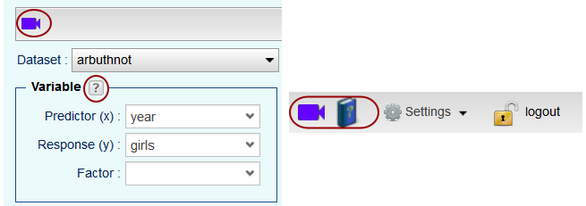
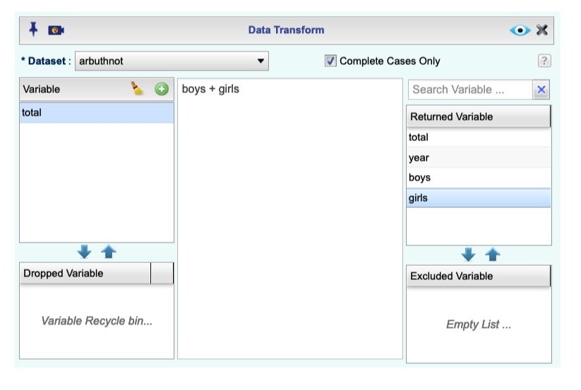

```{r global_options, include=FALSE}
knitr::opts_chunk$set(eval = TRUE, results = FALSE)
```


## The Rguroo Interface

The goal of this lab is to introduce you to Rguroo, which you'll be using throughout the course both to learn the statistical concepts discussed in the course and to analyze real data and come to informed conclusions. 

Today we begin with the fundamental building blocks of Rguroo: the interface, reading in data, and basic commands.

To start, you will need to create an Rguroo account. Go to Rguroo ([https://rguroo.com/](https://rguroo.com/)) and select `Register`. Next, click `Student` to obtain student access. Then, select `Obtain 12 month access (New Account)` and enter your student e-mail address in both the `Email` and `Verify Email` boxes. Click `Submit` and a verification code will be sent to your student e-mail address. In the next section, type your verification code in the `Email Verification Code` box and click Submit.

**IMPORTANT!** It is very easy to accidentally include a leading or trailing space when copying/pasting the verification code. This is the most common reason why Rguroo declines verification codes!

Once Rguroo has verified your code, proceed to the registration screen. You will need to type your first and last name and the ZIP (postal) code for your institution. Select your `Institution` and its `State`. Leave the Access Key field blank. Read and accept the terms of service, then click `Submit` to get to the Billing Details page.

12-month access to Rguroo costs $20. However, some colleges and universities have site license deals with Rguroo that make student accounts available at reduced or no cost. If your institution has such a license, the discount will be automatically reflected in the Total amount at the bottom of the page. Fill out your billing details and click `Place Order`.

Upon completion of the registration, a message will be sent to your student e-mail address including a temporary password. Follow the instructions in the e-mail to set up your Rguroo account.

Once you have set up your Rguroo account, you should see a fairly open browser window similar to that shown below.

```{r r-interface-2020, echo=FALSE, results="asis"}
knitr::include_graphics("img/rguroo-interface-v1_4_3.png")
```

The sidebar to the right contains five sections: Data, Plots, Analytics, Probability-Simulation, and Applets. You can click on any of these sections to view your saved Rguroo objects. You can also access a specific section via the keyboard by pressing Alt + the second letter of the section name (Alt + A for Data, Alt + L for Plots, Alt + N for Analytics, Alt + R for Probability-Simulation, and Alt + P for Applets).


## Dr. Arbuthnot's Baptism Records

To get started, let's take a peek at the data.

***NOTE: WE NEED TO SET UP THE RGUROO OpenIntroLabs DATA REPOSITORY TO LOAD THE LABS***

```{r load-abrbuthnot-data, eval = FALSE}
# replace this with Data Repository screenshot
arbuthnot
```

You can run the command by

- clicking on the green arrow at the top right of the code chunk in the R Markdown (Rmd) file, or
- putting your cursor on this line, and clicking the **Run** button on the upper right corner of the pane, or
- holding `Ctrl-Shift-Enter`, or
- typing the code in the console.

This command instructs Rguroo to load some data: the Arbuthnot baptism counts for boys and girls. You should now see an Rguroo data file called `arbuthnot` in the `Data` section of the sidebar.

As you interact with Rguroo, you will create a series of objects. Sometimes you import them as we have done here, but most of the time create them yourself as the byproduct of a computation or some analysis you have performed.

The Arbuthnot data set refers to the work of Dr. John Arbuthnot, an 18<sup>th</sup> century physician, writer, and mathematician.
He was interested in the ratio of newborn boys to newborn girls, so he gathered the baptism records for children born in London for every year from 1629 to 1710. 

To view the data, select the name of the dataset in the Data sidebar and press Enter to view it. Alternatively, you can double-click the dataset name.

You will notice in the screenshot below that there is some text in the box above the list of datasets. As you continue to add Rguroo objects to your account, it will become difficult to immediately find the object you want. Thus, you can type text in the box to start filtering the objects in that section. 

```{r view-data, eval = FALSE}
# Replace this with a screenshot of arbuthnot data
arbuthnot
```

What you should see are four columns of numbers, each row representing a different year: the first entry in each row is simply the case number (an index we can use to access the data from individual years if we want), the second is the year, and the third and fourth are the numbers of boys and girls baptized that year, respectively. 
Use the scrollbar on the right side of the window to examine the complete data set. By default, Rguroo will show up to 100 rows and 15 columns of the dataset. You can use the `Row` and `Column` sections at the bottom of the window to specify 

Note that the row numbers in the first column are not part of Arbuthnot's data. 
R adds them as part of its printout to help you make visual comparisons. 
You can think of them as the index that you see on the left side of a spreadsheet. 
In fact, the comparison to a spreadsheet will generally be helpful. 
Rguroo has stored Arbuthnot's data in a kind of spreadsheet or table called a *data frame*.

We can see that there are 82 observations and 3 variables in this dataset. The variable names are `year`, `boys`, and `girls`. 

## Some Exploration

**NOT CLEAR WHAT RGUROO SHOULD DO HERE**

### Data visualization

Rguroo has some powerful modules for making graphics. Let's start by creating a simple plot of the number of girls baptized per year. First, we need to open the Plots section and click Create Plot. The plot we want to make is a Scatterplot, so let's select that.

When we open up an Rguroo dialog, usually the first thing we need to do is select the Dataset we will be using. Let's select `arbuthnot` as our dataset. Then, we need to select the x- and y-variables on our plot using the dropdown menus.

```{r plot-girls-vs-year, echo=FALSE, results="asis"}

```

Click the eye button to view the output:

```{r plot-girls-vs-year 2, echo=FALSE, results="asis"}
knitr::include_graphics("img/scatterplot-1-output.png")
```

Let's say we want to visualize the above plot using a line graph instead. Click the `Details` button and select the `Attributes of Scatterplot Points, LS Line, LOESS, and Identified Points` menu. Once open, check the `Show Line` box. To remove, the points, uncheck the `Show Points` box.

```{r plot-girls-vs-year-line, echo=FALSE, results="asis"}
knitr::include_graphics("img/linegraph-1.png")
```

The default line is a solid orange line. You change from the defaults using the `Line Type` and `Color` options. For example, by clicking the orange box under color, you can bring up a color palette and select a different color.

```{r plot-girls-vs-year-line-2, echo=FALSE, results="asis"}
knitr::include_graphics("img/linegraph-1-customization.png")
```

When you're done customizing your line, you can again click the eye button to view your output.

```{r plot-girls-vs-year-line-2-output, echo=FALSE, results="asis"}

```

You might wonder how you are supposed to know how to fill in a dialog in Rguroo. There are three different ways to get help:

* Throughout the dialog, you will see several `?` boxes associated with a section of the dialog. You can click the box to bring up a help dialog explaining how to fill in that section. For example, in the screenshot below, you can click the `?` box for the `Variable` section to learn what should be selected in the `Predictor (x)`, `Response (y)`, and/or `Factor` dropdown menus.
* At the top left of many dialogs, there is a video camera icon. You can click this icon to bring up in Rguroo a video tutorial on how to fill out the dialog.

```{r plot-help, tidy = FALSE, echo=FALSE, results="asis"}



```

* The top right of the workspace (by `Settings`) contains two options for getting general help. You can click the video camera icon to bring up a searchable list of tutorial videos or the book icon to open the Rguroo User's Guide in a separate tab.

1. Is there an apparent trend in the number of girls baptized over the years? 
   How would you describe it? (To ensure that your lab report is comprehensive,
   be sure to include screenshots of your Basics dialog and the plot output as well as your
   written interpretation)

### Rguroo as a big calculator

Now, suppose we want to plot the total number of baptisms. To do basic calculations in Rguroo, click on Applets, then open the `Calculators (Desmos)` folder and select one of the calculators.

```{r calc-total-bapt-numbers, echo=FALSE, results="asis"}

```

This brings up the selected calculator from [https://www.desmos.com/](https://www.desmos.com/) directly within Rguroo. Use the calculator to compute the total number of baptisms in 1629 by adding `5218 + 4613`.

### Adding a new variable to the data frame

We'll want to compute the total number of baptisms for every year and use it to generate some plots, so we'll want to save it as a permanent column in our dataset.

To modify our dataset, go back to the Data section, select the Functions menu, and select `Transform`. As usual, the first thing to select in the dialog is the apporpriate `Dataset`.

In the `Variable` section to the left, click the green plus sign to add a new variable to the dataset. The default name for the variable will be something uninformative like `Transform_1`. Change the name to `total`. In the `Returned Variable` section on the right, you should see `total` added to the list of variables.

In the middle section, type `boys + girls` to indicate that for each row, Rguroo will add up the `boys` and `girls` counts for that year and record that sum as the value of the new variable `total`. To avoid typos, or if you have long variable names, you can instead double-click a variable name in the Returned Variable list to add it to the center box.

```{r calc-total-bapt-vars-save, echo=FALSE, results="asis"}

```

As usual, click the eye button to view the output. You'll see that there is now a new column called `total` that has been tacked onto the data frame.

Now, to be able to create plots with this new dataset, we need to save it to Rguroo. First, type a name in the in the Save As... box, then click the button to save it. In the screenshot below, we have named the new dataset `arbuthnot_total`.

```{r calc-total-bapt-vars-save-dataset, echo=FALSE, results="asis"}

```

Note that since the Save Parameters box is checked, two things will happen. First, a new dataset will be added to the Data section with a different icon. This icon indicates that when you open the dataset, you can also open the Transform dialog that created it. Second, the original `arbuthnot` dataset has changed text format to become green, bolded, and italicized. Text in this format indicates that *Rguoo objects* have been saved using this dataset. To see the datasets, plots, and reports that have been created from this dataset, right-click the dataset and select `Show Dependencies`.

You can make a line plot of the total number of baptisms per year by opening a new Scatterplot dialog (in the Plots section). Remember to open the Details menu to remove the points and add the line!

```{r plot-total-vs-year, echo=FALSE, results="asis"}
knitr::include_graphics("img/scatterplot2-1.png")
knitr::include_graphics("img/scatterplot2-2.png")
knitr::include_graphics("img/scatterplot2-output.png")

```


You can also use the calculator to compute the ratio of the number of boys to the number of girls baptized in 1629:

```{r calc-prop-boys-to-girls-numbers}
5218 / 4683
```

Or the proportion of newborns that are boys in 1629:

```{r calc-prop-boys-numbers}
5218 / (5218 + 4683)
```

However, to do this for all years simultaneously and append it to the dataset, let's open the `arbuthnot_total` dataset again. Remember that since the `Save Parameters` box was checked, we can open up the `Basics` dialog to see the original transformations and modify or add new variables.

Let's add two more variables, `boy_to_girl_ratio` and `boy_proportion`. Then, we'll highlight each new variable on the left side and use the center box to type the formula used to compute the new variable.

```{r calc-prop-boys-vars, echo=FALSE, results="asis"}

knitr::include_graphics("img/transform2-2.png")

```

Note that we are using the new `total` variable we created from the original transformation.

Finally, in addition to simple mathematical operators like subtraction and division, our formula box can use comparisons like greater than, `>`, less than, `<`, and equality, `==`. 
For example, we can ask if the number of births of boys outnumber that of girls in each year by adding another variable to our list:

```{r boys-more-than-girls, echo=FALSE, results="asis"}

```

This command adds a new variable to the dataset containing the values of either `TRUE` if that year had more boys than girls, or `FALSE` if that year did not (the answer may surprise you). 
This variable contains a different kind of data than we have encountered so far. 
All other columns in the `arbuthnot` data frame have values that are numerical (the year, the number of boys and girls). 
Here, we've asked R to create *logical* data, data where the values are either `TRUE` or `FALSE`. 
In general, data analysis will involve many different kinds of data types, and one reason for using Rguroo is that it is able to represent and compute with many of them.

2. Save the resulting dataset as `arbuthnot_ratio`. Now, use the `arbuthnot_ratio` dataset to generate a plot of the proportion of boys born over time. What do you see? 

## More Practice

In the earlier part of this lab, you recreated some of the displays and preliminary analysis of Arbuthnot's baptism data. 
Your assignment involves repeating these steps, but for present day birth records in the United States. 
The data are stored in a data frame called `present`.  ***NOTE ABOUT IMPORTING THIS ONE***

These data come from reports by the Centers for Disease Control. 
You can learn more about them by clicking the `i` icon to the right of the dataset name. Once you've finished reading the information, you can click `Import` to import the data.

1.  What years are included in this data set? What are the dimensions of the 
    data frame? What are the variable (column) names?

1.  How do these counts compare to Arbuthnot's? Are they of a similar magnitude?

1.  Make a plot that displays the proportion of boys born over time. What do you see? 
    Does Arbuthnot's observation about boys being born in greater proportion than girls 
    hold up in the U.S.? Include the plot in your response. *Hint:* You should be
    able to Transform the `present` dataset using the steps learned in the previous section.

1.  In what year did we see the most total number of births in the U.S.? *Hint:*
    First, use the Transform dialog to add a `total` variable to the dataset. 
    Then, sort your dataset in descending order based on the total column. You can do this
    using the Sort dialog (in the Data section, click Functions, then Sort) as shown
    in the screenshot below.

```{r sample-arrange, echo=FALSE, results="asis"}

```

* * *

<a rel="license" href="http://creativecommons.org/licenses/by-sa/4.0/"></a><br />This work is licensed under a <a rel="license" href="http://creativecommons.org/licenses/by-sa/4.0/">Creative Commons Attribution-ShareAlike 4.0 International License</a>.
