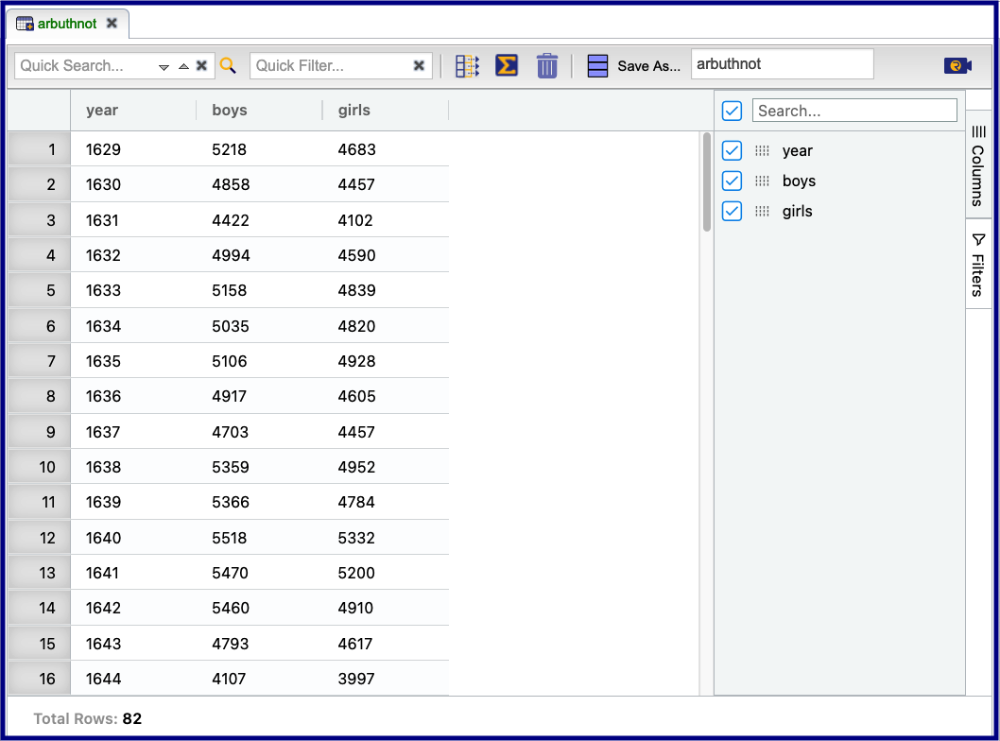
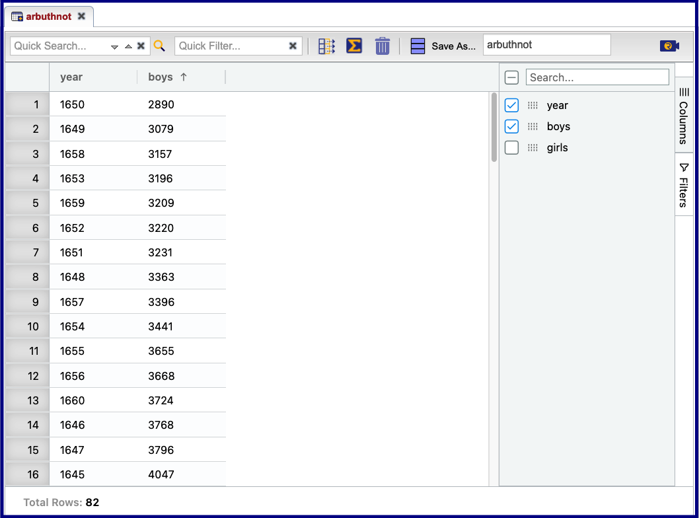
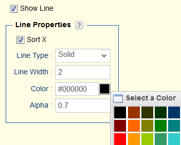

```{r global_options, include=FALSE}
knitr::opts_chunk$set(eval = TRUE, results = FALSE)
```


## The Rguroo Interface

The goal of this lab is to introduce you to Rguroo, which you'll use throughout the course to learn the statistical concepts discussed in the course and analyze real data and come to informed conclusions. To use Rguroo, you need to register for an account, as we explain below. There is no need to download or install any software. All you need is a browser and the Internet.

Today we begin with the fundamental building blocks of Rguroo: the interface, reading in data, and basic functions. Functions in Rguroo consist of dialog boxes where you input information, usually by selecting checkboxes or typing in values in text boxes, to perform a specific task. 

To start, you will need to create a Rguroo account. Go to Rguroo ([https://rguroo.com/](https://rguroo.com/)) and select **Register**. Next, click **Student** to obtain student access. Then, select **Obtain 12 month access (New Account)** and enter your student email address in both the **Email** and **Verify Email** boxes. Click **Submit**, and a verification code will be sent to your student email address. In case you don't see the email in your Inbox, check your Spam folder. In the next section, type your verification code in the **Email Verification Code** box and click **Submit**.

**IMPORTANT!** It is very easy to accidentally include a leading or trailing space when copying/pasting the verification code. This is the most common reason why Rguroo declines verification codes!

Once Rguroo has verified your code, proceed to the registration screen. You will need to type your first and last name and the ZIP (postal) code for your institution. Select your **Institution** and its **State**. Leave the **Access Key** field blank. Read and accept the terms of service, then click **Submit** to get to the Billing Details page.

You may need to purchase a Rguroo license. However, some colleges and universities have site license deals with Rguroo that make student accounts available at reduced or no cost. If your institution has such a license, and there is a discounted amount to pay, the discount will be automatically reflected in the billing process that you would go through. If there is a non-zero balance that you have to pay, go through the billing process and click **Place Order**.

Upon completion of the registration, a message will be sent to the email address you used to register your Rguroo account, which includes a temporary password. Follow the instructions in the email to set up your Rguroo account.

Once you have set up your Rguroo account, you should see a fairly open browser window similar to that shown below.

```{r rguroo-interface-2020, echo=FALSE, results="asis", fig.cap="*A view of the Rguroo interface*", fig.align='center', outwidth = "80%"}

```

The sidebar on the left contains five toolboxes: **Data**, **Plots**, **Analytics**, **Probability-Simulation**, and **Applets**. You can click on any of these toolboxes to view the Rguroo objects you have saved to that toolbox. You can also access a specific toolbox via the keyboard by pressing Alt + the second letter of the toolbox name (Alt + A for **Data**, Alt + L for **Plots**, Alt + N for **Analytics**, Alt + R for **Probability-Simulation**, and Alt + P for **Applets**). There is also a **Quick Access Tools** button on the top right that you can use to access a few frequently used functions, such as **Import Dataset** or a list of shortcut keys.


## Dr. Arbuthnot's Baptism Records

To get started, let's take a peek at the data. To access the data, go to the **Data** toolbox, select **Data Import**, and click on **Dataset Repository**, as shown in the figure below. In the dialog box that opens, type *open* in the upper search box and you should see the option to select the `OpenIntro` repository. Once selected, the lower panel of the dialog box should show all the datasets in the repository; type *arb* in the lower search box to find the *arbuthnot* dataset, select it, and click on the `Import` button. You should now see an Rguroo data file called *arbuthnot* in the **Data** toolbox on the sidebar. This dataset is now available for use in Rguroo functions. 

```{r arbuthnot-upload, echo=FALSE, results="asis", fig.align="center", fig.cap = "*Importing data from the Rguroo Dataset Repository*", out.width = "90%"}

```

As you work with Rguroo, you will create a series of objects. Objects include datasets, plots, output reports, etc., which can be saved under the **Data**, **Plots**, **Analytics**, and **Probability-Simulation** toolboxes in Rguroo.  Sometimes you import objects as we have done here, but most of the time, you create them as the byproduct of computation or some analysis you have performed. 

As you add Rguroo objects to your account, it will become difficult to find the object you want immediately. Thus, you can type text in the "Search" box to filter the objects in each section. You can also take advantage of the folder system to organize your objects.

The Arbuthnot dataset refers to the work of Dr. John Arbuthnot, an 18th-century physician, writer, and mathematician. He was interested in the ratio of newborn boys to newborn girls, so he gathered the baptism records for children born in London every year from 1629 to 1710. 

To view the *arbuthnot* dataset that you imported, select the dataset's name in the **Data** toolbox (in the sidebar) and press Enter to view it. Alternatively, you can double-click the dataset name. The dataset opens in Rguroo's **Data Viewer**, as shown in the figure below. You should see four columns of numbers, each row representing a different year: the first entry in each row is simply the case number (an index we can use to access the data from individual years if we want), the second is the year, and the third and fourth are the numbers of boys and girls baptized that year, respectively. Use the scroll bar on the right side of the window to examine the complete data set. By default, Rguroo will show up to 100 rows and 15 columns of the dataset. You can use the **Row** and **Column** options at the bottom of the **Data Viewer** window to navigate any part of the data. 

```{r arbuthnot-data-view, echo=FALSE, results="asis", fig.align="center", fig.cap="*A portion of the Arbuthnot dataset*", out.width = "80%"}

```

The row numbers in the first column are not part of Arbuthnot's dataset. Rguroo adds them as part of its printout. You can think of them as the index that you see on the left side of a spreadsheet. In fact, the comparison to a spreadsheet will generally be helpful. Rguroo has stored Arbuthnot's data in a kind of spreadsheet or table called a **data frame**. We can see that there are 82 observations and 3 variables in this dataset. The variable names are year, boys, and girls.


## Some Exploration

Let’s start to examine the data a little more closely. As mentioned earlier, you can use the navigation toolbar in **Data Viewer** to explore your data by selecting specific rows and columns to view. Alternatively, you can right-click on a column heading to get a menu, as shown in the figure below, to explore the columns of a dataset. In that menu, you can select or deselect columns to view or hide them. In the figure, we have chosen the columns “year” and “boys” to be shown and deselected the columns “Case No.” and “girls” so they are hidden. You get a few other options for sorting, grouping, etc., which we will explore as needed.

```{r column-navigation, echo=FALSE, results="asis", fig.align="center", fig.cap="*The menu for exploring columns*", out.width = "80%"}

```

1. How would you view only the counts of girls baptized? Right-click on one of the columns and deselect all variables except for girls. Copy and paste the first ten cases. 

### Data visualization

Rguroo has some powerful modules for making graphics. Let's start by creating a simple plot of the number of girls baptized per year. First, we need to open the **Plots** toolbox and click **Create Plot**. The plot we want to make is a scatterplot, so let's select that, as shown in the figure below. This opens up the **Scatterplot** dialog box. When we open up an Rguroo dialog, usually the first thing we need to do is select the `Dataset` we will be using. Let's select *arbuthnot* as our `Dataset`. Then, we need to select the `Predictor (x)` and  `Response (y)` variables on our plot using the dropdown menus.

```{r plot-girls-vs-year-dialog, echo=FALSE, results="asis", fig.align= "center", fig.cap = "Creating the scatterplot of number of girls baptized versus year", out.width = "90%"}

```

To apply your selections and see results, click the `Preview` button , which can be found at the top right of every dialog box or on the top bar on the Rguroo panel. The graph below is the scatterplot of girls versus year created using these steps.

```{r plot-girls-vs-year, echo=FALSE, results="asis", fig.align="center", fig.cap = "*Scatterplot of number of girls baptized versus year*", out.width= "80%"}

```

Let's say we want to visualize the above plot using a line graph instead. In the **Scatterplot** menu, you can select `Line` under the `Superimpose` part of the dialog box. This will connect the points consecutively by lines. If you would like to hide the points, click the  button and select the `Attributes of Scatterplot Points, LS Line, LOESS, and Identified Points` menu. Once open, check the `Show Line` box. To remove the points, uncheck the `Show Points` box, as shown in the figure below.

```{r plot-girls-vs-year-line, echo=FALSE, results="asis", fig.align = "center", fig.cap = "*A dialog box to customize points and lines*", out.width="80%"}

```

The default line is a solid orange line. You can select the line type and line color using the `Line Type` and `Color` options. For example, by clicking the colored box in the option `Color`, as shown below, you can bring up a color palette and select a different color.

```{r plot-girls-vs-year-line-2, echo=FALSE, results="asis", fig.align = "center", fig.cap = "*Options to customize lines*"}

```

When you're done customizing your line, you can again click the `Preview` button  to view your output.

```{r plot-girls-vs-year-line-2-output, echo=FALSE, results="asis", fig.align = "center", fig.cap = "*Line plot of number of baptized girls versus year*", out.width="80%"}
knitr::include_graphics("img/linegraph-1-output.png")
```

2. Is there an apparent trend in the number of girls baptized over the years? 
   How would you describe it? (To ensure that your lab report is comprehensive,
   be sure to include screenshots of your  dialog and the plot output as well as your written interpretation).

### Rguroo as a big calculator

Now, suppose we want to plot the total number of baptisms. To do basic calculations in Rguroo, click on **Applets**, then open the **Calculators (Desmos)** folder and select one of the calculators. Alternatively, you can find a link to a scientific calculator in the **Quick Access Tools**.

```{r calc-total-bapt-numbers, echo=FALSE, results="asis", fig.align = "center", fig.cap = "*Desmos Calculator on Rguroo*", out.width="40%"}
knitr::include_graphics("img/calculator-applets.png")
```

This brings up the selected calculator from [https://www.desmos.com/](https://www.desmos.com/) directly within Rguroo. Use the calculator to compute the total number of baptisms in 1629 by adding `5218 + 4613`. We could repeat this once for each year, but there is a faster way. You can add a new variable to your dataset (data frame) that includes the sums for each row. 

### Adding a new variable to the data frame

We'll want to compute the total number of baptisms for every year and use it to generate some plots, so we'll want to save it as a permanent column in our dataset.

To modify our dataset, go back to the **Data** toolbox, select the **Functions** menu, and select **Transform**. As usual, the first thing to select in the dialog is the appropriate `Dataset`. Select the *arbuthnot* dataset.

In the `Variable` section to the left, click the green plus sign  to add a new variable to the dataset. The default name for the variable will be something uninformative like *Transform_1*. Change the name to *total*. In the `Returned Variable` section on the right, you should see *total* added to the list of variables.

In the middle section, type `boys + girls`. This will ask Rguroo to add up the *boys* and *girls* counts for each row of our dataset (i.e., for each year) and record that sum as the value of the new variable *total*. 

```{r calc-total-bapt-vars-save, echo=FALSE, results="asis", fig.align = "center", fig.cap = "*The Data Transform dialog box*", out.width="75%"}
knitr::include_graphics("img/transform-1.png")
```

As usual, click the `Preview` button  to view the output. You'll see that there is now a new column called *total* that has been tacked onto the first column of the data frame. You can rearrange the variables by dragging and dropping their names in the `Returned Variable` column to your desired position. For example, you can move the newly calculated variable total to the last column.

<div id="boxedtext">
**Tip: ** To avoid typos in typing variable names in the **Transform** dialog box, especially if you have long variable names, you can double-click a variable name in the `Returned Variable` column to add it to the center box.
</div>

<div id="boxedtext">
**A note on Transform function: ** If you become familiar with the programming language R, you can write multiple lines of R code in the **Transform** dialog box.
</div>

Now, to be able to create plots with this new dataset, we need to save it to Rguroo. First, type a name in the in the **Save As...** box, then click the button to save it. In the screenshot below, we have named the new dataset *arbuthnot_total*.

```{r calc-total-bapt-vars-save-dataset, echo=FALSE, results="asis", fig.align = "center", fig.cap = "*Saving your work*", out.width="75%"}
knitr::include_graphics("img/transform-2.png")
```

Note that since the **Save Parameters** box is checked, two things will happen. First, a new dataset will be added to the **Data** toolbox with a different icon. This icon indicates that when you open the dataset, you can also open the **Transform** dialog that created it. Second, the original *arbuthnot* dataset name in the **Data** toolbox is now shown with a bold-face green font. A dataset name that has the bold-face green format indicates that one or more **Rguroo objects** have been saved using this dataset. To see the datasets, plots, and reports that have been created from this dataset, right-click the dataset and select the option **Show Dependencies**.

<div id="boxedtext">
**Tip: ** If you want to save a dataset created in the **Transform** function as an *independent dataset*, uncheck the **Save Parameters** box. An *independent dataset* is one whose  origin is not recorded in Rguroo. To remember information about a dataset, you can right-click on its name and add a **Comment**. 
</div>


You can make a line plot of the total number of baptisms per year by opening a new **Scatterplot** dialog (in the **Plots** toolbox). Remember to open the  menu to remove the points and add the line! The following figures should help.

```{r plot-total-vs-year_dialog, echo=FALSE, results="asis", fig.align = "center", fig.cap = "*Scatterplot's Basics dialog box*", out.width="80%"}

```
```{r plot-total-vs-year_details, echo=FALSE, results="asis", fig.align = "center", fig.cap = "*Scatterplot's Details dialog box*", out.width="80%"}

```

```{r plot-total-vs-year, echo=FALSE, results="asis", fig.align = "center", fig.cap = "*Scatterplot of total of boys and girls versus year*", out.width="80%"}

```


In a similar way that you computed the total number of births, you can use the calculator to compute the ratio of the number of boys to the number of girls baptized in 1629:

```{r calc-prop-boys-to-girls-numbers}
5218 / 4683
```

Or the proportion of newborns that are boys in 1629:

```{r calc-prop-boys-numbers}
5218 / (5218 + 4683)
```

However, to do this for all years simultaneously and append it to the dataset, let's open the *arbuthnot_total* dataset again. Remember that since the **Save Parameters** box was checked, we can open up the  dialog to see the original work (transformation) that we did and modify or add new variables to the dataset.

Let's add two more variables, *boy_to_girl_ratio* and *boy_proportion*. Then, we'll highlight each new variable on the left side and use the center box to type the formula used to compute the new variable.

```{r calc-ratio-boys-vars, echo=FALSE, results="asis", fig.align = "center", fig.cap = "*Calculating the ratio of boys to girls in the Transform function*", out.width="75%"}
knitr::include_graphics("img/transform2-1.png")
```

```{r calc-prop-boys-vars, echo=FALSE, results="asis", fig.align = "center", fig.cap = "*Calculating the proportion of boys in the Transform function*", out.width="75%"}

```

Note that we are using the *total* variable we created from the original transformation.

3. Save the resulting dataset as *arbuthnot_ratio*. Now, use the *arbuthnot_ratio* dataset to generate a plot of the proportion of boys born over time. What do you see?

<div id="boxedtext">
**Tip: ** If you are creating a variable that would be simpler to write in a few lines, you can write multiple lines in the formula box. For example, to obtain the proportion of boys, you can click on the plus sign , name your variable, and write the following two lines in the formula box:

```{r, echo=TRUE, eval = FALSE}
total = boys + girls
boy_proportion = boys/total
```

Note that the values of the last variable in the formula box, in this example "boy_proportion," will be assigned to your named variable. 
</div>

Finally, in addition to simple mathematical operators like subtraction and division, we can use comparisons like greater than, `>`, less than, `<`, and equality, `==` in the center box. For example, we can ask if the number of births of boys outnumber that of girls in each year by adding another variable to our list, *more_boys*, using the code `boys > girls` in the center box:

```{r boys-more-than-girls, echo=FALSE, results="asis", fig.align = "center", fig.cap = "*Calculating whether the year has more boys in the Transform function*", out.width="100%"}
knitr::include_graphics("img/transform2-3.png")
```

The variable *more_boys* will have the value `TRUE` if that year had more boys than girls and `FALSE` if that year did not (the answer may surprise you). 
This variable contains a different kind of data than we have encountered so far. 
All other columns in the `arbuthnot` data frame have values that are numerical (the year, the number of boys and girls). 
Here, we've asked Rguroo to create *logical* data, data where the values are either `TRUE` or `FALSE`. 
In general, data analysis will involve many different kinds of data types, and one reason for using Rguroo is that it is able to represent and compute with many of them.

To get summary information about a dataset, you can right-click on the dataset name, and in the menu that appears, select **Dataset Summary**. Then a table containing various information about the dataset is shown. This table includes information about the minimum and maximum values, number of observations, etc. In the upcoming labs, we will talk in more detail about summary statistics.

## More Practice

In the earlier part of this lab, you recreated some of the displays and preliminary analysis of Arbuthnot's baptism data. 
Your assignment involves repeating these steps, but for present day birth records in the United States. 
The data are stored in a data frame called `present` and are available in the Rguroo's **Dataset Repository** under `Open Intro`. 
These data come from reports by the Centers for Disease Control. 
You can learn more about them by clicking the the information icon  to the right of the dataset name. Once you've finished reading the information, you can click `Import` to import the data into your account.

1.  What years are included in this data set? What are the dimensions of the 
    data frame? What are the variable (column) names?

1.  How do these counts compare to Arbuthnot's? Are they of a similar magnitude?

1.  Make a plot that displays the proportion of boys born over time. What do you see?     Does Arbuthnot's observation about boys being born in greater proportion than girls hold up in the U.S.? Include the plot in your response. **Hint:** You should be
    able to **Transform** the *present* dataset using the steps learned in the previous section.

1.  In what year did we see the most total number of births in the U.S.? **Hint:**
    First, use the **Transform** dialog to add a `total` variable to the dataset. 
    Then, sort your dataset in descending order based on the total column. You can do this using the **Sort** dialog (in the **Data** toolbox, click **Functions**, then **Sort**) as shown in the screenshot below.
    
```{r sort-function, echo=FALSE, results="asis", fig.align = "center", fig.cap = "*Rguroo `Sort` function*", out.width="60%"}
knitr::include_graphics("img/sort.png")
```

Do you know another way to sort the column total in Rguroo's **Data Viewer**?

## Resources for learning about Rguroo

That was a short introduction to Rguroo, but we will provide you with more functions and a better sense of how to use Rguroo as the course progresses.

You can get help in how to use Rguroo in several ways.

* Throughout the Rguroo's dialog boxes, you will see question-mark signs `?` that are associated with a section of the dialog. You can click on the question mark to bring up a help dialog explaining what each component of that section is and how to fill it in. For example, in the screenshot below, you can click the question-mark `?` for the `Variable` section to learn what should be selected in the `Predictor (x)`, `Response (y)`, and/or `Factor` dropdown menus. Moreover, at the top left of many dialogs, there is a video camera icon. You can click this icon to bring up a video tutorial on how to use the specific function and fill out the dialog.

```{r dialog-help, tidy = FALSE, echo=FALSE, results="asis", fig.align = "center", fig.cap = "*Video and text help on dialog boxes*", out.width="50%"}

```

* The top right of the workspace (by **Settings**) contains two options for getting general help, as shown in the figure below. You can click the video camera icon to bring up a searchable list of tutorial videos or the book icon to open the Rguroo User's Guide in a separate tab. The Rguroo User's Guide contains many examples and even some formulas on how the numbers in Rguroo are calculated.

```{r user-help, tidy = FALSE, echo=FALSE, results="asis", fig.align = "center", fig.cap = "*Rguroo User's Guide and video tutorials*", out.width="50%"}
knitr::include_graphics("img/rguroo-help-2.png")
```
* * *

<a rel="license" href="http://creativecommons.org/licenses/by-sa/4.0/"></a><br />This work is licensed under a <a rel="license" href="http://creativecommons.org/licenses/by-sa/4.0/">Creative Commons Attribution-ShareAlike 4.0 International License</a>. Rguroo.com, the Rguroo.com logo, and all other trademarks, service marks, graphics and logos used in connection with Rguroo.com or the Website are trademarks or registered trademarks of Soflytics Corp. in the USA and other countries and are not included under the CC-BY-SA license.
