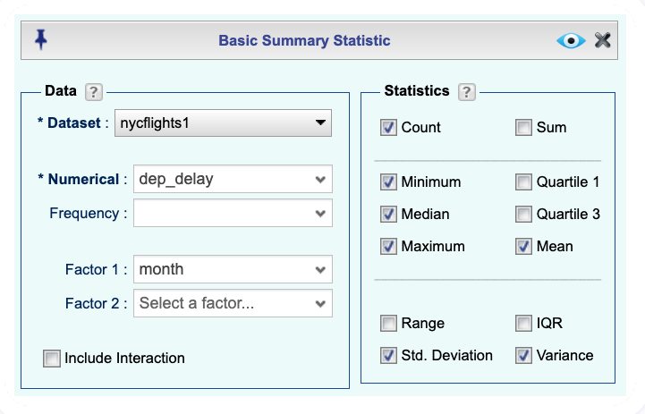
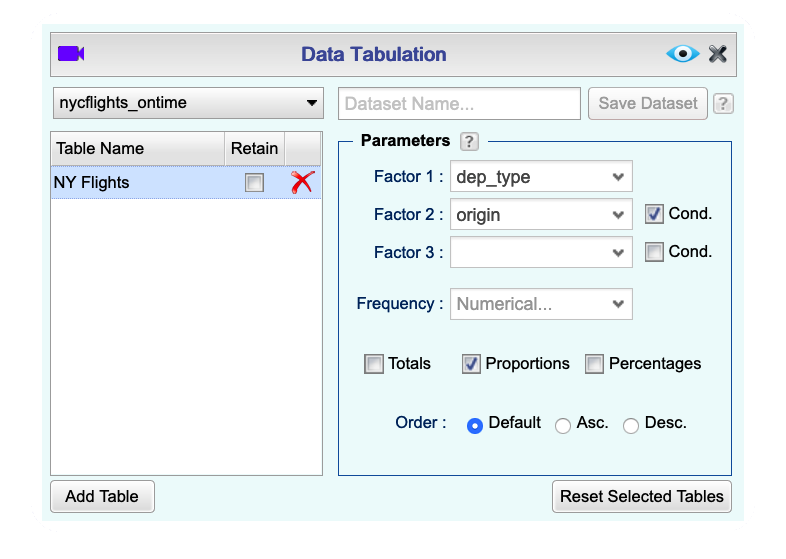

```{r global-options, include=FALSE}
knitr::opts_chunk$set(eval = TRUE, results = FALSE, message = FALSE)
```

Some define statistics as the field that focuses on turning information into
knowledge. The first step in that process is to summarize and describe the raw
information -- the data. In this lab we explore flights, specifically a random
sample of domestic flights that departed from the three major 
New York City airports in 2013. We will generate simple graphical and numerical 
summaries of data on these flights and explore delay times. Since this is a large 
data set, along the way you'll also learn the indispensable skills of data 
processing and subsetting.

## Getting started

### The data

The [Bureau of Transportation Statistics](http://www.rita.dot.gov/bts/about/) 
(BTS) is a statistical agency that is a part of the Research and Innovative 
Technology Administration (RITA). As its name implies, BTS collects and makes 
transportation data available, such as the flights data we will be working with 
in this lab.

As usual, you can import this data from the ***Rguroo Data Repository Name*** repository. The dataset we want to import is `nycflights`. First, access the **codebook** (description of the variables) by clicking the `i` icon. One of the variables refers to the carrier (i.e. airline) of the flight, which 
is coded according to the following system.

- `carrier`: Two letter carrier abbreviation.
    + `9E`:           Endeavor Air Inc.
    + `AA`:      American Airlines Inc.
    + `AS`:        Alaska Airlines Inc.
    + `B6`:             JetBlue Airways
    + `DL`:        Delta Air Lines Inc.
    + `EV`:    ExpressJet Airlines Inc.
    + `F9`:      Frontier Airlines Inc.
    + `FL`: AirTran Airways Corporation
    + `HA`:      Hawaiian Airlines Inc.
    + `MQ`:                   Envoy Air
    + `OO`:       SkyWest Airlines Inc.
    + `UA`:       United Air Lines Inc.
    + `US`:             US Airways Inc.
    + `VX`:              Virgin America
    + `WN`:      Southwest Airlines Co.
    + `YV`:          Mesa Airlines Inc.


When you are done reading the codebook, import the dataset to your Data section.

***Put a screenshot here to import nycflights***

The dataset `nycflights` that shows up in your workspace is a *data matrix*, 
with each row representing an *observation* and each column representing a 
*variable*. Rguroo calls this data format a **Rguroo dataset** or **data frame**,
which is a term that will be used throughout the labs. 
For this data set, each *observation* is a single flight.

To view the names of the variables and some summary information., right-click the `nycflights` dataset and click `Dataset Summary`. You can also double-click the dataset name to view the first 100 rows and 15 columns of the data frame.

The `nycflights` data frame is a massive trove of information. Let's think about 
some questions we might want to answer with these data:

- How delayed were flights that were headed to Los Angeles?
- How do departure delays vary by month?
- Which of the three major NYC airports has the best on time percentage for 
departing flights?

## Analysis

### Departure delays

Let's start by examining the distribution of departure delays of all flights with a 
histogram. Since this is a plot, we need to open the Plots section and Create Plot. Clearly, we want to create a histogram.

We start by selecting the dataset and the variable to plot.

```{r hist-dep-delay, echo=FALSE, results="asis"}

```

Note that the border color has been changed from the default in the screenshot above. Histograms are generally a very good way to see the shape of a single 
distribution of numerical data, but that shape can change depending on how the 
data is split between the different bins. In this case, the bins are so small that with the default border color the bars blend into the background! Let's define our own bins.

To do this, we click `Details` and open the `Bins, Bars, Smoothing` section. In the `Bin Breakpoints` box, we'll enter a `Center` of 100 and a `Width` of 15. Once we've seen that histogram, we'll go back and change to a bin width of 150.


```{r hist-dep-delay-bins, echo = FALSE, results = "asis"}


```

1.  Look carefully at these three histograms. How do they compare? Are features
    revealed in one that are obscured in another?

If you want to visualize only on delays of flights headed to Los Angeles, you need 
to first filter the data for flights with that destination (LAX). To do this, go to the `Data` section, select `Functions`, and then `Subset`.

As usual, we first need to select the `nycflights` Dataset. Next, we want to filter to get specific observations in the dataset (rows), so we look at the `Row Selection` section. There are two buttons in this box. The `Sequence` button is used when we know the specific row numbers we want to include. The `Logical Expression` button is used when we know the condition(s) that the remaining rows in the dataset should satisfy. In this case, we want `Logical Expression`.

In the Logical Expression Creator dialog, click the green `+` button to add a logical expression.

```{r lax-filter, echo = FALSE, results = "asis"}

```

Let's take a second to decipher the logical expression we've created.

- `dest` is the name of the variable we want to filter on. You can select this directly from the left dropdown menu.
- `==` means "if it's equal to". You can select this directly from the middle dropdown menu.
- `LAX` is the value we want `dest` to be equal to. You can usually select this directly from the right dropdown menu, but there are so many flight destinations that Rguroo won't list them. Instead, we can directly type the value in. We write it inside single quotation marks since it is a character string and not a number.

<div id="boxedtext">
**Logical operators: ** Filtering for certain observations (e.g. flights from a 
particular airport) is often of interest in data frames where we might want to 
examine observations with certain characteristics separately from the rest of 
the data. To do so, you can use the `filter` function and a series of 
**logical operators**. The most commonly used logical operators for data 
analysis are as follows:

- `==` means "equal to"
- `!=` means "not equal to"
- `>` or `<` means "greater than" or "less than"
- `>=` or `<=` means "greater than or equal to" or "less than or equal to"
</div>

Save your new data subset as `lax_flights` and then make a histogram of the departure delays of only those flights.

```{r lax-flights-hist, echo = FALSE, results = "asis"}
knitr::include_graphics("img/histogram2-1.png")
```

You can also obtain a custom numerical summary of the departure delays for these flights by going to the Data section, clicking `Functions` and then selecting `Summary Statistic`:

```{r lax-flights-summary, echo = FALSE, results = "asis"}

```

<div id="boxedtext">
**Summary statistics: ** Some useful summary statistics for a 
single numerical variable are as follows:

- `Mean`
- `Median`
- `Standard Deviation`
- `Variance`
- `IQR`
- `Minimum`
- `Maximum`

</div>

See if you can find each of those summary statistics in the dialog. Check the boxes for those statistics, then View the output. Note that you will have to click the `+` sign next to "All Observations" to view the values. 

You can also filter based on multiple criteria. Suppose you are interested in
flights headed to San Francisco (SFO) in February. For this, we'll have to set up two different lgical expressions. In the Data section, click `Functions`, select `Subset`, select the nycflights Dataset, then click `Logical Expression`, just like we did earlier. First, we'll put in a logical expression for flights headed to SFO, then we'll put in another logical expression for the flights in February (month 2). Note that we'll have to type in both 'SFO' and 2:

```{r sfo-feb-flights, echo = FALSE, results = "asis"}


```

Finally, we need to create the correct logical expression in the bottom box. Click the down-arrow in the `Pick` column for the logical expression corresponding to the SFO flights. If you want flights that are both headed to SFO **and** in February, click the `AND` button. If you are interested in either flights headed to SFO **or** in February, click the `OR` button. Then, click the down-arrow in the `Pick` column for the logical expression corresponding to the February flights. When you're done, click `Done`, then View the output.

Save the new output as `sfo_feb_flights`.

1.  How many flights meet these criteria? **Hint:** The answer is less than 100, so you can
    simply look at the number of rows in the Data Viewer.
    
1.  Describe the distribution of the **arrival** delays of these flights using a 
    histogram and appropriate summary statistics. **Hint:** The summary 
    statistics you use should depend on the shape of the distribution.
    
Another useful technique is quickly calculating summary statistics for various 
groups in your data frame. For example, we can use the `Summary Statistic` dialog on the sfo_feb_flights dataset, but tell Rguroo to group the departure delays by origin airport by selecting origin as `Factor 1`:

```{r summary-custom-list-origin, echo = FALSE, results = "asis"}

```

To view the summary statistics of departure delays based on the origin airport, click the + sign to the left of `origin` in the output:

```{r summary-custom-list-origin-output, echo = FALSE, results = "asis"}

```

1.  Use the `Summary Statistic` dialog to calculate the median and interquartile range for   
    `arr_delay`s of flights in the `sfo_feb_flights` data frame, grouped by carrier. Which
    carrier has the most variable arrival delays?

### Departure delays by month

Which month would you expect to have the highest average delay departing from an
NYC airport?

Let's think about how you could answer this question. We need to do three things:

- `group` by months
- `summarize` the average departure delays for each month
- `sort` the months based on their average departure delays

We know how to do the first two of these things, but there's a bit of a problem. When we open the `Summary Statistic` dialog, we can't select month as `Factor 1`. The reason for this is that Rguroo has classified month as a *numerical* variable, not a *categorical* variable. To overwrite this classification, we need to right-click the nycflights dataset and select the `Variable Type Editor`. Then we drag-and-drop the month variable from the `Numerical` column to the `Factor/Categorical` column, as shown below.

```{r mean-dep-delay-months-1, echo= FALSE, results = "asis"}

```

Click `Update` to make the changes. Now open a new `Summary Statistic` dialog and month will now appear as a `Factor 1` option:

```{r mean-dep-delay-months-2, echo= FALSE, results = "asis"}

```

Save the summary as `nycflights_month`. We'll use this dataset to perform the last step of sorting the dataset. In the Data section, click `Functions`, then select `Sort`. Select nycflights_month as the `Dataset`. Click the `+` button to add a variable to sort by. We want to sort by `Mean` in descending order:

```{r mean-dep-delay-months-3, echo= FALSE, results = "asis"}
knitr::include_graphics("img/sort-1.png")
```

We obtain the following output:

```{r mean-dep-delay-months-4, echo= FALSE, results = "asis"}

```

Note that there are actually 13 rows in this output: one for each month and one for All Observations. While this is not always useful, in this case we can also easily see which months were above or below the average departure delay for the entire dataset.

1.  Suppose you really dislike departure delays and you want to schedule 
    your travel in a month that minimizes your potential departure delay leaving 
    NYC. One option is to choose the month with the lowest mean departure delay.
    Another option is to choose the month with the lowest median departure delay. 
    What are the pros and cons of these two choices?

<!--
Which month has the highest average departure delay from an NYC airport? What
    about the highest median departure delay? Which of these measures is more 
    reliable for deciding which month(s) to avoid flying if you really dislike 
    delayed flights.
-->

### On time departure rate for NYC airports

Suppose you will be flying out of NYC and want to know which of the 
three major NYC airports has the best on time departure rate of departing flights. 
Also supposed that for you, a flight that is delayed for less than 5 minutes is 
basically "on time."" You consider any flight delayed for 5 minutes of more to be 
"delayed".

In order to determine which airport has the best on time departure rate, 
you can 

- first classify each flight as "on time" or "delayed",
- then group flights by origin airport,
- then calculate on time departure rates for each origin airport,
- and finally arrange the airports in descending order for on time departure
percentage.

Let's start with classifying each flight as "on time" or "delayed" by
creating a new variable. In the Data section, click `Functions` and select `Transform`. Then add a new variable called `dep_type` to the nycflights Dataset using the same sequence we learned in the previous lab. First, click the `+` button to add the variable, then give it an informative name (`dep_type`), then type some code in the middle box to indicate how to create `dep_type`. In this case, the code `ifelse(dep_delay < 5, "on time", "delayed")` indicates to classify the flight as `"on time"` if the flight is delayed by less than 5 minutes and `"delayed"` if not, i.e., if the flight is delayed by 5 or more minutes.

```{r dep-type, echo= FALSE, results = "asis"}

```

Save the new dataset as `nycflights_ontime`.

*** At this point there is a problem as Rguroo does not want to save the output. ***

With the new dataset saved, we can find the proportion of on-time flights out of each airport. In the Analytics Section, select `Tabulation`. Click `Add Table` to add a table. We want to find the distribution of `dep_type` conditional on `origin`, so select those variables as `Factor 1` and `Factor 2` respectively. Check the `Cond.` box and `Proportions` box to tell Rguroo to calculate conditional proportions.

```{r ot-dep-rate, echo= FALSE, results = "asis"}

```

1.  If you were selecting an airport simply based on on time departure 
    percentage, which NYC airport would you choose to fly out of?

You can also visualize the distribution of on on time departure rate across 
the three airports using a segmented bar plot.

```{r viz-origin-dep-type, echo = FALSE, results = "asis"}

```

You may want to play around with changing from `Side by side` to `Stacked` and/or changing from `Counts` to `Proportions` to find the best visualization.

* * *

## More Practice

1.  Using the Transform dialog, add a new variable to the dataset that contains the 
    average speed, `avg_speed` traveled by the plane for each flight (in mph).
    **Hint:** Average speed can be calculated as distance divided by
    number of hours of travel, and note that `air_time` is given in minutes.
    
1.  Make a scatterplot of `avg_speed` vs. `distance`. Describe the relationship
    between average speed and distance.
    

1.  Replicate the following plot. **Hint:** The plot shows only flights from American Airlines (AA), Delta Airlines (DL), and United Airlines (UA), and the points are colored based on the `Factor` variable `carrier`. Rather than using Subset, you can use the Factor Level Editor attached to the Scatterplot to drop the unused levels and change the colors. Once you replicate
    the plot, determine (roughly) what the cutoff point is for departure
    delays where you can still expect to get to your destination on time.

```{r plot-to-replicate, echo= FALSE, results = "asis"}

```

* * *

<a rel="license" href="http://creativecommons.org/licenses/by-sa/4.0/"></a><br />This work is licensed under a <a rel="license" href="http://creativecommons.org/licenses/by-sa/4.0/">Creative Commons Attribution-ShareAlike 4.0 International License</a>.
