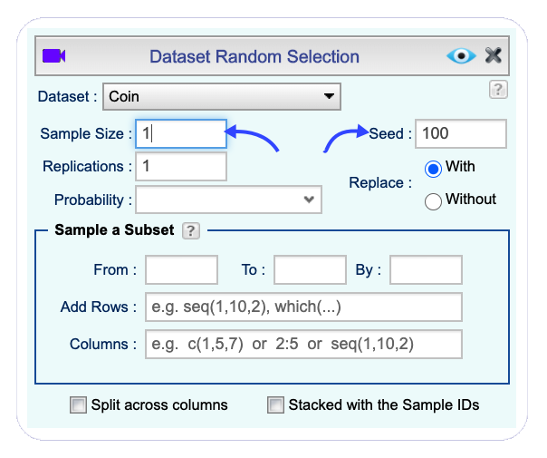
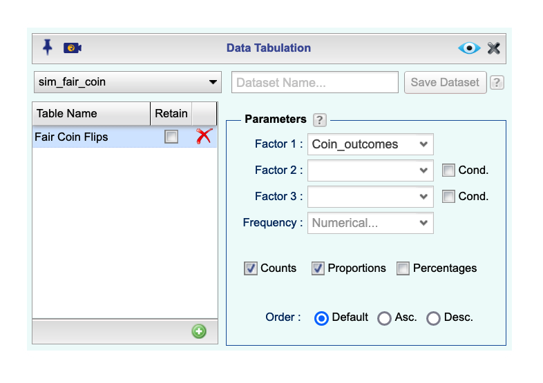
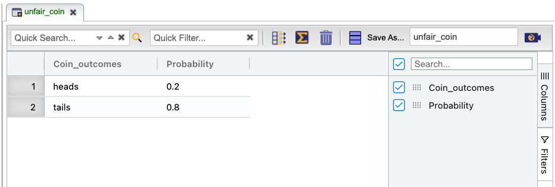
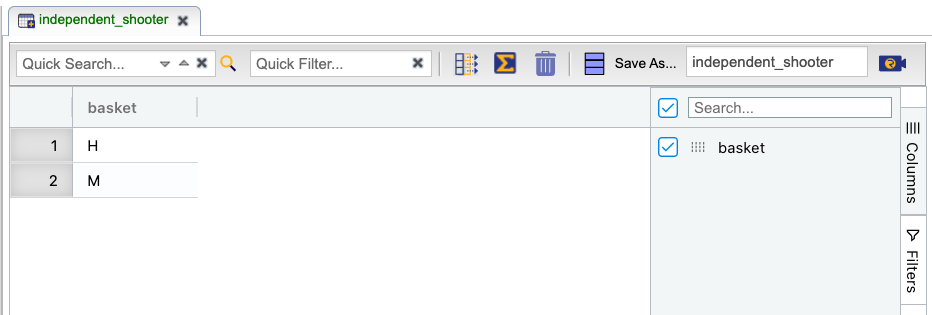

```{r global-options, include=FALSE}
knitr::opts_chunk$set(eval = TRUE, results = FALSE, message = FALSE)
```

## The Hot Hand

Basketball players who make several baskets in succession are described as 
having a *hot hand*. Fans and players have long believed in the hot hand 
phenomenon, which refutes the assumption that each shot is independent of the 
next. However, [a 1985 paper](http://www.sciencedirect.com/science/article/pii/0010028585900106) by Gilovich, Vallone, and Tversky collected evidence
that contradicted this belief and showed that successive shots are independent 
events. This paper started a great controversy that continues to this day, as you can 
see by Googling *hot hand basketball*.

We do not expect to resolve this controversy today. However, in this lab we'll 
apply one approach to answering questions like this. The goals for this lab are 
to (1) think about the effects of independent and dependent events, (2) learn 
how to simulate shooting streaks in R, and (3) to compare a simulation to actual
data in order to determine if the hot hand phenomenon appears to be real.

## Getting Started


### Data

Your investigation will focus on the performance of one player: [Kobe Bryant](https://en.wikipedia.org/wiki/Kobe_Bryant) of the Los Angeles Lakers. 
His performance against the Orlando Magic in the [2009 NBA Finals](https://en.wikipedia.org/wiki/2009_NBA_Finals) earned him the title *Most Valuable Player* and many spectators commented on how he appeared to show a hot hand. The data file we'll use is called *kobe_basket*. Import this dataset from the `OpenIntro` **Dataset Repository**  into your Rguroo environment (see figure below). After importing the dataset, the name *kobe_basket* appears in the **Data** toolbox. Double-click on the name to view the data.

```{r kobe_basket_repository, echo=FALSE, results="asis" , fig.align = "center", fig.cap = "*Importing the kobe_basket data from the OpenIntro Dataset Repository*", out.width="80%"}

```

This data frame contains 133 observations and 6 variables, where every
row records a shot taken by Kobe Bryant. The *shot* variable in this dataset
indicates whether the shot was a hit (`H`) or a miss (`M`).

Just looking at the string of hits and misses, it can be difficult to gauge 
whether or not it seems like Kobe was shooting with a hot hand. One way we can 
approach this is by considering the belief that hot hand shooters tend to go on 
shooting streaks. For this lab, we define the length of a shooting streak to be 
the *number of consecutive baskets made until a miss occurs*.

For example, in Game 1 Kobe had the following sequence of hits and misses from 
his nine shot attempts in the first quarter:

\[ \textrm{H M | M | H H M | M | M | M} \]

You can verify this by viewing the first 9 rows of the data in the data viewer.

Within the nine shot attempts, there are six streaks, which are separated by a 
"|" above. Their lengths are one, zero, two, zero, zero, zero (in order of 
occurrence).

1.  What does a streak length of 1 mean, i.e. how many hits and misses are in a 
    streak of 1? What about a streak length of 0?

Counting streak lengths manually for all 133 shots would get tedious, so we ask Rguroo to compute the streak lengths. For this lab, you can get the streak lengths in one of the two ways: (1) Upload the dataset *kobe_streak* from Rguroo's `Open Intro` dataset repository; this includes the streak lengths. (2) you can apply an R function, called `calc_streak`, in the **Transform** function to calculate the streak lengths from the *kobe_basket* dataset. We refer to these as Method 1 and Method 2, respectively. 

#### Method 1: Getting streak lengths from data repository {#method-1}

The dataset `kobe_streak` in the *Open Intro* dataset repository contains computed values of the streak lengths. This dataset has 76 rows, and one variable also named *kobe_streak*. Import this dataset from the Rguroo repository the same way that you imported the *kobe_basket* file above. If you like to know what an R code looks like for computing the streak lengths, read Method 2. Otherwise, skip to the section "Now that we have the Kobe Streak lengths."

#### Method 2: Computing streaks from the data {#method-2}

To compute the length of the streaks from the `kobe_basket` dataset, we run the R code below in the **Transform** function.

```{r, eval = FALSE, attr.source='.numberLines' }
# A function that calculates streaks
calc_streak <- function (x) {
    if (!is.atomic(x)) 
        x <- x[, 1]
    y <- rep(0, length(x))
    y[x == "H"] <- 1
    y <- c(0, y, 0)
    wz <- which(y == 0)
    streak <- diff(wz) - 1
    return(streak)
}
# Apply the function
calc_streak(basket)
```

In the R code above, line number 1, which starts with `#`, is a comment and not part of the program. In the R language, lines that begin with this symbol are for adding comments to the program. Lines 2 through 11 define a function named `calc_streak`; its name is specified on line 2. Understanding this code requires knowledge of the R language and the logic used to obtain the result. When you run this code in Rguroo, you can use the `calc_streak` function to compute streak lengths of "H" for any vector consisting of a sequence of "H" and "M" values.

The variable *basket* in the dataset *kobe_basket* consists of "H" and "M" values. Line 13 shows how you can apply the function `calc_streak` to the variable *basket* to obtain a vector comprising the streak lengths of "H" in the *basket* variable.

To use the above code in Rguroo's **Transform** function, go to the **Data** toolbox, and in the **Functions** dropdown select **Transform**. The **Transform** dialog box opens. Select the dataset *kobe_basket* from the `Dataset` dropdown, and click the plus sign  to create a new `Transform`. A `Transform` in Rguroo consists of a new variable and the set of R code that you write to create it. On the left column, name your variable `kobe_streak` and copy and paste the above R code in the center panel of the `Transformation` function dialog, as shown below. You will notice that the variable *kobe_streak* gets added to the top  of the `Returned Variable` column on the right. We only like to retain the streak lengths, so drag all other variables to the lower panel labeled `Excluded Variable`. Click the `Preview` button , and you will see a dataset with the *kobe_streak* variable only. **Save** the dataset as *kobe_streak*. 

```{r kobe_streak_transform, echo=FALSE, results="asis" , fig.align = "center", fig.cap = "*Using Rguroo's Transform function to compute streak lengths*", out.width="90%"}

```

<div id="boxedtext">
**Details of kobe_streak dataset: ** The *kobe_streak* variable that you obtained using the `Transform` function consists of 76 values, but 133 rows. Rows 77 to 133 are *NA*'s, denoting missing values. This is because the *kobe_streak* variable was an addition to the *kobe_basket* dataset, which had 133 rows. In the Rguroo's **Subset** function, select the *kobe_streak* `Dataset` and use the `Sequence` option with the sequence `1:76` to retain only the first 76 rows and remove the *NA*'s.
</div>

#### Now that we have the Kobe Streak lengths!

From this point on, when we refer to the *kobe_streak* dataset, we refer to the dataset with 76 rows, regardless of whether you used Method 1 or Method 2 to obtain it.


Now let's take a look at the distribution of these streak lengths by looking at a barplot of the streak lengths.

To create the barplot, in the **Plots** toolbox of Rguroo, select **Create Plot** and click on **Barplot**. The **Barplot** dialog box, shown below, opens. This dialog box has two tabs labeled `Categorical` and `Numerical`. These tabs are used to draw barplots for categorical and numerical variables, respectively. Since the variable *kobe_streak* is numerical, we choose the `Numerical` tab. Then, select the *kobe_streak* `Dataset`; you will see that the variable *kobe_streak* appears in the list box below the `Dataset` dropdown. Move this variable to the `Selected` column on the right. Finally, from the `Function` dropdown on the right, select the option *Counts*. Click the `Preview` button  to see a barplot of the streak lengths. If you select the `Value Labels` option, you will see the counts of each streak length on top of each bar.

```{r barplot_kobe_streak_lengths, echo=FALSE, results="asis" , fig.align = "center", fig.cap = "*Barplot dialog box to get a plot of Kobe streak lengths*", out.width="80%"}

```


1.  Describe the distribution of Kobe's streak lengths from the 2009 NBA finals. 
    What was his typical streak length? How long was his longest streak of 
    baskets? Make sure to accompanying the barplot in your answer.

## Compared to What?

We've shown that Kobe had some long shooting streaks, but are they long enough 
to support the belief that he had a hot hand? What can we compare them to?

To answer these questions, let's return to the idea of *independence*. Two 
processes are independent if the outcome of one process doesn't effect the outcome 
of the second. If each shot that a player takes is an independent process, 
having made or missed your first shot will not affect the probability that you
will make or miss your second shot.

A shooter with a hot hand will have shots that are *not* independent of one 
another. Specifically, if the shooter makes his first shot, the hot hand model 
says he will have a *higher* probability of making his second shot.

Let's suppose for a moment that the hot hand model is valid for Kobe. During his
career, the percentage of time Kobe makes a basket (i.e. his shooting 
percentage) is about 45%, or in probability notation,

\[ P(\textrm{shot 1 = H}) = 0.45 \]

If he makes the first shot and has a hot hand (*not* independent shots), then 
the probability that he makes his second shot would go up to, let's say, 60%,

\[ P(\textrm{shot 2 = H} \, | \, \textrm{shot 1 = H}) = 0.60 \]

As a result of these increased probabilites, you'd expect Kobe to have longer 
streaks. Compare this to the skeptical perspective where Kobe does *not* have a
hot hand, where each shot is independent of the next. If he hit his first shot,
the probability that he makes the second is still 0.45.

\[ P(\textrm{shot 2 = H} \, | \, \textrm{shot 1 = H}) = 0.45 \]

In other words, making the first shot did nothing to effect the probability that
he'd make his second shot. If Kobe's shots are independent, then he'd have the 
same probability of hitting every shot regardless of his past shots: 45%.

Now that we've phrased the situation in terms of independent shots, let's return
to the question: how do we tell if Kobe's shooting streaks are long enough to 
indicate that he has a hot hand? We can compare his streak lengths to someone
without a hot hand: an independent shooter. 

## Simulations in Rguroo

While we don't have any data from a shooter we know to have independent shots, 
that sort of data is very easy to simulate in Rguroo. In a simulation, you set the 
ground rules of a random process and then the computer uses random numbers to 
generate an outcome that adheres to those rules. 

As a simple example, you can simulate flipping a fair coin using the **Random Selection** function in the **Probability-Simulation** toolbox of Rguroo. 

First, open Rguroo's data editor by selecting **Create New Dataset** in the **Data** toolbox. In the data editor, create the variable *coin_outcomes* with two values of "heads" and "tails." To add variables click `Add Column`   and to add rows click *Add Row* . Save this dataset with the name *Coin*, as shown below. The variable *coin_outcomes* can be thought of as a hat with two slips of paper in it: 
one slip says *heads* and the other says *tails*. 

```{r coin_data_editor, echo=FALSE, results="asis" , fig.align = "center", fig.cap = "*Rguroo data editor to create the Coin dataset*", out.width="80%"}

```

You can now use Rguroo's **Random Selection** function to select one of the two choices ("heads" or "tails") at random from the variable *Coin_outcomes*. This is like drawing one slip randomly from the hat. The figure below shows the **Random Selection** dialog box. Choose the `Dataset` *Coin* from which we want to draw randomly. Type in the `Sample Size` box the number *1*, to ask for a single draw. Click the `Preview` button . Did Rguroo draw heads or tails?


```{r coin_random_selection_1, echo=FALSE, results="asis" , fig.align = "center", fig.cap = "*Random Selection function dialog to flip a coin*", out.width="60%"}

```

Click the `Preview` button  again. You will see a message that reads "*Nothing has been changed. Do you want to continue?*" Select the option `Preview anyway` and see what you get: heads or tails? Repeat this several times. Do you see any change in the result?

<div id="boxedtext">
**What is a seed? ** A computer program uses an algorithm to generates random values. These algorithms use a number to initialize the number generator called [*Random Seed*](https://en.wikipedia.org/wiki/Random_seed). Setting a seed will cause Rguroo to select the same sample each time you preview the result.  This will ensure your results don't change each time you preview, and it will also ensure the reproducibility of your work (by setting the same seed, it will be possible to reproduce your results). In Rguroo, the default seed, shown in the `Seed` text box, is 100. This number is completely arbitrary. If you need inspiration, you can use your
ID, birthday, or just a random string of numbers. Every time you change the seed, Rguroo will generate different value(s), although, in the fair coin example, there is a 50% chance that two seeds lead to the same result. If you clear the seed from the `Seed` text box in Rguroo, then you would generate a new random pick with every preview.
</div>

To open and close the **Random Selection** dialog box, click on the  button. Clear the number 100 from the `Seed` text box and click the `Preview` button  several times. Each time, you will see a message that reads, "*Nothing has been changed. Do you want to continue?*" Select the option `Preview anyway`. Just like when flipping a 
coin, sometimes you'll get a heads, sometimes you'll get a tails, but in the 
long run, you'd expect to get roughly equal numbers of each.

If you wanted to simulate flipping a fair coin 100 times, you simply type in *100* in the `Sample Size` text box. Make sure that you choose the option `With` for `Replace`. This tells Rguroo to do sampling with replacement. In essence, this option indicates that we put the slip of paper back in the hat before drawing again. (If you choose `Without` instead, Rguroo will run out of options to pick after it's picked `heads` once and `tails` once, and you will get an error message.)

The result of the 100 flips will appear in the Rguroo **Data Viewer**. The figure below shows 10 rows of the result in the **Data Viewer**. 

```{r sim_fair_coin, echo=FALSE, results="asis" , fig.align = "center", fig.cap = "*A subset of 100 coin outcomes shown in the Data Viewer*", out.width="85%"}

```

You see two text boxes labeled **Save As ...** and **Save Dataset As ...** on top of the **Data Viewer**. These are used to save your work. The **Save As ...** option saves all the parameters of the dialog box. Type *sim_fair_coin* in that box, and click the **Save As ...** button. The name *sim_fair_coin* appears in the **Probability-Simulation** toolbox. If you sign out of Rguroo, or close your simulation tab, by double-clicking on this name, you will get back the dialog box that you were working on along with the data that you generated. 

Now, in the text box next to **Save Dataset As ...**, type in  *sim_fair_coin*, and click the **Save Dataset As ...** button. This will save the dataset containing the  *coin_outcomes* variable as an independent dataset in the **Data** toolbox. The  *sim_fair_coin* dataset can now be used in all functions of Rguroo.

You can tabulate the results of your simulation in Rguroo. Go to the **Analytics** toolbox, and in the **Analysis** dropdown, select **Tabulation** to open the **Data Tabulation** dialog box shown below.

```{r tabulate_fair_coin, echo=FALSE, results="asis" , fig.align = "center", fig.cap = "*Tabulation dialog to tabulate the result of the fair coin simlation*", out.width="75%"}

```

Select the `Dataset` *sim_fair_coin*. Click on `Add Table`, and type in a  name like *Fair Coin Flips*. In the `Parameters` toolbox of the dialog, choose *Coin_outcomes* from the `Factor 1` dropdown to tabulate this variable's values. Also, check `Totals` and `Proportions`, and click the `Preview` button . You will see two tables that show the number of heads and tails and the proportion of heads and tails that your simulation resulted in.

Since there are only two elements in *coin_outcomes*, the probability that we "flip" 
a coin and it lands heads is 0.5. Say we're trying to simulate an unfair coin 
that we know only lands heads 20% of the time. To simulate this unfair coin, we add a "Probability" column to the *Coin* dataset, which provides a vector of the two probability weights. To do so, right-click on the *Coin* dataset name and select **Edit**. In Rguroo data editor, add probabilities 0.2 and 0.8 corresponding to heads and tails, as shown in the figure below. Then **Save** the new dataset with the name *unfair_coin*.

```{r unfair_coin, echo=FALSE, results="asis" , fig.align = "center", fig.cap = "*Adding a probability column to simulate an unfair coin*", out.width="75%"}

```

Now, open the **Random Selection** dialog box and select the `Dataset` *unfair_coin*. This time we chose the seed "32658" arbitrarily. You can choose a seed of your own. Also, in the `Probability` dropdown, we select the *Probability* column that we added to the *unfair_coin* dataset. This ensures that heads is selected with probability 0.2, and tails is selected with probability 0.8. One more detail: in the section `Sample a subset`, type in the number 1 for `Columns`, as shown in the figure below. This is because the dataset *unfair_coin* has two columns of *Coin_outcome* and *Probability*, and we want to only to sample the first column, which is *Coin_outcome*.

```{r unfair_coin_random_selection, echo=FALSE, results="asis" , fig.align = "center", fig.cap = "*Simulating an unfair coin*", out.width="75%"}

```

Another way of thinking about this simulation is to 
think of the outcome space as a bag of 10 chips, where 2 chips are labeled 
"head" and 8 chips "tail". Therefore at each draw, the probability of drawing a 
chip that says "head"" is 20%, and "tail" is 80%.

1.  In your simulation of flipping the unfair coin 100 times, how many flips 
    came up heads? Include a screenshot of the dialog box that you use for the simulation and tabulation. Also give a screenshot of the first 20 flips and the results from the **Tabulation** function. Also, "set a seed, different than the one we used " **before** you sample. 

In a sense, we've shrunken the size of the slip of paper that says "heads", 
making it less likely to be drawn, and we've increased the size of the slip of 
paper saying "tails", making it more likely to be drawn. When you simulated the 
fair coin, both slips of paper were the same size. This happens by default if 
you don't provide a variable for `Probability` in the **Random Selection** dialog; without specifying `Probability`, all elements in the *outcomes* vector have 
an equal probability of being drawn.

If you want to learn more about the **Random Selection** function  or any other function, recall that you can always check out [Rguroo's User's Guide](https://rguroo.com/latest_userguide.pdf) or watch [Rguroo's video tutorials](https://rguroo.com/video-tutorials).

## Simulating the Independent Shooter

Simulating a basketball player who has independent shots uses the same mechanism 
that you used to simulate a coin flip. To simulate a single shot from an 
independent shooter with a shooting percentage of 50%, you make a dataset, call it *basket*, consisting of two values "H" and "M", representing a basket hit and basket missed.  Then you use this dataset in Rguroo's **Random Selection** function, as shown below.

```{r basket_data_editor, echo=FALSE, results="asis", fig.align = "center", fig.cap = "*Rguroo data editor to create the basket dataset*", out.width="80%"}

```

```{r basket_random_selection, echo=FALSE, results="asis", fig.align = "center", fig.cap = "*Random selection function dialog to simulate 100 shots with 50% success*", out.width="70%"}
knitr::include_graphics("img/basket_random_selection.png")
```

To make a valid comparison between Kobe and your simulated independent shooter, 
you need to align both their shooting percentage and the number of attempted shots.

1.  Create a new dataset, called *independent_kobe*, using the **Data Editor**. This dataset should have two variables, *basket* and *Probability*, with values reflecting a shooting percentage of 45%. Show a screenshot of the dataset you created.

1. Now, use the *independent_kobe* dataset to run a simulation to sample 133 shots. Show a  screenshot of the **Random Selection** dialog that you use.  Save the output of this simulation in a dataset called *sim_basket*.

With the results of the simulation saved as *sim_basket*, you now have the data 
necessary to compare Kobe to our independent shooter.

Both data sets represent the results of 133 shot attempts, each with the same 
shooting percentage of 45%. We know that our simulated data is from a shooter 
that has independent shots. That is, we know the simulated shooter does not have
a hot hand.

* * *

## More Practice

### Comparing Kobe Bryant to the Independent Shooter

1.  Using the `calc_streak` streak function in Rguroo's **Transform** function, compute the streak lengths of the variable *basket* in your *sim_basket* data frame, and save the results in a data frame called *sim_streak*. **Hint:** Use [Method 2](#method-2).

1.  Describe the distribution of streak lengths. What is the typical streak 
    length for this simulated independent shooter with a 45% shooting percentage?
    How long is the player's longest streak of baskets in 133 shots? Make sure
    to include a plot in your answer.

1.  If you were to run the simulation of the independent shooter a second time, 
    how would you expect its streak distribution to compare to the distribution 
    from the question above? Exactly the same? Somewhat similar? Totally 
    different? Explain your reasoning.

1.  How does Kobe Bryant's distribution of streak lengths compare to the 
    distribution of streak lengths for the simulated shooter? Using this 
    comparison, do you have evidence that the hot hand model fits Kobe's 
    shooting patterns? Explain.

* * *

<a rel="license" href="http://creativecommons.org/licenses/by-sa/4.0/"></a><br />This work is licensed under a <a rel="license" href="http://creativecommons.org/licenses/by-sa/4.0/">Creative Commons Attribution-ShareAlike 4.0 International License</a>. Rguroo.com, the Rguroo.com logo, and all other trademarks, service marks, graphics and logos used in connection with Rguroo.com or the Website are trademarks or registered trademarks of Soflytics Corp. in the USA and other countries and are not included under the CC-BY-SA license.
