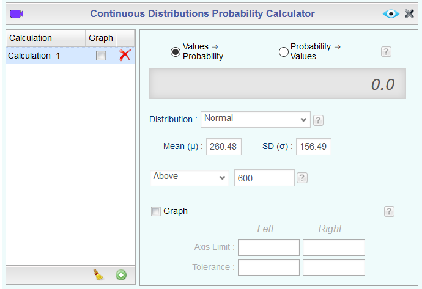

```{r echo = FALSE}
knitr::opts_chunk$set(eval = TRUE, results = FALSE, message = FALSE)
```

In this lab, you'll investigate the probability distribution that is most central
to statistics: the normal distribution.  If you are confident that your data are 
nearly normal, that opens the door to many powerful statistical methods.  Here 
we'll use Rguroo to assess the normality of our data and also 
generate random numbers from a normal distribution.

## Getting Started

### The data

This week you'll be working with fast food data.  This data set contains data on
515 menu items from some of the most popular fast food restaurants worldwide.

As usual, find the dataset in the Repository, view the codebook, and then import the dataset to your Data section. Then, view the `Dataset Summary` and the first 100 rows and 15 columns of the dataset.

You'll see that for every observation there are 17 measurements, many of which are
nutritional facts.

You'll be focusing on just three columns to get started: restaurant, calories, 
calories from fat.

Let's first focus on just products from McDonalds and Dairy Queen. To do this, we'll need to use the Rguroo Subset dialog. In the Data sections, select Functions, then Subset. In the dialog that pops up, select your Dataset, then find the `Logical Expression` button and click it.

We'll need to include two logical expressions, one to select the McDonalds restaurants and one to select Dairy Queen. In the Logical Expression section, click the `+` button to add a new logical expression, then create the expression to select McDonalds restaurants using the dropdown menus.

```{r male-female, echo = FALSE, results = "asis"}


```

Once everything is set up correctly, click Done and view the output. Save the new dataset as `mcdonalds`. Repeat the Subset steps for Dairy Queen and save that dataset as `dairyqueen`.

1.  Make plots to visualize the distributions of the amount of calories
from fat (variable `cal_fat`) of the options from these two restaurants.  How do their centers, shapes,
and spreads compare?

## The normal distribution

In your description of the distributions, did you use words like *bell-shaped* 
or *normal*?  It's tempting to say so when faced with a unimodal symmetric 
distribution.

To see how accurate that description is, you can plot a normal distribution curve 
on top of a histogram to see how closely the data follow a normal distribution. 
This normal curve should have the same mean and standard deviation as the data. 

In Rguroo, this can be done by opening the  menu for the histogram and, in the Smoothing section, checking the `Normal` box. The screenshot below shows this for the `dairyqueen` dataset.

```{r normal curve, echo = FALSE, results = "asis"}

```

Strictly speaking, the normal distribution curve should display a normal probability density function that has area under the curve of 1. However, Rguroo scales this curve to an appropriate height on the y-axis.

If this is annoying to you, you can reopen the  menu and change the `Type` option from `Frequency` to `Density`. The difference between a 
frequency histogram and a density histogram is that while in a frequency 
histogram the *heights* of the bars add up to the total number of observations, 
in a density histogram the *areas* of the bars add up to 1. The area of each bar
can be calculated as simply the height *times* the width of the bar. Frequency and density histograms both display the
same exact shape; they only differ in their y-axis. You should not see any obvious difference just looking at your new histogram.

The default option for the normal curve is a solid red line. To change attributes of the line, open the `Details` dialog, select the `Bins, Bars, Smoothing` menu and `Normal` tab, then change the attributes of the line. In the screenshot below we have changed the line to be dotted and black.

```{r normal curve details, echo = FALSE, results = "asis"}
knitr::include_graphics("img/normalcurve1-2.png")
```

2.  Based on the this plot, does it appear that the data follow a nearly normal 
    distribution?

## Evaluating the normal distribution

Eyeballing the shape of the histogram is one way to determine if the data appear
to be nearly normally distributed, but it can be frustrating to decide just how 
close the histogram is to the curve, especially if the shape noticeably changes when you choose a different set of bins! An alternative approach involves 
constructing a normal probability plot, also called a normal Q-Q plot for 
"quantile-quantile".

This plot is not part of the Plots section in Rguroo; instead, we will have to go to the Analytics section. In Analytics, click the Analysis button and find Mean Inference -> One Population. As usual, select the Dataset and Variable to be plotted. Then, check the `Normal Probability Plot` box and View the output.

```{r qq, echo = FALSE, results = "asis"}


```

The x-axis values correspond to the quantiles of a theoretically normal curve 
with mean 0 and standard deviation 1 (i.e., the standard normal distribution).  The 
y-axis values correspond to the quantiles of the original unstandardized sample 
data. However, even if we were to standardize the sample data values, the Q-Q
plot would look identical. A data set that is nearly normal will result in a
probability plot where the points closely follow a diagonal line.  Any deviations
from normality leads to deviations of these points from that line.

The plot for Dairy Queen's calories from fat shows points that tend to follow the
line but with some errant points towards the upper tail.  You're left with the same
problem that we encountered with the histogram above: how close is close enough and how far is too far?

A useful way to address this question is to rephrase it as: what do probability 
plots look like for data that I *know* came from a normal distribution?  We can 
answer this by simulating data from a normal distribution.

As you might expect, you'll need to go to the Probability-Simulation section for this. In that section, click Probability and then Random Generator. The default distribution is Normal, but with mean 0 and standard deviation 1. If you go back to the tab with the normal probability plot, you should see a summary with the sample size, mean and standard deviation of `cal_fat` for the `dairyqueen` dataset. Fill in those values in the appropriate places in the `Random Number Generator` dialog, then View the output.

```{r sim-norm, echo=FALSE, results = "asis"}

```

Save the dataset as `sim_norm`. Note that in Rguroo there are two `Save As` text boxes. The left box allows you to save the dialog that created the dataset to your Probability-Simulation section (for example, to use as a template any time you need to generate random numbers from a normal distribution). The right dialog box allows you to save the result as a dataset. We want to save the dataset, though it's not a bad idea to also save the dialog as well.

3.  Make a normal probability plot of `sim_norm`. Note that the default variable name (which cannot be changed) is `Sample`.  Do all of the points fall on 
    the line?  How does this plot compare to the probability plot for the real 
    data?

***I don't think we can do this in Rguroo. We need to figure out an alternative.***

Even better than comparing the original plot to a single plot generated from a 
normal distribution is to compare it to many more plots using the following 
function. It shows the Q-Q plot corresponding to the original data in the top
left corner, and the Q-Q plots of 8 different simulated normal data.  It may be
helpful to click the zoom button in the plot window.

```{r qqnormsim, eval = FALSE}
qqnormsim(sample = cal_fat, data = dairy_queen)
```

4.  Does the normal probability plot for the calories from fat look similar to the plots 
    created for the simulated data?  That is, do the plots provide evidence that the
    female heights are nearly normal?

5.  Using the same technique, determine whether or not the calories from McDonald's
    menu appear to come from a normal distribution.

## Normal probabilities

Okay, so now you have a slew of tools to judge whether or not a variable is 
normally distributed.  Why should you care?

It turns out that statisticians know a lot about the normal distribution.  Once 
you decide that a random variable is approximately normal, you can answer all 
sorts of questions about that variable related to probability.  Take, for 
example, the question of, "What is the probability that a randomly chosen Dairy 
Queen product has more than 600 calories from fat?"

If we assume that the calories from fat from Dairy Queen's menu are normally 
distributed (a very close approximation is also okay), we can find this probability
by calculating a Z score and consulting a Z table (also called a normal probability
table).  This is tedious to do by hand, so most statistical software (including Rguroo) has automated the process.

In the Probability-Simulation section, click Probability, then find Probability Calculator -> Continuous. Again, the default distribution is normal, so we don't have to change the Distribution, but we should change the Mean and Standard Deviation to their values for the `dairyqueen` dataset. Finally, we should tell Rguroo that we want the probability that a Dairy Queen item has `Above 600` calories from fat:

```{r pnorm, echo=FALSE, results = "asis"}

```

You can also see how the probability corresponds to the area under the normal density curve by checking the `Graph` box and Viewing the output.

```{r pnorm 2, echo=FALSE, results = "asis"}
knitr::include_graphics("img/normalcalc1-output.png")
```

Assuming a normal distribution has allowed us to calculate a theoretical 
probability.  If we want to calculate the probability empirically, we simply 
need to determine how many observations fall above 600 then divide this number 
by the total sample size.

There are a variety of ways to do this in Rguroo. Probably the easiest way to do this is with the `Transform` dialog. Note that here we add logical variables. Rguroo interprets TRUE as 1 and FALSE as 0, so this is essentially counting the number of Dairy Queen items with more than 600 calories, and dividing the result by the number of Dairy Queen items with at least 0 calories (i.e., all of them). One strange thing about the result is that the probability will be shown in every row of the output.

```{r probability, echo=FALSE, results = "asis"}

```

Although the probabilities are not exactly the same, they are reasonably close. 
The closer that your distribution is to being normal, the more accurate the 
theoretical probabilities will be.

6.  Write out two probability questions that you would like to answer about any 
    of the restaurants in this dataset.  Calculate those probabilities using both
    the theoretical normal distribution as well as the empirical distribution 
    (four probabilities in all).  Which one had a closer agreement between the 
    two methods?

* * *

## More Practice

***Have to think about how to get multiple normal probability plots in Rguroo.***

7.  Now let's consider some of the other variables in the dataset.  Out of all the
    different restaurants, which ones' distribution is the closest to normal for sodium?
   
8.  Note that some of the normal probability plots for sodium distributions seem
    to have a stepwise pattern. why do you think this might be the case?

9.  As you can see, normal probability plots can be used both to assess 
    normality and visualize skewness.  Make a normal probability plot for the total
    carbohydrates from a restaurant of your choice.  Based on this normal 
    probability plot, is this variable left skewed, symmetric, or right skewed?  
    Use a histogram to confirm your findings.


* * *

<a rel="license" href="http://creativecommons.org/licenses/by-sa/4.0/"></a><br />This work is licensed under a <a rel="license" href="http://creativecommons.org/licenses/by-sa/4.0/">Creative Commons Attribution-ShareAlike 4.0 International License</a>.
