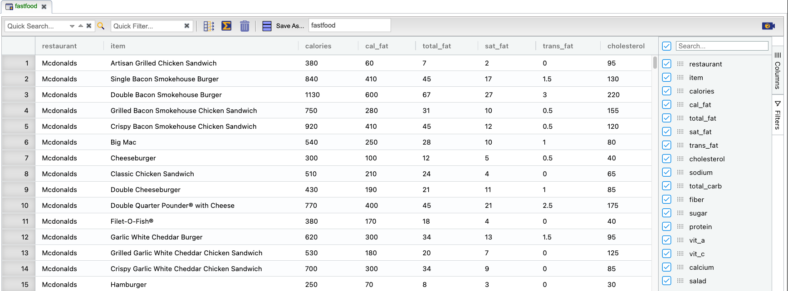
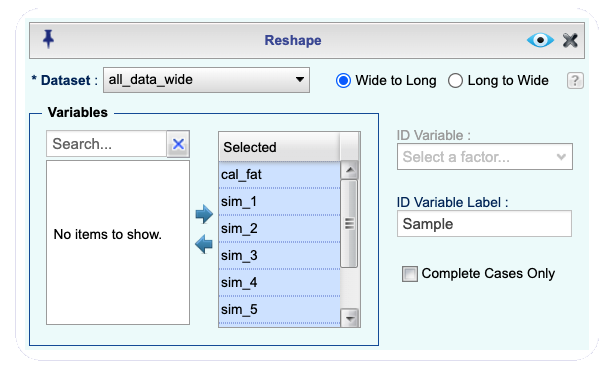
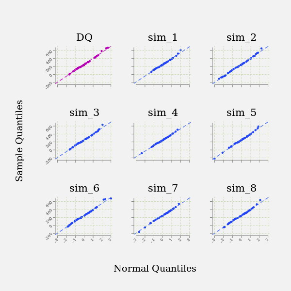
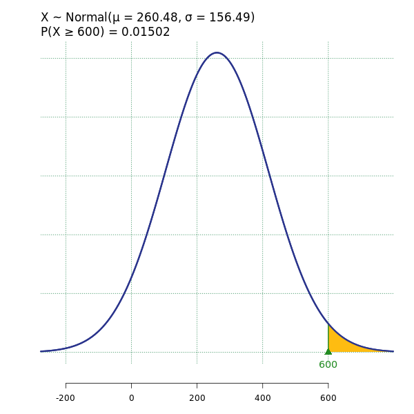

```{r echo = FALSE}
knitr::opts_chunk$set(eval = TRUE, results = FALSE, message = FALSE)
```

In this lab, you'll investigate the probability distribution that is most central
to statistics: the normal distribution.  If you are confident that your data are 
nearly normal, that opens the door to many powerful statistical methods.  Here 
we'll use Rguroo to assess the normality of our data and also 
generate random numbers from a normal distribution.

## Getting Started

### The data

This week you'll be working with fast food data.  This data set contains data on
515 menu items from some of the most popular fast food restaurants worldwide.

As usual, find the *fastfood* dataset in the `OpenIntro` Repository, view the information about the dataset by clicking , and then import the dataset to your **Data** toolbox. Then, view the **Dataset Summary** and **View** the data in Rguroo's Data Viewer.

```{r fastfood_data_view, echo=FALSE, results="asis" , fig.align = "center", fig.cap = "*A portion of the fast food dataset*", out.width="90%"}

```

You'll see that for every observation there are 17 measurements, many of which are
nutritional facts.

You'll be focusing on just three columns to get started: *restaurant*, *calories*, and 
*calories from fat*.

Let's first visualize the distribution of the variable `calories` using a histogram. In the **Plots** toolbox, open the **Create Plot** dropdown and select **Histogram**. The Histogram dialog box opens. You can open and close this dialog box by clicking on the  button. In that dialog, select the `Dataset` *fastfood* and the `Variable` *calories*. Click the `Preview` button , and you will see the histogram of calories for all the restaurants.

How can we get a histogram of calories for each restaurant separately? The variable `restaurant` in the `fastfood` data set is a *factor* variable with 8 levels (i.e. eight restaurant names). Note that "categorical" variables in Rguroo are referred to as "factors". To create a histogram of calories for each level of the variable *calories*,  in the `Plot By Group` section of the Histogram dialog box, select *restaurant* in the `Factor` dropdown (see figure below). If we click the `Preview` button , we will see a histogram for each level of the variable restaurant, that is, for each of the 8 restaurants.

```{r hist_calories_each_level, echo=FALSE, results="asis" , fig.align = "center", fig.cap = "*Creating histograms of calories for each level of the variable restaurant*", out.width="75%"}

```

Now, let's focus on just products from McDonald's and Dairy Queen. How can we get a histogram of calories for McDonald's only? To do this, Rguroo needs to ignore all levels of the variable *restaurant* except *Mcdonalds*. This can be done in Rguroo's **Factor Level Editor**. To open the Factor Level Editor, 
click on the  button. The **Factor Level Editor** is shown in the figure below. It consists of three columns. The first column lists the names of the factor (categorical) variables in the selected dataset. When you select a factor from that list, its levels show in the middle column, under the column labeled `Level`. Note that there is a `Dropped Level` list at the bottom of the middle column. To omit the plotting of a level, you move that level to the `Dropped Level` list. So, if we want to have a histogram for McDonald's only, we drag the name of all levels, except for McDonald's, to the `Dropped Level` list. Try this, and click the `Preview` button  to see the calories for McDonald's only.

```{r hist_fle, echo=FALSE, results="asis" , fig.align = "center", fig.cap = "*The Factor Level Editor*", out.width="85%"}

```


1.  Make plots to visualize the distributions of the amount of calories
from fat (variable *cal_fat*) of the options for McDonald's and Dairy Queen restaurants.  How do their centers, shapes,
and spreads compare? Make individual histograms for each restaurant. Then ask Rguroo to plot a histogram for McDonald's and Dairy Queen simultaneously (in this case, try the option `Uniform x-limit` in the `Plot by Group` section.).  

<div id="boxedtext">
**More about the Factor Level Editor: ** The **Factor Level Editor** in Rguroo is used to control levels of a factor, including dropping levels, reordering levels, and setting properties for each level. In all Rguroo plots, you can relabel factor levels and select colors for each of the levels. In some plots, you can set more specific properties for each level. For example, in the **Histogram** function, you can set the bin locations and their widths for each factor level.
</div>

## The normal distribution

In your description of the distributions, did you use words like *bell-shaped* 
or *normal*?  It's tempting to say so when faced with a unimodal symmetric 
distribution.

To see how accurate that description is, you can plot a normal distribution curve 
on top of a histogram to see how closely the data follow a normal distribution. 
This normal curve should have the same mean and standard deviation as the data. 

In Rguroo, this can be done by clicking  and, in the `Smoothing` section, checking the `Normal` box. The screenshot below shows this for the *fastfood* dataset. In the **Plot by Group** section, we have selected the factor variable *restaurant*, so we will get one histogram for each level of the factor *restaurant* that is not dropped in the **Factor Level Editor**. Finally, in the **smoothing** section, we have selected the `Normal` checkbox to superimpose a normal curve on top of each of the histograms.

```{r hist_calories_each_level_with_normal, echo = FALSE, results = "asis", fig.align = "center", fig.cap = "*Superimposing a normal density curve on a histogram*", out.width="75%"}

```

<div id="boxedtext">
**Types of Histogram: ** In the `Type` section of the Histogram dialog box, you have three options: `Frequency`, `Relative Frequency`, and `Density`. The `Frequency` option displays the raw counts of values of the selected variable in each interval (bin), and therefore the *heights* of the bars add up to the total number of observations. The `Relative Frequency` option displays the proportion of the observations in each bin, and the `Density` option rescales the y-axis so that the total area under the bars sums to 1. The area of each bar
can be calculated as simply the height *times* the width of the bar. Frequency and density histograms both display the
same shape; they only differ in their y-axis scale.
</div>

Strictly speaking, the normal distribution curve should display a normal probability density function that has an area under the curve of 1. If the `Density` option is not selected, when superimposing the normal curve on top of a histogram, Rguroo scales this curve to an appropriate height on the y-axis, and the area under the curve is not necessarily equal to 1. If not having an area of 1 under the normal curve is annoying to you, you can click  and change the `Type` option from `Frequency` to `Density`. You should not see any obvious difference in the shape of the distribution by just looking at your new histogram.

The default option for the normal curve is a solid red line. To change attributes of the line, open the  dialog, select the `Bins, Bars, Smoothing` menu and `Normal` tab, then change the attributes of the line. In the screenshot below we have changed the line to be dotted and black.

```{r normal curve details, echo = FALSE, results = "asis", fig.align = "center", fig.cap = "*Customizing the normal curve superimposed on the histogram*", out.width="75%"}

```

2.  Based on your plots, does it appear that the distributions of the fat calories (variable *cal_fat*) for McDonald's and Dairy Queen restaurants follow a nearly normal distribution?

## Evaluating the normal distribution

Eyeballing the shape of the histogram is one way to determine if the data appear
to be nearly normally distributed, but it can be frustrating to decide just how 
close the histogram is to the curve, especially if the shape noticeably changes when you choose a different set of bins! An alternative approach involves 
constructing a *normal probability plot*, also called a quantile-quantile plot (Q-Q plot) for the normal distribution. 

This plot is not part of the **Plots** toolbox in Rguroo; instead, we will have to go to the **Analytics** toolbox. If you want to get a single normal probability plot for a numerical variable without involving any factors, you can select  **Mean Inference** $\rightarrow$ **One Population** and in the dialog box that opens select your `Dataset`, your `Variable`, and the option `Normal Probability Plot`. In our example, however, we want to get a normal probability plot at a specific level of the factor variable $restaurant$. 

To draw a normal probability plot for each level of the factor $restaurant$, select **Mean Inference** $\rightarrow$ **One & Two Population**. In the dialog box that opens, select the *fastfood* `Dataset`. There are two options to choose your variable(s). The first option includes `Variable 1` and `Variable 2`. You would use this option if you want to make a normal probability plot for one or two numerical variables in your dataset without considering a factor variable. In our example, we want to draw a normal probability plot for the numerical variable *cal_fat* for the level *Dairy Queen* of the factor variable *restaurant*. So, choose the second option labeled `Variable`, as shown in the figure below. Then, select *cal_fat* from the first dropdown menu, and in the `By Factor` dropdown, select *restaurant*. In the section `Population 1`, select the `Level` of the factor, namely  *Dairy Queen*, for which we want a normal probability plot. As a last step, check the box `Normal Probability Plot` that is on top of the dialog box. By clicking the `Preview` button , we get a normal probability plot for the fat calories (variable *cal_fat*) for Dairy Queen restaurants. The resulting graph is shown below.

```{r normal_probability_plot_GUI, echo = FALSE, results = "asis", fig.align = "center", fig.cap = "*Obtaining the normal probability plot*", out.width="75%"}

```

```{r normal_probability_plot, echo = FALSE, results = "asis", fig.align = "center", fig.cap = "*Data summary and normal probability plot for calories from fat for Dairy Queen menu items*", out.width="80%"}

```

The x-axis values correspond to the quantiles of a theoretically normal curve 
with mean 0 and standard deviation 1 (i.e., the standard normal distribution).  The 
y-axis values correspond to the quantiles of the original unstandardized sample 
data. However, even if we standardize the sample data values, the Q-Q
plot would look identical. Data that are nearly normal will result in a
probability plot where the points closely follow the green line shown.  Any deviation
from normality leads to deviations of the points from that line. The two red dotted lines are called 95% confidence bands. If all the points fall within these confidence bands or only a few data points fall outside of the confidence bands, then we feel comfortable that the data are normal. 

The plot for Dairy Queen's calories from fat shows points that tend to follow the
line but with some errant points towards the upper tail that fall outside of the confidence band.  You are left with the same problem we encountered with the histogram above: how many points outside the band would be considered few enough to say that our data follow a normal distribution?

A useful way to address this question is to rephrase it as: what do probability 
plots look like for data that I *know* came from a normal distribution?  We can 
answer this by simulating data from a normal distribution with the same sample size, mean, and standard deviation.

As you might expect, you'll need to go to the **Probability-Simulation** toolbox for this. But first, we need to know the sample size, mean, and standard deviation for the Dairy Queen data. You can find these values in the summary table above the normal probability plot, or you can click the  button and read the values from the `Summary` tab.

For the *cal_fat* variable of the Dairy Queen data, you should find that the sample size is 42, the sample mean is 260.48 calories, and the standard deviation is 156.49 calories. Therefore we should simulate 42 values from a normal distribution with mean 260.48 and standard deviation 156.49.

Go to the **Probability-Simulation** toolbox, select **Probability** $\rightarrow$ **Multiple Distribution Generator**. Click the  button and in the text box that appears type *sim* (or any other name). 
The default distribution, shown on the right panel, is Normal, but with mean 0 and standard deviation 1. Fill in the values that we got for *cal_fat* in the appropriate places in the **Multiple Distribution Random Generator** dialog, then click the `Preview` button  to preview the output.

```{r simulate_single, echo=FALSE, results = "asis", fig.align = "center", fig.cap = "*Simulating 42 values from a normal distribution with mean 260.48 and sd 156.49*", out.width="75%"}
knitr::include_graphics("img/simulate_single.png")
```

**Save** the dataset as *sim_norm*. Note that in Rguroo, there are two **Save As** text boxes. The left box allows you to save the dialog that created the dataset to your **Probability-Simulation** toolbox (for example, to use as a template any time you need to generate random numbers from a normal distribution). The right dialog box allows you to save the result as a dataset. We want to save the dataset, though it's not a bad idea to also save the dialog.

3.  Make a normal probability plot of the variable *sim* in the dataset *sim_norm*. It is easier in this case to use the **Mean Inference** $\rightarrow$ **One Population** dialog.  Do all of the points fall on the line?  How does this plot compare to the probability plot for the real data (i.e., Dairy Queen's fat calories)?

Even better than comparing the normal probability plot of the observed data to a single normal probability plot of simulated values is to compare it to a few plots of simulated values. To do so, click  to reopen the simulation dialog, change the `Seed` for the random generator to a number you have not used before, click the `Preview` button  to get the output, **Save** the dataset as *sim_norm2*, create a normal probability plot of the *sim_norm2* dataset using the **Mean Inference** $\rightarrow$ **One Population** dialog, and copy and paste the graph to your report.

You can repeat these steps several times, but remember to save each newly simulated dataset with a new name, for example, *sim_norm3*, *sim_norm4*, etc., and make a normal probability plot of that newly simulated dataset. If you are happy with this approach, you can skip reading the next section.

4.  Does the normal probability plot for the calories from fat look similar to the plots created for the simulated data?  That is, do the plots provide evidence that the calories from fat for the Dairy Queen menu are nearly normal?

5.  Using the same technique, determine whether or not the calories from fat for the McDonald's
    menu appear to come from a normal distribution.

### Creating a graph with a few normal probability plots

This section shows how you can create a single graph that simultaneously consists of the normal probability plot for the original data and eight sets of simulated values from the normal distribution; this involves five steps. If you think this sounds too complicated, don't panic! We will explain all the steps thoroughly. The rewards you get by going through these steps are learning more about some hidden capabilities of the Rguroo functions, learning methods of manipulating data such as subsetting, merging and reshaping, and finally learning how a normal probability plot is created in Rguroo.

The five steps are as follows: 

*Step 1*: Use the **Transform** function to obtain the subset of the *fastfood* dataset that consists of only the fat calories (*cal_fat*) for Dairy Queen. 

*Step 2*:  Simulate eight samples of normal random values, simultaneously. 

*Step 3*: Use Rguroo's **Merge** function to merge the Dairy Queen data with the simulated samples. 

*Step 4*: Use the **Reshape** function to change the data from "wide" format to "long" format. 

*Step 5*: Use the **Scatterplot** function to draw the normal probability plots.

We start by explaining the last step first.

How can we make a normal probability plot for a set of observed values using the **Scatterplot** function? Take another look at the normal probability plot for the *cal_fat* variable for Dairy Queen. This is a scatterplot of the standard normal quantiles on the x-axis, and the quantiles of the original unstandardized sample data on the y-axis. Let's say that your sample data is saved in a variable named *foo*, and you want to draw a normal probability plot for these data. The R-code ```qqnorm(foo)$x``` computes the quantiles of the standard normal (the x-axis values), and ```qqnorm(foo)$y``` computes the sample quantiles of the sample *foo*. Plotting these values in a scatterplot gives you a normal probability plot. 

As an example, let's recreate the normal probability plot for the *cal_fat* variable for Dairy Queen using Rguroo's **Scatterplot** function. Open the **Scatterplot** dialog and choose the *fastfood* dataset. In the `Predictor (x)` dropdown menu type ```qqnorm(cal_fat)$x``` and in the `Response (y)` dropdown menu type ```qqnorm(cal_fat)$y```. In the `Plot by Group` section, select *restaurant* from the `Group` dropdown. The `Plot by Group` option is used to draw separate scatterplots for one or more levels of a factor variable. In this example, we want to draw a plot for only one level of the factor variable *restaurant*, namely *Dairy Queen*. To  select the level *Dairy Queen* only, click the  button, select the factor *restaurant*, and drag all of its levels except *Dairy Queen*  to the `Dropped Level` list. 

To add a straight line as a visual reference, select `LS Line` in the `Superimpose` section. The line shown on the plot is the least-squares line and is not the line that is usually superimposed on a normal probability plot. However, when the variable is normally distributed, the least-squares line and the usual line that is placed on a normal probability plat are very similar. The **Scatterplot** dialog is shown below. Click the `Preview` button  to see the graph. Does it look like the one that we had plotted before?

```{r scatterplot_single, echo=FALSE, results = "asis", fig.align = "center", fig.cap = "*Creating a normal probability plot using the Scatterplot function*", out.width="80%"}

```

<div id="boxedtext">
**Writing R functions in Scatterplot:** Ordinarily, you would choose variable names in the `Predictor (x)` and `Response (y)` boxes of the **Scatterplot** dialog. In addition to this, however, you can write R functions that result in numerical values with the restriction that the number of x-values must be equal to the number of y-values. It's important that you type in the names of the variables correctly. In R, commands and variable names are case-sensitive.
</div>

Now that we know how to create a normal probability plot in the **Scatterplot** function, let's go through the five steps.

In Step 1, we create a dataset with a single variable that consists of the fat calories for the Dairy Queen restaurants. You can use the **Subset** function to do this. But to see an alternative method, let's use the **Transform** function. From the **Data** toolbox, select the **Transform** function. Choose the `Dataset` *fastfood*, click the  button, and in the `Variable` column type in a new variable name; call it *DQ*. In the middle panel, type ```cal_fat[restaurant == "Dairy Queen"]```. This R code extracts values of the variable *cal_fat* for the restaurant *Dairy Queen*. Now on the right panel, move all variables except the newly constructed *DQ* to the `Excluded Variable` list, and select the `Complete Cases Only` checkbox on the top. This will result in a dataset with one variable consisting of the fat calories for the Dairy Queen restaurant. The **Data Transform** dialog is shown below. Click the `Preview` button . You should see the DQ variable with 42 values. **Save** this dataset as *DQ_cal_fat*.

```{r transform_dq_cal_fa, echo=FALSE, results = "asis", fig.align = "center", fig.cap = "*Getting the values of cal_fat for only Dairy Queen restaurants*", out.width="75%"}

```

In Step 2, we simulate 8 samples of size 42 from a normal distribution with mean 260.48 and standard deviation 156.49. To do this, we use the **Multiple Distribution Generator** function the same way that we simulated a single sample, except here we change the value of 1 in the `Replications` box to 8. The dialog box is shown below. Click the `Preview`  button . You should see a dataset with 42 rows and 8 columns with variable names *sim_1*, *sim_2*, ..., *sim_8*. Each column is a sample of size 42 from the normal distribution with mean of 260.48 and standard deviation of 156.49. **Save** this dataset as *normal_sims*.

```{r multiple_sim_generator, echo=FALSE, results = "asis", fig.align = "center", fig.cap = "*Generating 8 samples of size 42 from the normal distribution with mean 260.48 and sd 156.49*", out.width="75%"}

```

Remember that our goal is to create a plot that simultaneously shows a normal probability plot for the Dairy Queen fat calorie data and normal probability plots for each of the eight simulated samples. We need to place all nine samples in a single dataset, so we use the **Merge** function in the **Data** toolbox to concatenate the datasets *DQ_cal_fat* and *normal_sims* horizontally. As shown in the figure below, in the **Data Merge** dialog, select *DQ_cal_fat* as the `Primary Dataset` and *normal_sims* as the `Secondary Dataset`, and click the `Preview` button . **Save** the resulting dataset as *all_data_wide*.

```{r merge, echo=FALSE, results="asis" , fig.align = "center", fig.cap = "*Merging datasets DQ_cal_fat and normal_sims*", out.width="65%"}

```

A portion of the dataset *all_data_wide* is shown in the figure below, consisting of the variables *DQ*, *sim_1*, ..., *sim_8*. 

```{r all_data_wide, echo=FALSE, results="asis" , fig.align = "center", fig.cap = "*A portion of all_data_wide*", out.width="85%"}

```

You may wonder why we added the word "wide" in the name of the dataset that we just saved. There are two well-known data formats called "long" and "wide." The "long" format is the type of data matrix we are used to; each row represents an observation and each column represents a variable. In the "wide" format, each column of data is considered a group. In our example, we can think of the Dairy Queen data being one of the group and the eight simulated samples being the other eight groups. 

The long format is more useful when you want to have a single graph consisting of a separate plot for each group, as is our case here. In the long format, all nine columns in this dataset would be stacked in a single column and we would add a second variable, called the identification (ID) variable, that shows which values belong to which group. 

To change the data from a wide format to a long format, we use the **Reshape** function in Rguroo's **Data** toolbox. Open the **Reshape** dialog, and select the `Dataset` *all_data_wide*. The default option of `Wide to Long` is already selected. In the `Variables` section, select all the variables and move them to the `Selected` column. In the `ID Variable Label`, name the ID variable *Sample*. Click the `Preview`  button, and **Save** the result as *all_data_long*.

```{r reshape, echo=FALSE, results="asis" , fig.align = "center", fig.cap = "*Changing all_data_wide from wide to long format*", out.width="65%"}

```

Portions of the *all_data_long* dataset are shown below. This dataset has 378 rows since we stacked 9 columns of size 42. The first 42 rows are the Dairy Queen data, identified by *DQ* in the identification variable *Sample*. Then rows 43 to 84 consist of data from the *sim_1* variable, rows 85 to 126 consist of data from the *sim_2* variable, and so on. The last 42 rows are values from the *sim_8* variable.

```{r all_data_long, echo=FALSE, results="asis" , fig.align = "center", fig.cap = "*A portion of the all_data_long dataset*", out.width="65%"}

```

We are now ready to create the normal probability plots. Open the **Scatterplot** dialog. As you can see in the figure above, the sample values are saved in the variable called *Values*, and the names of the groups are under the variable *Sample*. In the `Predictor (x)` box type the R code ```qqnorm(Values)$x``` and in the `Response (y)` box type the R code ```qqnorm(Values)$y```. Then, in the `Plot by Group` section, select *Sample* from the `Group` dropdown menu. Finally, select `LS line` to get a reference line for each plot, and in the `Label` section type in "Normal Quantile" for the `X-Axis` and "Sample Quantile" for the `Y-Axis`. Click the `Preview` button  and **Save** the result as *npp_all*.


```{r npp_all, echo=FALSE, results="asis" , fig.align = "center", fig.cap = "*Creating multiple normal probability plots using Scatterplot*", out.width="75%"}

```

The figure below shows the 9 normal probability plots. We have changed the dots' color for the Dairy Queen data in the **Factor Level Editor** so it stands out.

```{r npp_all_graph, echo=FALSE, results="asis" , fig.align = "center", fig.cap = "*Normal probability plots of Dairy Queen and eight simulated samples*", out.width="85%"}

```

4.  Does the normal probability plot for the calories from fat for the Dairy Queen restaurant look similar to the plots created for the simulated data?  That is, do the plots provide evidence that the fat calories for Dairy Queen are nearly normal?

5.  Going through the same five steps, determine whether or not the fat calories from McDonald's menu appear to come from a normal distribution.

## Normal probabilities

Okay, so now you have a slew of tools to judge whether or not a variable is 
normally distributed.  Why should you care?

It turns out that statisticians know a lot about the normal distribution.  Once 
you decide that a random variable is approximately normal, you can answer all 
sorts of questions about that variable related to probability.  Take, for 
example, the question of, "What is the probability that a randomly chosen Dairy 
Queen product has more than 600 calories from fat?"

If we assume that the calories from fat from Dairy Queen's menu are normally 
distributed (a very close approximation is also okay), we can find this probability
by calculating a Z score and consulting a Z table (also called a normal probability
table).  This is tedious to do by hand, so most statistical software (including Rguroo) has automated the process.

In the **Probability-Simulation** toolbox, click **Probability**, then select **Probability Calculator** $\rightarrow$ **Continuous**. The default distribution is normal, so we don't have to change the `Distribution`, but we should change the `Mean` and `Standard Deviation` to their values for the Dairy Queen dataset (260.48 and 156.49, respectively). Finally, we should tell Rguroo that we want the probability that a Dairy Queen item has `Above 600` calories from fat:

```{r pnorm, echo=FALSE, results = "asis", fig.align = "center", fig.cap = "*Rguroo's Probability Calculator*", out.width="75%"}
knitr::include_graphics("img/normalcalc1-1.png")
```

You can also see how the probability corresponds to the area under the normal density curve by checking the `Graph` box. When you `Preview`  the output, you will see a graph showing the distribution of the variable, in which the gold shaded region visually displays the probability as an area under the density curve.

```{r pnorm 2, echo=FALSE, results = "asis", fig.cap = "*The theoretical probability that a Dairy Queen item has more than 600 calories from fat*"}

```

Assuming a normal distribution has allowed us to calculate a theoretical 
probability.  If we want to calculate the probability empirically, we simply 
need to determine how many observations fall above 600 then divide this number 
by the total sample size.

There are a variety of ways to do this in Rguroo. Probably the easiest way to do this is with the **Transform** dialog. Recall that the fat calories for Dairy Queen were saved in the dataset *DQ_cal_fat* in the variable *DQ*. In the **Transform** dialog, select the *DQ_cal_fat* dataset; you should see the variable *DQ* on the left column. Click the  sign, and in the middle panel type ```sum(DQ > 600) / length(DQ)```. Note that here we add a logical variable. Rguroo interprets TRUE as 1 and FALSE as 0, so the statement ```sum(DQ > 600)``` is essentially counting the number of Dairy Queen items with more than 600 calories. The R code ```length(DQ)``` gives the number of Dairy Queen items. The ratio of these two values gives us the proportion of Dairy Queen items with more than 600 calories. Move the *DQ* variable to `Excluded Variable` section, as we don't need to see its values, and make sure to check `Complete Cases Only`. Otherwise, you will see a whole bunch of NA's below the proportion value. The figure below shows the dialog. Click the `Preview` button , and you will see the result.

```{r calculate_proportion, echo=FALSE, results = "asis", fig.cap = "*Calculating the empirical probability that a Dairy Queen menu item has over 600 calories from fat*"}

```

Although the probabilities are not exactly the same, they are reasonably close. 
The closer that your distribution is to being normal, the more accurate the 
theoretical probabilities will be.

6.  Write out two probability questions that you would like to answer about any 
    of the restaurants in this dataset.  Calculate those probabilities using both
    the theoretical normal distribution as well as the empirical distribution 
    (four probabilities in all).  Which one had a closer agreement between the 
    two methods?

* * *

## More Practice


7.  Now let's consider some of the other variables in the dataset.  Out of all the
    different restaurants, which one's distribution is the closest to normal for sodium? [Hint: You can use the ```qqnorm``` function in the **Scatterplot** with the `Plot by Group` option to graph all the normal probability plots simultaneously. Also, in the `Plot by Group` section, uncheck the `Uniform x-y Limit` option. Alternatively, you can use **Mean Inference** $\rightarrow$ **One & Two Population** to get normal probability plots.]
   
8.  Note that some of the normal probability plots for sodium distributions seem
    to have a stepwise pattern. Why do you think this might be the case?

9.  As you can see, normal probability plots can be used both to assess 
    normality and visualize skewness.  Make a normal probability plot for the total
    carbohydrates from a restaurant of your choice.  Based on this normal 
    probability plot, is this variable left skewed, symmetric, or right skewed? Use a histogram to confirm your findings.


* * *

<a rel="license" href="http://creativecommons.org/licenses/by-sa/4.0/"></a><br />This work is licensed under a <a rel="license" href="http://creativecommons.org/licenses/by-sa/4.0/">Creative Commons Attribution-ShareAlike 4.0 International License</a>. Rguroo.com, the Rguroo.com logo, and all other trademarks, service marks, graphics and logos used in connection with Rguroo.com or the Website are trademarks or registered trademarks of Soflytics Corp. in the USA and other countries and are not included under the CC-BY-SA license.
