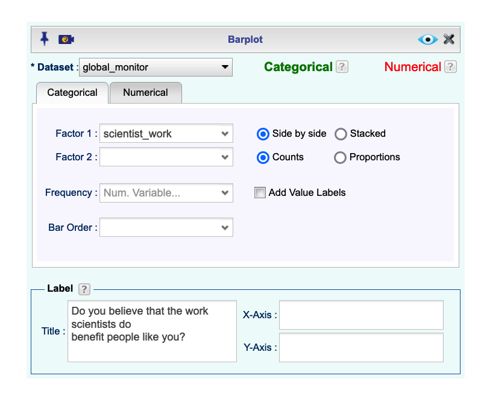
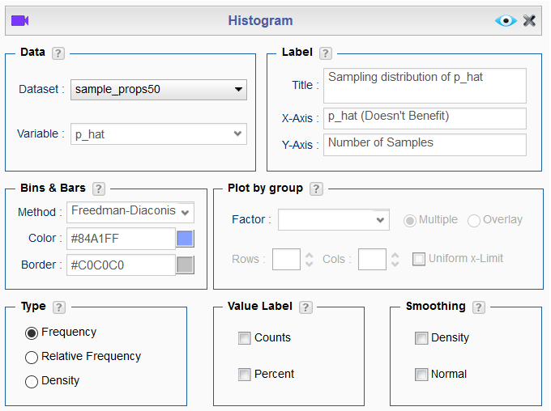

```{r global_options, include=FALSE}
knitr::opts_chunk$set(eval = TRUE, results = FALSE, message = FALSE)
library(ggplot2)
library(tidyverse)
```

```{r load data, echo = FALSE}
global_monitor <- readr::read_csv("global_monitor.csv")
```

In this lab, you will investigate the ways in which the statistics from a random 
sample of data can serve as point estimates for population parameters. We're 
interested in formulating a *sampling distribution* of our estimate in order 
to learn about the properties of the estimate, such as its distribution.

## Getting Started

### The data

A 2019 Gallup report states the following:

>The premise that scientific progress benefits people has been embodied in discoveries throughout the ages -- from the development of vaccinations to the explosion of technology in the past few decades, resulting in billions of supercomputers now resting in the hands and pockets of people worldwide. Still, not everyone around the world feels science benefits them personally. 
>
>**Source:** [World Science Day: Is Knowledge Power?](https://news.gallup.com/opinion/gallup/268121/world-science-day-knowledge-power.aspx)

The Wellcome Global Monitor finds that 20% of people globally do not believe that the work scientists do benefits people like them.
In this lab, you will assume this 20% is a true population proportion and learn about how sample proportions can vary from sample to sample by taking smaller samples from the population.

Import the global_monitor dataset from the Data Repository. This dataset contains a simulated population of 100,000 people. The variable `scientist_work` contains the responses to the question *"Do you believe that the work scientists do benefit people like you?"*. 20,000 people in the population (20%) think the work scientists do does not benefit them personally and the remaining 80,000 think it does.

We can quickly visualize the distribution of these responses using a bar plot.

```{r bar-plot-pop, echo = FALSE, results = "asis"}

```

## The unknown sampling distribution

In this lab, you have access to the entire population, but this is rarely the case in real life. Gathering information on an entire population is often extremely costly or impossible. 
Because of this, we often take a sample of the population and use that to understand the properties of the population.


If you are interested in estimating the proportion of people who don't think the work scientists do benefits them, you can survey the population. Here we will perform the sampling by simulating 50 people from the population using Rguroo's Random Selection dialog in Probability-Simulation.

In the Dataset Random Selection dialog, select the global_monitor dataset. Since we want 50 people, we want a Sample Size of 50. Since we don’t want a person to be included in our dataset twice, change the Replace button to without. This is similar to randomly drawing 50 names from a hat that contains the names of all in the population.

```{r samp1, echo = FALSE, results = "asis"}
knitr::include_graphics("img/sample-1.png")
```

Once your dialog looks like the dialog above, change the Seed to any number other than 100 and View your results. If everyone used the Seed 100, we would all get the same results.

There are two Save boxes in this module. We want to save both the process that produced our random sample and the result of the process. To save the process, type `gm_randomsample` in the left of the two boxes and click “Save As...”. To save the result as a dataset, type `gm_sample1` in the right of the two boxes and click “Save Dataset As...”.

```{r samp1 save, echo = FALSE, results = "asis"}
knitr::include_graphics("img/sample-1-save.png")
```

Working with these 50 names is considerably simpler than working with all 100,000 people in the population.

1.  Describe the distribution of responses in this sample. How does it compare to the 
    distribution of responses in the population?

If you're interested in estimating the proportion of all people who do not believe that the work scientists do benefits them, but you do not have access to the population data, your best single guess is the sample proportion. You can find the sample counts by right-clicking the `gm_sample1` dataset, selecting Dataset Summary, and looking at the summary of the variable `scientist_work`.

Depending on which 50 people were selected, your estimate could be a bit above 
or a bit below the true population proportion of 20%. In general, though, the sample proportion turns out to be a pretty good estimate of the true population proportion, and you were able to get it by sampling less than 1% of the population.

1.  Would you expect the sample proportion to match the sample proportion of 
    another student's sample? Why, or why not? If the answer is no, would you 
    expect the proportions to be somewhat different or very different? Ask a 
    student team to confirm your answer.

1.  Open the Random Selection dialog, change the seed again, and take a second sample of size 50. Save the new dataset as `gm_sample2`. How does the sample proportion of `gm_sample2` compare with that of `gm_sample1`? Suppose we took two more samples, one of size 100 and one of size 1000. Which would you think would provide a more accurate estimate of the population proportion?

Not surprisingly, every time you take another random sample, you might get a different sample proportion. It's useful to get a sense of just how much variability you should expect when estimating the population mean this way. 
The distribution of sample proportions, called the *sampling distribution (of the proportion)*, can help you understand this variability. 
In this lab, because you have access to the population, you can build up the sampling distribution for the sample proportion by repeating the above steps many times. 
Here, we use Rguroo to take 15,000 different samples of size 50 from the population, calculate the proportion of  *Doesn't benefit* responses, and store each result in a vector called `sample_props50`. 

Open your gm_randomsample dialog again and change the number of Replications to 15000. Also, specify that we want to sample `Replace: With` since sampling distribution are constructed by sampling with replacement. Then, click the Statistic button to open the Custom Statistic menu. Click the + button to add a statistic and name it `p_hat` to represent the sample proportion. In the center box, type:

`sum(scientist_work == "Doesn't Benefit")/50`

```{r iterate, echo = FALSE, results = "asis"}
knitr::include_graphics("img/sampling-distribution-1.png")
```

View the results. It may take a couple of seconds for Rguroo to process all 15,000 replications. Save the process as `sampling_distribution_phat`. Save the resulting dataset as `sample_props50` and visualize the distribution of these proportions with a histogram.

```{r histogram1, echo = FALSE, results = "asis"}

```

1.  How many elements are there in `sample_props50`?  Describe the sampling 
    distribution, and be sure to specifically note its center. Make sure to include 
    a plot of the distribution in your answer.

## Interlude: Sampling distributions

In the first part of this lab, you took a single sample of size `n` (50) from the population of all people in the population. In the part you just did, you repeated the procedure 15,000 times, summarized each sample with the same sample statistic, and built a distribution of a series of sample statistics, which is called the **sampling distribution**. 

Note that in practice one rarely gets to build true sampling distributions, because one rarely has access to data from the entire population. 

Without the `Replications` box in the dialog, this would be painful. We would have to run the dialog 15,000 times (with 15,000 different seeds to ensure we didn't get the same result every time), store the results in 15,000 different datasets, and compute the sample proportion in each dataset.

Note that for each of the 15,000 times we computed a proportion, we did so from a **different** sample!

1.  To make sure you understand how sampling distributions are built, try modifying the `sampling_distribution_p_hat` dialog to create a sampling distribution of **25 sample proportions** from **samples of size 10**, and put them in a data frame named `sample_props_small`. How many observations are there in this object called `sample_props_small`? What does each observation represent?

## Sample size and the sampling distribution

Mechanics aside, let's return to the reason we used the `Replications` box: to compute a sampling distribution, specifically, the sampling distribution of the proportions from samples of 50 people. 

The sampling distribution that you computed tells you much about estimating the true proportion of people who think that the work scientists do doesn't benefit them. 
Because the sample proportion is an unbiased estimator, the sampling distribution is centered at the true population proportion, and the spread of the distribution indicates how much variability is incurred by sampling only 50 people at a time from the population.

In the remainder of this section, you will work on getting a sense of the effect that sample size has on your sampling distribution.

*** BEGIN SHINY APP SECTION ***

1.  Use the app below to create sampling distributions of proportions of 
    *Doesn't benefit* from samples of size 10, 50, and 100. Use 5,000 simulations. 
    What does each observation in the sampling distribution represent? 
    How does the mean, standar error, and shape of the sampling distribution 
    change as the sample size increases? How (if at all) do these values change 
    if you increase the number of simulations? (You do not need to include plots 
    in your answer.)
    
```{r shiny, echo=FALSE, eval=TRUE, results = TRUE}
shinyApp(
  ui <- fluidPage(
    
    # Sidebar with a slider input for number of bins 
    sidebarLayout(
      sidebarPanel(
        
        selectInput("outcome",
                    "Outcome of interest:",
                    choices = c("Benefits", "Doesn't benefit"),
                    selected = "Doesn't benefit"),
        
        numericInput("n_samp",
                     "Sample size:",
                     min = 1,
                     max = nrow(global_monitor),
                     value = 30),
        
        numericInput("n_rep",
                     "Number of samples:",
                     min = 1,
                     max = 30000,
                     value = 15000),
        
        hr(),
        
        sliderInput("binwidth",
                    "Binwidth:",
                    min = 0, max = 0.5,
                    value = 0.02,
                    step = 0.005)
        
      ),
      
      # Show a plot of the generated distribution
      mainPanel(
        plotOutput("sampling_plot"),
        textOutput("sampling_mean"),
        textOutput("sampling_se")
      )
    )
  ),
  
  server <- function(input, output) {
    
    # create sampling distribution
    sampling_dist <- reactive({
      global_monitor %>%
        rep_sample_n(size = input$n_samp, reps = input$n_rep, replace = TRUE) %>%
        count(scientist_work) %>%
        mutate(p_hat = n /sum(n)) %>%
        filter(scientist_work == input$outcome)
    })
    
    # plot sampling distribution
    output$sampling_plot <- renderPlot({
      
      ggplot(sampling_dist(), aes(x = p_hat)) +
        geom_histogram(binwidth = input$binwidth) +
        xlim(0, 1) +
        labs(
          x = paste0("p_hat (", input$outcome, ")"),
          title = "Sampling distribution of p_hat",
          subtitle = paste0("Sample size = ", input$n_samp, " Number of samples = ", input$n_rep)
        ) +
        theme(plot.title = element_text(face = "bold", size = 16))
    })
    
    ggplot(data = sample_props50, aes(x = p_hat)) +
      geom_histogram(binwidth = 0.02) +
      labs(
        x = "p_hat (Doesn't benefit)",
        title = "Sampling distribution of p_hat",
        subtitle = "Sample size = 50, Number of samples = 15000"
      )
    
    # mean of sampling distribution
    output$sampling_mean <- renderText({
      paste0("Mean of sampling distribution = ", round(mean(sampling_dist()$p_hat), 2))
    })
    
    # mean of sampling distribution
    output$sampling_se <- renderText({
      paste0("SE of sampling distribution = ", round(sd(sampling_dist()$p_hat), 2))
    })
  },
  
  options = list(height = 900) 
)
```

* * *

## More Practice

So far, you have only focused on estimating the proportion of those you think the work scientists doesn't benefit them. 
Now, you'll try to estimate the proportion of those who think it does.

Note that while you might be able to answer some of these questions using the app,
you are expected to create the necessary simulations and produce the necessary plots and
summary statistics using Rguroo. You are welcome to use the app for exploration.

1.  Take a sample of size 15 from the population and calculate the proportion of 
    people in this sample who think the work scientists do enchances their lives. 
    Using this sample, what is your best point estimate of the population proportion 
    of people who think the work scientists do enhances their lives?

1.  Since you have access to the population, simulate the sampling 
    distribution of proportion of those who think the work scientists do enchances 
    their lives for samples of size 15 by taking 2000 samples from the population 
    of size 15 and computing 2000 sample proportions. Store these proportions in 
    as `sample_props15`. Plot the data, then describe the shape of this sampling 
    distribution. Based on this sampling distribution, what would you guess the 
    true proportion of those who think the work scientists do enchances their lives 
    to be? Finally, calculate and report the population proportion.

1.  Change your sample size from 15 to 150, then compute the sampling 
    distribution using the same method as above, and store these proportions in a 
    new object called `sample_props150`. Describe the shape of this sampling 
    distribution and compare it to the sampling distribution for a sample 
    size of 15. Based on this sampling distribution, what would you guess to 
    be the true proportion of those who think the work scientists do enchances 
    their lives?

1.  Of the sampling distributions from 2 and 3, which has a smaller spread?  If
    you're concerned with making estimates that are more often close to the 
    true value, would you prefer a sampling distribution with a large or small spread?

* * *

<a rel="license" href="http://creativecommons.org/licenses/by-sa/4.0/"></a><br />This work is licensed under a <a rel="license" href="http://creativecommons.org/licenses/by-sa/4.0/">Creative Commons Attribution-ShareAlike 4.0 International License</a>.
