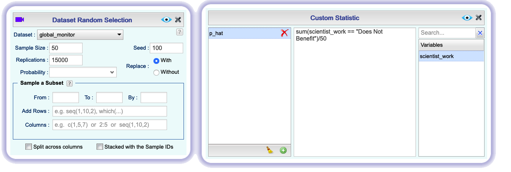

```{r global_options, include=FALSE}
knitr::opts_chunk$set(eval = TRUE, results = FALSE, message = FALSE)
library(ggplot2)
library(tidyverse)
```

```{r load data, echo = FALSE}
#global_monitor <- readr::read_csv("global_monitor.csv")
```

In this lab, you will investigate the ways in which the statistics from a random 
sample of data can serve as point estimates for population parameters. We're 
interested in formulating a *sampling distribution* of our estimate in order 
to learn about the properties of the estimate, such as its distribution.


## Getting Started

### The data

A 2019 Gallup report states the following:

>The premise that scientific progress benefits people has been embodied in discoveries throughout the ages -- from the development of vaccinations to the explosion of technology in the past few decades, resulting in billions of supercomputers now resting in the hands and pockets of people worldwide. Still, not everyone around the world feels science benefits them personally. 
>
>**Source:** [World Science Day: Is Knowledge Power?](https://news.gallup.com/opinion/gallup/268121/world-science-day-knowledge-power.aspx)

The Wellcome Global Monitor finds that 20% of people globally do not believe that the work scientists do benefits people like them.
In this lab, you will assume this 20% is a true population proportion and learn about how sample proportions can vary from sample to sample by taking smaller samples from the population.

Import the *global_monitor* dataset from the `OpenIntro` **Dataset Repository**. This dataset contains a simulated population of 100,000 people. The variable *scientist_work* contains the responses to the question, *"Do you believe that the work scientists do benefit people like you?"*. 20,000 people in the population (20%) think the work scientists does not benefit them personally, and the remaining 80,000 think it does.

We can visualize the distribution of these responses using a bar plot.

```{r bar-plot-pop, echo = FALSE, results = "asis", fig.align = "center", fig.cap = "*Barplot dialog to display the distribution of scientist_work*", out.width="80%"}
knitr::include_graphics("img/barplot-1.png")
```

We can also confirm this by right-clicking on the dataset name *global_monitor* in the **Data** toolbox, and selecting the option **Dataset Summary**. 

## The unknown sampling distribution

In this lab, you have access to the entire population, but this is rarely the case in real life. Gathering information on an entire population is often extremely costly or impossible. 
Because of this, we often take a sample of the population and use that to understand the properties of the population.

If you are interested in estimating the proportion of people who don't think the work scientists do benefits them, you can survey the population. Here we will perform the sampling by simulating 50 people from the population using Rguroo's **Random Selection** function in the **Probability-Simulation** toolbox.

In the **Dataset Random Selection** dialog, select the *global_monitor* dataset. Since we want 50 people, we want a `Sample Size` of 50. Since we don’t want a person to be included in our dataset twice, change the `Replace` button to `Without`. This is similar to randomly drawing 50 names from a hat that contains the names of everyone in the population.

```{r samp1, echo = FALSE, results = "asis", fig.align = "center", fig.cap = "*Dialog to select a sample of size 50 from the global_monitor data*", out.width="75%"}

```

Change the `Seed` to any number other than 100 and click the `Preview` button  to view your results. If everyone used the `Seed` 100, we would all get the same results. So, to get different results, you should use a different seed from other students in your class.

There are two **Save** boxes in this function. We want to save both the process that produced our random sample and the result of the process. To save the process, type *gm_randomsample* in the left of the two boxes and click **Save As...**. To save the result as a dataset, type *gm_sample1* in the right of the two boxes and click **Save Dataset As...**.

```{r samp1 save, echo = FALSE, results = "asis", fig.align = "center", fig.cap = "*Two save options to save the sample from the global_monitor data*", out.width="80%"}
knitr::include_graphics("img/sample-1-save.png")
```

Now, you should see an Rguroo object called *gm_randomsample* in the **Probability-Simulation** toolbox and an Rguroo dataset called *gm_sample1* in the **Data** toolbox.

Working with these 50 randomly selected people is considerably simpler than working with all 100,000 people in the population.

1.  Create a plot to show the distribution of responses in this sample. Describe the distribution. How does it compare to the distribution of responses in the population? Make sure to label your plot so that it is clear that the data is from a sample.

If you're interested in estimating the proportion of all people who do not believe that the work scientists do benefits them, but you do not have access to the population data, your best single guess is the sample proportion. You can find the sample counts by right-clicking the *gm_sample1* dataset in the **Data** toolbox, selecting **Dataset Summary**, and looking at the summary of the **Categorical Variable** *scientist_work*. Under **Level 1**, you should see "Benefits: " followed by the count of people in your sample who responded that scientists' work does benefit them. Under **Level 2**, you should see "Does Not Benefit: " followed by the count of people in your sample who responded that scientists' work does not benefit them.

So to find the proportion of people in your sample who believe that scientists' work does not benefit them, take the number following  "Does Not Benefit" and divide by 50. This would be your estimate, which you denote by $\hat p$.

Depending on which 50 people were selected, your estimate could be a bit above 
or a bit below the true population proportion of 0.20. In general, though, the sample proportion turns out to be a pretty good estimate of the true population proportion, and you were able to get it by sampling less than 1% of the population.

1.  Would you expect the sample proportion to match the sample proportion of 
    another student's sample? Why, or why not? If the answer is no, would you 
    expect the proportions to be somewhat different or very different? Ask a 
    student team to confirm your answer.

1.  Open the **Random Selection** dialog, change the seed again, and take a second sample of size 50. **Save** the new dataset as *gm_sample2*. How does the sample proportion of "Does Not Benefit" in *gm_sample2* compare with that in *gm_sample1*? Suppose we took two more samples, one of size 100 and one of size 1000. Which would you think would provide a more accurate estimate of the population proportion?

Not surprisingly, every time you take another random sample, you might get a different sample proportion. It's useful to get a sense of just how much variability you should expect when estimating the population proportion this way. 
The distribution of sample proportions, called the *sampling distribution (of the proportion)*, can help you understand this variability. 
In this lab, because you have access to the population, you can build up the sampling distribution for the sample proportion by repeating the above steps many times. 

Here, we use Rguroo to take 15,000 different samples of size 50 from the population, calculate the proportion of "Does Not Benefit" responses, and store each result in a vector called *sample_props50*. 

In the **Probability-Simulation** toolbox, double-click the *gm_randomsample* object to bring back the tab in which you did the initial simulation. Click  to open the **Dataset Random Selection** dialog and change the number of `Replications` to 15000. Also, change the `Replace` button to `With` since sampling distribution are constructed by sampling with replacement. Then, click the 
 button to open the **Custom Statistic** dialog. Click the  button to add a statistic and name it *p_hat* to represent the sample proportion. In the center box, type:

```sum(scientist_work == "Does Not Benefit")/50```

```{r iterate, echo = FALSE, results = "asis", fig.align = "center", fig.cap = "*Computing sample proportions for 15,000 samples of size 50*", out.width="95%"}

```
The R code ```scientist_work == "Does Not Benefit"``` is a logical statement that equals *TRUE* if the response is "Does Not Benefit" and equals *FALSE* if the response is anything else. *TRUE* counts as one, and *FALSE* counts as zero; therefore, when you sum them, that is ```sum(scientist_work == "Does Not Benefit")```, you get the total number in a sample of size 50 who stated "Does Not Benefit." Dividing this total by 50 gives us the proportion of the 50 people in the sample who stated "Does Not Benefit". In Rguroo, the formula that you write in the *Custom Statistic* dialog will be applied to each of the samples of size 50 and the result will be 15,000 sample proportions. 

Click the `Preview`   button to see the results. It may take a couple of seconds for Rguroo to process all 15,000 replications. **Save** the process as *sampling_distribution_phat*. **Save** the resulting dataset as *sample_props50* and visualize the distribution of these proportions with a histogram.

```{r histogram1, echo = FALSE, results = "asis", fig.align = "center", fig.cap = "*Dialog to draw a histogram of the sample proportions*", out.width="80%"}
knitr::include_graphics("img/histogram-1.png")
```

1.  How many elements are there in *sample_props50*?  Describe the sampling 
    distribution, and be sure to specifically note its center. Make sure to include 
    your histogram in your answer.

## Interlude: Sampling distributions {#interlude}

In the first part of this lab, you took a single sample of size `n` (50) from the population of all people in the population. In the part you just did, you repeated the procedure 15,000 times, summarized each sample with the same sample statistic, and built a distribution of a series of sample statistics, which is called the **sampling distribution**. 

Note that in practice one rarely gets to build true sampling distributions, because one rarely has access to data from the entire population. 

Without the `Replications` box in the dialog, this would be painful. We would have to run the dialog 15,000 times (with 15,000 different seeds to ensure we didn't get the same result every time), store the results in 15,000 different datasets, and compute the sample proportion in each dataset.

Note that for each of the 15,000 times we computed a proportion, we did so from a **different** sample!

1.  To make sure you understand how sampling distributions are built, try to modify the **Dataset Random Selection** dialog you saved as *sampling_distribution_p_hat* to create **25 sample proportions** from **samples of size 10**, then **Save** your result as a dataset named *sample_props_small* and create a histogram to visualize the sampling distribution. How many observations are there in this object called *sample_props_small*? What does each observation represent?

## Sample size and the sampling distribution

Mechanics aside, let's return to the reason we used the `Replications` box: to compute a sampling distribution, specifically, the sampling distribution of the proportions from samples of 50 people. 

The sampling distribution that you computed tells you much about estimating the true proportion of people who think that the work scientists do doesn't benefit them. 
Because the sample proportion is an unbiased estimator, the sampling distribution is centered at the true population proportion, and the spread of the distribution indicates how much variability is incurred by sampling only 50 people at a time from the population.

* * *

## More Practice

So far, you have only focused on estimating the proportion of people who think that scientists' work does not benefit them. Now, you'll try to estimate the proportion of people who think that scientists' work *does* benefit them.

1.  Using Rguroo's **Random Selection** function, take a sample of size 15 from the population and calculate the proportion of 
    people in this sample who think the work scientists do enhances their lives ("Benefits"). 
    Using this sample, what is your best point estimate of the population proportion 
    of people who think the work scientists do enhances their lives?

1.  Since you have access to the population, simulate the sampling 
    distribution of proportion of those who think the work scientists do enhances 
    their lives (`scientist_work == "Benefits"`) for samples of size 15. Modify the **Dataset Random Selection** dialog to take 2000 samples of size 15 from the population 
    and compute 2000 sample proportions (**Hint:** What did you change in [Interlude: Sampling Distributions](#interlude) to get 25 sample proportions from samples of size 10? What should you change those numbers to now?). **Save** these proportions 
    in a dataset called *sample_props15*, plot the data, and describe the shape of this sampling distribution. Based on this sampling distribution, what would you guess the 
    true proportion of those who think the work scientists do enhances their lives 
    to be? Finally, calculate and report the population proportion.

1.  Modify your **Dataset Random Selection** and **Custom Statistic** dialogs to take 2000 samples of size 150 from the population and compute 2000 sample proportions. **Save** these proportions in a 
    dataset called *sample_props150* and plot their distribution. Describe the shape of this sampling 
    distribution and compare it to the sampling distribution for a sample 
    size of 15. Based on this sampling distribution, what would you guess to 
    be the true proportion of those who think the work scientists do enhances 
    their lives?

1.  Of the sampling distributions from the previous two questions, which has a smaller spread?  If
    you're concerned with making estimates that are more often close to the 
    true value, would you prefer a sampling distribution with a large or small spread?

* * *

<a rel="license" href="http://creativecommons.org/licenses/by-sa/4.0/"></a><br />This work is licensed under a <a rel="license" href="http://creativecommons.org/licenses/by-sa/4.0/">Creative Commons Attribution-ShareAlike 4.0 International License</a>. Rguroo.com, the Rguroo.com logo, and all other trademarks, service marks, graphics and logos used in connection with Rguroo.com or the Website are trademarks or registered trademarks of Soflytics Corp. in the USA and other countries and are not included under the CC-BY-SA license.
