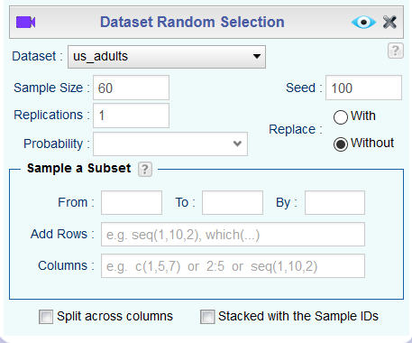
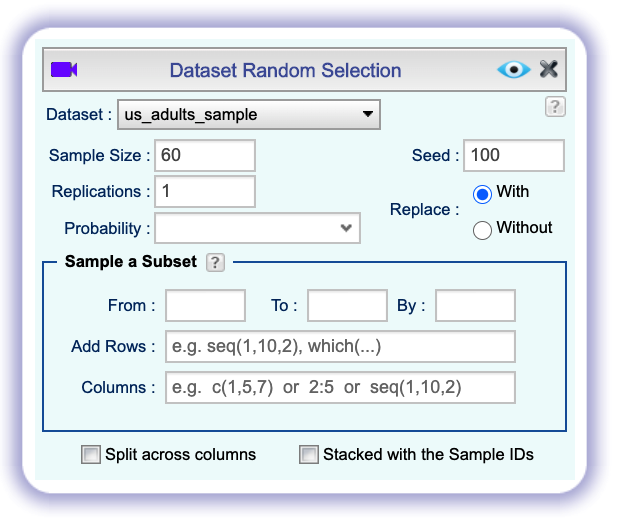
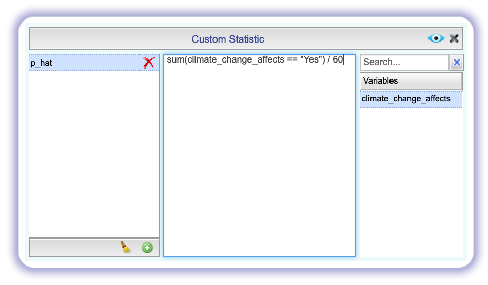
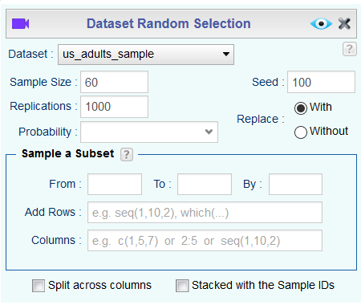
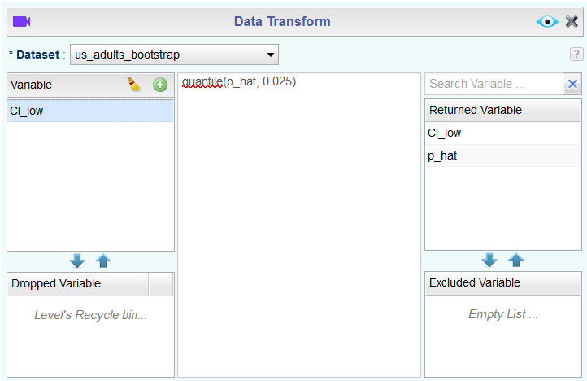
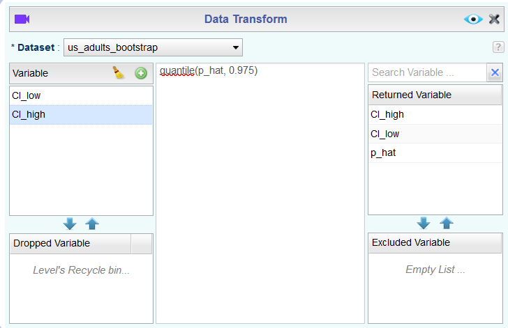

```{r global_options, include=FALSE}
knitr::opts_chunk$set(eval = TRUE, results = FALSE, message = FALSE)
```

If you have access to data on an entire population, say the opinion of every adult in the United States on whether or not they think climate change is affecting their local community, it's straightforward to answer questions like, "What percent of US adults think climate change is affecting their local community?". 
Similarly, if you had demographic information on the population you could examine how, if at all, this opinion varies among young and old adults and adults with different leanings.
If you have access to only a sample of the population, as is often the case, the task becomes more complicated. 
What is your best guess for this proportion if you only have data from a small sample of adults?
This type of situation requires that you use your sample to make inference on what your population looks like.

## Getting Started

### The data

A 2019 Pew Research report states the following:

To keep our computation simple, we will assume a total population size of 100,000 (even though that's smaller than the population size of all US adults).

> Roughly six-in-ten U.S. adults (62%) say climate change is currently affecting their local community either a great deal or some, according to a new Pew Research Center survey.
>
>**Source:** [Most Americans say climate change impacts their community, but effects vary by region](https://www.pewresearch.org/fact-tank/2019/12/02/most-americans-say-climate-change-impacts-their-community-but-effects-vary-by-region/)

In this lab, you will assume this 62% is a true population proportion and learn about how sample proportions can vary from sample to sample by taking smaller samples from the population. 

The dataset `us_adults` in the Rguroo Data Repository contains 100,000 simulated responses to the question *"Do you think climate change is affecting your local community?"*. The variable name is `climate_change_affects`. 62,000 responses (62%) are from people who think climate change impacts their community, and the remaining 38,000 do not think so.

```{r import data, echo = FALSE}
us_adults <- readr::read_csv("us_adults.csv")
```

Once you have imported the dataset, right-click the name of the dataset in the Data pane and select Summary to confirm that the dataset contains what we think it does. We can also quickly visualize the distribution of these responses using a bar plot.

```{r barplot, echo= FALSE, results = "asis"}
knitr::include_graphics("img/barplot-1.png")
```

In this lab, you'll start with a simple random sample of size 60 from the population. Remember that we use the Random Selection dialog in the Probability-Simulation section to take random samples from our dataset. Again, change the Seed from 100 to a different number of your choice.

```{r sample, echo= FALSE, results = "asis"}

```

Save the dataset as `us_adults_sample`.

1.  What percent of the adults in your sample think climate change affects their 
    local community? **Hint:** Just like we did with the population, we can calculate 
    the proportion of those **in this sample** who think climate change affects their 
    local community.

1.  Would you expect another student's sample proportion to be identical to yours? 
    Would you expect it to be similar? Why or why not?

## Confidence intervals

Return for a moment to the question that first motivated this lab: based on this sample, what can you infer about the population? 
With just one sample, the best estimate of the proportion of US adults who think climate change affects their local community would be the sample proportion, usually denoted as $\hat{p}$ (here we are calling it `p_hat`). 
That serves as a good **point estimate**, but it would be useful to also communicate how uncertain you are of that estimate. 
This uncertainty can be quantified using a **confidence interval**.

One way of calculating a confidence interval for a population proportion is based on the Central Limit Theorem, as $\hat{p} \pm z^\star SE_{\hat{p}}$ is, or more precisely, as
\[ \hat{p} \pm z^\star \sqrt{ \frac{\hat{p} (1-\hat{p})}{n} } \]

Another way is using simulation, or to be more specific, using **bootstrapping**. 
The term **bootstrapping** comes from the phrase "pulling oneself up by one’s bootstraps", which is a metaphor for accomplishing an impossible task without any outside help.
In this case the impossible task is estimating a population parameter (the unknown population proportion), and we’ll accomplish it using data from only the given sample.
Note that this notion of saying something about a population parameter using only information from an observed sample is the crux of statistical inference, it is not limited to bootstrapping. 

In essence, bootstrapping assumes that there are more of observations in the populations like the ones in the observed sample. 
So we "reconstruct" the population by resampling from our sample, with replacement. 
The bootstrapping scheme is as follows:

- **Step 1.** Take a bootstrap sample - a random sample taken **with replacement** from the original sample, of the same size as the original sample.
- **Step 2.** Calculate the bootstrap statistic - a statistic such as mean, median, proportion, slope, etc. computed on the bootstrap samples.
- **Step 3.** Repeat steps (1) and (2) many times to create a bootstrap distribution - a distribution of bootstrap statistics.
- **Step 4.** Calculate the bounds of the XX% confidence interval as the middle XX% of the bootstrap distribution.

Let's think about how to do this in Rguroo.

- **Step 1.** Use the Random Selection module to take a bootstrap sample from `us_adults_sample`. Again, change the seed to the same seed you've used throughout the lab.

```{r CI Step 1, echo= FALSE, results = "asis"}

```

- **Step 2.** Click the Statistic button and create the bootstrap statistic we want.

```{r CI Step 2, echo = FALSE, results = "asis"}

```

- **Step 3.** Go back to the Random Selection dialog and indicate the number of bootstrap samples we want as the number of Replications.

```{r CI Step 3, echo = FALSE, results = "asis"}

```

- **Step 4.** Save the process as `bootstrap_proportion` (you will want to use these steps later and it will be nice to have a template). Save the resulting dataset as `us_adults_bootstrap` and use the Transform dialog to calculate the bounds of the confidence interval. To get the middle 95% we need to look at the 2.5% and 97.5% quantiles.

```{r CI Step 4, echo = FALSE, results = "asis"}


```

Note that we don't need or want to save this transformed dataset. The lower and upper bounds of the confidence interval are repeated 1000 times in `CI_low` and `CI_high`.

To recap: even though we don't know what the full population looks like, we're 95% confident that the true proportion of US adults who think climate change affects their local community is between the two bounds reported as result of this set of actions.

## Confidence levels

1.  In the interpretation above, we used the phrase "95% confident". What does "95% confidence" mean?

In this case, you have the rare luxury of knowing the true population proportion (62%) since you have data on the entire population. 

1.  Does your confidence interval capture the true population proportion of US adults 
    who think climate change affects their local community? If you are working on this 
    lab in a classroom, does your neighbor's interval capture this value? 

1.  Each student should have gotten a slightly different confidence interval. What 
    proportion of those intervals would you expect to capture the true population 
    mean? Why?

*** BEGIN SHINY SECTION ***

In the next part of the lab, you will collect many samples to learn more about how sample proportions and confidence intervals constructed based on those samples vary from one sample to another.

-   Obtain a random sample.
-   Calculate the sample proportion, and use these to calculate and store the lower and upper bounds of the confidence intervals.
-   Repeat these steps 50 times.

Doing this would require learning programming concepts like iteration so that you can automate repeating running the code you've developed so far many times to obtain many (50) confidence intervals. 
In order to keep the programming simpler, we are providing the interactive app below that basically does this for you and created a plot similar to Figure 5.6 on [OpenIntro Statistics, 4th Edition (page 182)](https://www.openintro.org/os).

```{r shiny, echo=FALSE, eval=TRUE, results = TRUE}
store_ci <- function(i, n, reps, conf_level, success) {
  us_adults %>%
    sample_n(size = n) %>%
    specify(response = climate_change_affects, success = success) %>%
    generate(reps, type = "bootstrap") %>%
    calculate(stat = "prop") %>%
    get_ci(level = conf_level) %>%
    rename(
      x_lower = names(.)[1],
      x_upper = names(.)[2]
    )
}

shinyApp(
  ui <- fluidPage(
    h4("Confidence intervals for the proportion of US adults who think 
     climate change"),

    h4(selectInput("success", "",
      choices = c(
        "is affecting their local community" = "Yes",
        "is not affecting their local community" = "No"
      ),
      selected = "Yes", width = "50%"
    )),

    # Sidebar with a slider input for number of bins
    sidebarLayout(
      sidebarPanel(
        numericInput("n_samp",
          "Sample size for a single sample from the population:",
          min = 1,
          max = 1000,
          value = 60
        ),

        hr(),

        numericInput("n_rep",
          "Number of resamples for each bootstrap confidence interval:",
          min = 1,
          max = 15000,
          value = 1000
        ),

        numericInput("conf_level",
          "Confidence level",
          min = 0.01,
          max = 0.99,
          value = 0.95,
          step = 0.05
        ),

        hr(),

        radioButtons("n_ci",
          "Number of confidence intervals:",
          choices = c(10, 25, 50, 100),
          selected = 50, inline = TRUE
        ),

        actionButton("go", "Go")
      ),

      # Show a plot of the generated distribution
      mainPanel(
        plotOutput("ci_plot")
      )
    )
  ),

  server <- function(input, output) {

    # set true p
    p <- reactive(ifelse(input$success == "Yes", 0.62, 0.38))

    # create df_ci when go button is pushed
    df_ci <- eventReactive(input$go, {
      map_dfr(1:input$n_ci, store_ci,
        n = input$n_samp,
        reps = input$n_rep, conf_level = input$conf_level,
        success = input$success
      ) %>%
        mutate(
          y_lower = 1:input$n_ci,
          y_upper = 1:input$n_ci,
          capture_p = ifelse(x_lower < p() & x_upper > p(), "Yes", "No")
        )
    })

    # plot df_ci
    output$ci_plot <- renderPlot({
      ggplot(df_ci()) +
        geom_segment(aes(x = x_lower, y = y_lower, xend = x_upper, yend = y_upper, color = capture_p)) +
        geom_point(aes(x = x_lower, y = y_lower, color = capture_p)) +
        geom_point(aes(x = x_upper, y = y_upper, color = capture_p)) +
        geom_vline(xintercept = p(), color = "darkgray") +
        labs(
          y = "", x = "Bounds of the confidence interval",
          color = "Does the interval capture the true population proportion?"
        ) +
        theme(legend.position = "bottom")
    })
  },
  options = list(height = 700)
)
```


1.  Given a sample size of 60, 1000 bootstrap samples for each interval, and 50 
    confidence intervals constructed (the default values for the above app), what 
    proportion of your confidence intervals include the true population proportion? 
    Is this proportion exactly equal to the confidence level? If not, explain why. 
    Make sure to include your plot in your answer.

* * *

## More Practice

1.  Choose a different confidence level than 95%. Would you expect a confidence 
    interval at this level to me wider or narrower than the confidence interval 
    you calculated at the 95% confidence level? Explain your reasoning.

1.  Find a confidence interval for the proportion 
    of US Adults who think climate change is affecting their local community with a 
    confidence level of your choosing (other than 95%) and interpret it.

1.  Using the app, calculate 50 confidence intervals at the confidence level you chose 
    in the previous question, and plot all intervals on one plot, and calculate 
    the proportion of intervals that include the true population proportion. 
    How does this percentage compare to the confidence level selected for the 
    intervals?
    
1.  Lastly, try one more (different) confidence level. First, state how you expect the
    width of this interval to compare to previous ones you calculated. Then, 
    calculate the bounds of the interval and interpret it. Finally, use the app to generate many intervals 
    and calculate the proportion of intervals that are capture the true population 
    proportion.

1.  Using the app, experiment with different sample sizes and comment on how the 
    widths of intervals change as sample size changes (increases and decreases).
    
1.  Finally, given a sample size (say, 60), how does the width of the interval change 
    as you increase the number of bootstrap samples. **Hint:** Change the number of Replications, save the dataset, and look at the Dataset Summary. Does changing the 
    number of bootstrap samples affect the calculated standard deviation of `p_hat`?

* * *

<a rel="license" href="http://creativecommons.org/licenses/by-sa/4.0/"></a><br />This work is licensed under a <a rel="license" href="http://creativecommons.org/licenses/by-sa/4.0/">Creative Commons Attribution-ShareAlike 4.0 International License</a>.
