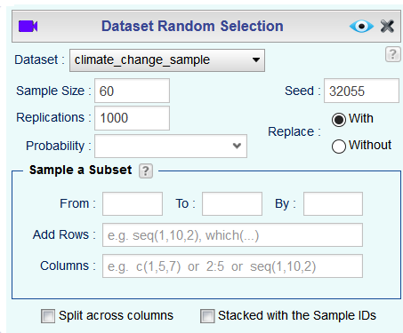
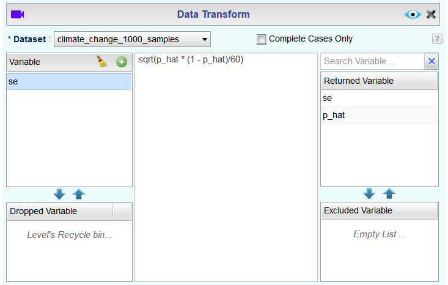
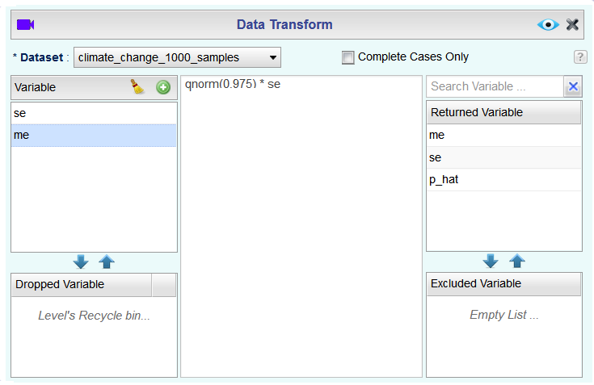
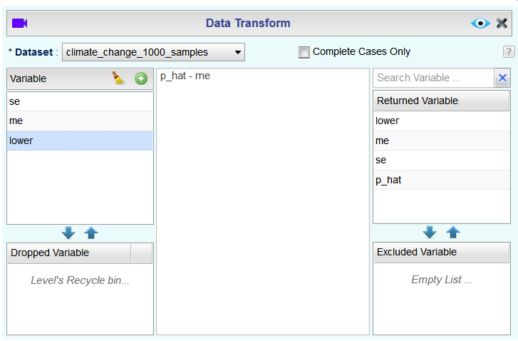
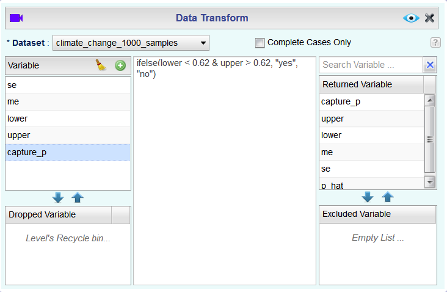

```{r global-options, include=FALSE}
knitr::opts_chunk$set(eval = TRUE, results = FALSE, message = FALSE)
```

If you have access to data on an entire population, say the opinion of every adult in the United States on whether or not they think climate change is affecting their local community, it's straightforward to answer questions like, "What percent of US adults think climate change is affecting their local community?". 
Similarly, if you had demographic information on the population you could examine how, if at all, this opinion varies among young and old adults and adults with different leanings.
If you have access to only a sample of the population, as is often the case, the task becomes more complicated. 
What is your best guess for this proportion if you only have data from a small sample of adults?
This type of situation requires that you use your sample to make inference on what your population looks like.

## Getting Started

### The data

A 2019 Pew Research report states the following:

> Roughly six-in-ten U.S. adults (62%) say climate change is currently affecting their local community either a great deal or some, according to a new Pew Research Center survey.
>
>**Source:** [Most Americans say climate change impacts their community, but effects vary by region](https://www.pewresearch.org/fact-tank/2019/12/02/most-americans-say-climate-change-impacts-their-community-but-effects-vary-by-region/)

In this lab, you will assume this 62% is a true population proportion and learn about how sample proportions can vary from sample to sample by taking smaller samples from the population. 

First, open Rguroo's data editor by selecting **Create New Dataset** in the **Data** toolbox. In the data editor, create the variable *Affects* with two values of "yes" and "no." To add variables click `Add Column`   and to add rows click *Add Row* . Next, add a "Probability" column to the dataset, which provides a vector of the two probability weights. Here, since we assume 62% of responses will be from people who think climate change impacts their community, the probability of "yes" should be 0.62 and the probability of "no" should be 0.38, as shown in the figure below. **Save** the dataset with the name *climate_change_affects*.

```{r create dataset, echo= FALSE, results = "asis", fig.align = "center", fig.cap = "*Creating a dataset with two variables Affects and Probability*", out.width="90%"}

```

We can visualize the distribution of these responses using a bar plot.

```{r barplot, echo= FALSE, results = "asis", fig.align = "center", fig.cap = "*Creating a barplot to visualize the distribution of the Affects variable*", out.width="80%"}

```

In this lab, you'll start with a simple random sample of size 60 from the population. Remember that we use the **Random Selection** function in the **Probability-Simulation** section to take random samples from our dataset. Again, change the `Seed` from 100 to a different number of your choice. In this example, we have arbitrarily chosen the number 32055.

```{r sample, echo= FALSE, results = "asis", fig.align = "center", fig.cap = "*Taking a sample of size 60 from the climate_change_affects dataset*", out.width="75%"}

```

**Save** the dataset as *climate_change_sample*.

1.  What percent of the adults in your sample think climate change affects their 
    local community? **Hint:** Use the **Dataset Summary** to find the number of "yes" and "no"
    outcomes in the sample.

1.  Would you expect another student's sample proportion to be identical to yours? 
    Would you expect it to be similar? Why or why not?

## Confidence intervals

Return for a moment to the question that first motivated this lab: based on this sample, what can you infer about the population? 
With just one sample, the best estimate of the proportion of US adults who think climate change affects their local community would be the sample proportion, usually denoted as $\hat{p}$ (here we are calling it `p_hat`). 
That serves as a good **point estimate**, but it would be useful to also communicate how uncertain you are of that estimate. 
This uncertainty can be quantified using a **confidence interval**.

One way of calculating a confidence interval for a population proportion is based on the Central Limit Theorem, as $\hat{p} \pm z^\star SE_{\hat{p}}$ is, or more precisely, as
\[ \hat{p} \pm z^\star \sqrt{ \frac{\hat{p} (1-\hat{p})}{n} }. \]

Another way is using simulation, or to be more specific, using **bootstrapping**. 
The term **bootstrapping** comes from the phrase "pulling oneself up by one’s bootstraps", which is a metaphor for accomplishing an impossible task without any outside help.
In this case the impossible task is estimating a population parameter (the unknown population proportion), and we’ll accomplish it using data from only the given sample.
Note that this notion of saying something about a population parameter using only information from an observed sample is the crux of statistical inference, it is not limited to bootstrapping. 

In essence, bootstrapping assumes that there are more observations in the population like the ones in the observed sample. 
So we "reconstruct" the population by resampling from our sample, with replacement. 
The bootstrapping scheme is as follows:

- **Step 1.** Take a bootstrap sample - a random sample taken **with replacement** from the original sample, of the same size as the original sample.
- **Step 2.** Calculate the bootstrap statistic - a statistic such as mean, median, proportion, slope, etc. computed on the bootstrap samples.
- **Step 3.** Repeat steps (1) and (2) many times to create a bootstrap distribution - a distribution of bootstrap statistics.
- **Step 4.** Calculate the bounds of the $100(1-\alpha)$% confidence interval as the middle $100(1-\alpha)$% of the bootstrap distribution. For example, for a 95% confidence interval, $\alpha = 0.05$, and we calculate the bounds for the middle 95% of the bootstrap distribution.

Let's think about how to do this in Rguroo.

- **Step 1.** Use the **Random Selection** module to take a bootstrap sample from your *climate_change_sample* `Dataset`. Again, change the seed to the same seed you used earlier. Note that we do **not** select anything in the `Probability` dropdown menu because we want all 60 adults in our sample to be equally likely to be picked.

```{r CI Step 1, echo= FALSE, results = "asis", fig.align = "center", fig.cap = "*Taking a bootstrap sample from the climate_change_sample dataset*", out.width="70%"}

```

- **Step 2.** Click the  button and create the bootstrap statistic we want. In this case we want to compute $\hat{p}$, the proportion of adults in the bootstrap sample who believe that climate change affects their community.

```{r CI Step 2, echo = FALSE, results = "asis", fig.align = "center", fig.cap = "*Creating the bootstrap statistic*", out.width="70%"}

```

- **Step 3.** Go back to the **Dataset Random Selection** dialog and indicate the number of bootstrap samples we want as the number of `Replications`. In this example we want 1000 replications.

```{r CI Step 3, echo = FALSE, results = "asis", fig.align = "center", fig.cap = "*Creating 1000 bootstrap replications*", out.width="70%"}

```

- **Step 4.** `Preview`  the output. **Save** the process as *bootstrap_proportion* (you will want to use these steps later and it will be nice to have a template). Save the resulting dataset as *climate_change_bootstrap* and use the **Transform** function to calculate the bounds of the confidence interval. 

We will create two variables, *CI_low* and *CI_high*, to represent the lower and upper bounds of the confidence interval. To get the middle 95% we need to look at the 2.5% and 97.5% quantiles, so in the center box we should type `quantile(p_hat, 0.025)` for *CI_low* and `quantile(p_hat, 0.975)` for *CI_high*. Finally, we check the `Complete Cases Only` box so that we only get 1 value for *CI_low* and 1 value for *CI_high* out.

Finally, for the best-looking output results, move the *p_hat* variable to the `Excluded Variable` section and reorder the `Returned Variable` section so that *CI_low* is on the top of the list, as shown below. Finally, `Preview`  the output and you should see the lower and upper bounds of the 95% confidence interval.

```{r CI Step 4 Part 3, echo = FALSE, results = "asis", fig.align = "center", fig.cap = "*Computing the lower and upper bounds of the confidence interval*", out.width="80%"}

```

To recap: even though we don't know what the full population looks like, we're 95% confident that the true proportion of US adults who think climate change affects their local community is between the two bounds reported as result of this set of actions.

## Confidence levels

1.  In the interpretation above, we used the phrase "95% confident". What does "95% confidence" mean?

In this case, you have the rare luxury of knowing the true population proportion (62%) since you have data on the entire population. 

1.  Does your confidence interval capture the true population proportion of US adults 
    who think climate change affects their local community? If you are working on this 
    lab in a classroom, does your neighbor's interval capture this value? 

1.  Each student should have gotten a slightly different confidence interval. What 
    proportion of those intervals would you expect to capture the true population 
    proportion? Why?


## Confidence Intervals Using Central Limit Theorem

In the next part of the lab, you will collect many samples to learn more about how sample proportions and confidence intervals constructed based on those samples vary from one sample to another.

-   Obtain a random sample.
-   Calculate the sample proportion, and use this sample proportion to calculate and store the lower and upper bounds of the confidence intervals.
-   Repeat these steps 1000 times.


We already did these steps in our *bootstrap_proportion* simulation, except we used a single random sample of size 60 as our population instead of the actual *climate_change_affects* dataset. So let's open up the *bootstrap_proportion* simulation and change the `Dataset` to *climate_change_affects*. Remember to add the `Probability` variable so that you simulate with the proper probabilities of "yes" and "no"!

```{r 1000 samples, echo = FALSE, results = "asis", fig.align = "center", fig.cap = "*Computing sample proportion for 1000 samples from a population.*", out.width="75%"}

```

`Preview`  the output and **Save** the resulting dataset as *climate_change_1000_samples*.

Now we can actually build and evaluate the 1000 confidence intervals in Rguroo.

- **Step 1.** Compute the standard error of the sample proportion.
- **Step 2.** Use the result from step (1) to compute the margin of error. 
- **Step 3.** Use the result from step (2) to compute the lower and upper bounds of the confidence interval.
- **Step 4.** Determine whether the confidence interval contains the true population proportion $p = 0.62$.

Let's follow all four steps using the **Transform** function.

- **Step 1**. Create a new variable, *se*, and in the center box type `sqrt(p_hat * (1-p_hat)/60)`. This will give us the standard error for each of the 1000 sample proportions in the dataset. Note that we use *60* because that is the sample size for each of the 1000 sample proportions.

```{r 1000 CIs Step 1, echo = FALSE, results = "asis", fig.align = "center", fig.cap = "*Computing the standard error*", out.width="70%"}

```


- **Step 2**. Create a new variable, *me*, and in the center box type `qnorm(0.975) * se`. The R function `qnorm` finds the $z^\star$ value for a confidence interval; we use 0.975 for a two-sided 95 percent confidence interval since the upper bound is at the 97.5% quantile.

```{r 1000 CIs Step 2, echo = FALSE, results = "asis", fig.align = "center", fig.cap = "*Computing the margin of error for a Central Limit Theorem-based confidence interval*", out.width="70%"}

```

- **Step 3**. Create two new variables, *lower* and *upper*. For *lower* we should type in the center box `p_hat - me` to get the lower bound of the interval and for *upper* we should type in the center box `p_hat + me` to get the upper bound.

```{r 1000 CIs Step 3a, echo = FALSE, results = "asis", fig.align = "center", fig.cap = "*Obtaining the lower bound for the confidence interval*", out.width="70%"}

```

```{r 1000 CIs Step 3b, echo = FALSE, results = "asis", fig.align = "center", fig.cap = "*Obtaining the upper bound for the confidence interval*", out.width="70%"}

```


- **Step 4**. Create a new variable, *capture_p*, that will take the value *yes* if the true value of $p = 0.62$ has been "captured" by the interval and *no* if the true value of $p = 0.62$ is not in the interval. The center box code for this is `ifelse(lower < 0.62 & upper > 0.62, "yes", "no")`. Recall that the `ifelse` statement takes three arguments: first is a logical statement, second is the value we want if the logical statement yields a true result, and third is the value we want if the logical statement yields a false result.

```{r 1000 CIs Step 4, echo = FALSE, results = "asis", fig.align = "center", fig.cap = "*Determining if an interval contains the true proportion p = 0.62*", out.width="75%"}

```

Finally, we will add one more variable, *prop_capture*, that will contain the proportion of intervals that contain the true value of $p = 0.62$. The center box code for this is `sum(capture_p == "yes")/1000`. Note that we are only interested in returning one value, namely *prop_capture*. So, we will move all other variables for the `Excluded Variable` list, except for *prop_capture*, and check the box `Complete Cases Only`.

```{r 1000 CIs Step 4b, echo = FALSE, results = "asis", fig.align = "center", fig.cap = "*Computing the fraction of intervals that contain the true proportion p = 0.62*", out.width="80%"}
knitr::include_graphics("img/1000CIs_Step4b2.png")
```

`Preview`  the output and **Save** the resulting dataset as *climate_change_1000_CIs*.

1.  What proportion of your 1000 confidence intervals include the true population proportion? Is this proportion exactly equal to the confidence level? If not, explain why.

* * *

## More Practice

1.  Choose a confidence level smaller than 95% (for example, 90%). Would you expect a confidence interval at this level to be wider or narrower than the confidence interval 
    you calculated at the 95% confidence level? Explain your reasoning.

1.  Using your new confidence level from the previous exercise, your *climate_change_bootstrap* dataset, and the **Transform** function, find a confidence interval for the proportion  of US adults who think climate change is affecting their local community and interpret it. (**Hint:** you will have to figure out the appropriate numbers to use in `quantile`.)

1.  Reopen your *climate_change_1000_CIs* dataset, click , and modify the center box code for *me* to obtain 1000 confidence intervals at this new confidence level and calculate 
    the proportion of intervals that include the true population proportion. 
    How does this percentage compare to the confidence level selected for the 
    intervals?
    
1.  Now, choose a confidence level larger than 95% (for example, 99%). First, state how you expect the width of this interval to compare to previous ones you calculated. Then, 
    calculate the bounds of the interval using the *climate_change_bootstrap* dataset and interpret it. Finally, use the *climate_change_1000_CIs* dataset to generate 1000 intervals at this confidence level using the Central Limit Theorem, and calculate the proportion of intervals that capture the true population proportion.

1.  Given a sample size (say, 60), how does the width of the interval change 
    as you increase the number of bootstrap samples? **Hint:** Open your *bootstrap_proportion* simulation, increase the number of `Replications`, save the new dataset, and look at the **Dataset Summary** for the old (*climate_change_bootstrap*) and new datasets. Does changing the number of bootstrap samples affect the calculated standard deviation of *p_hat*?

* * *

<a rel="license" href="http://creativecommons.org/licenses/by-sa/4.0/"></a><br />This work is licensed under a <a rel="license" href="http://creativecommons.org/licenses/by-sa/4.0/">Creative Commons Attribution-ShareAlike 4.0 International License</a>. Rguroo.com, the Rguroo.com logo, and all other trademarks, service marks, graphics and logos used in connection with Rguroo.com or the Website are trademarks or registered trademarks of Soflytics Corp. or Soflytics Corp. licensors and are not included under the CC-BY-SA license.
