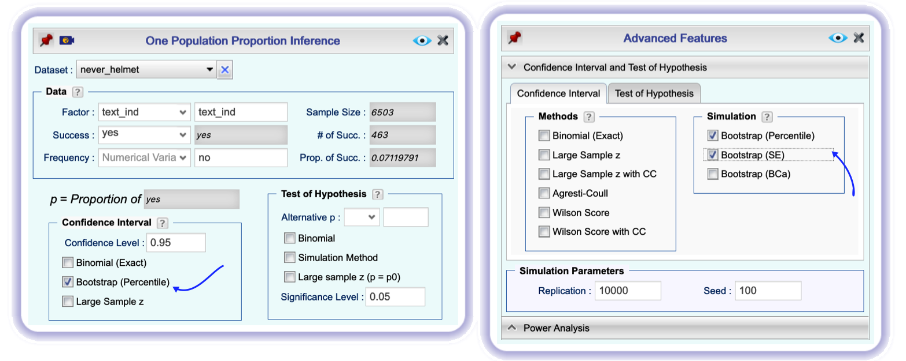
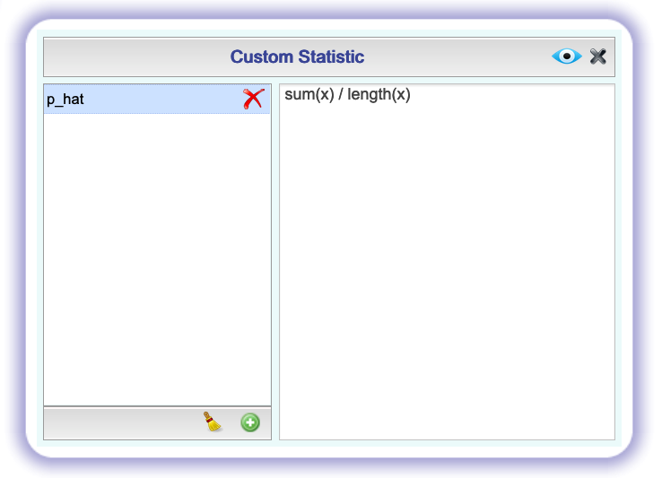
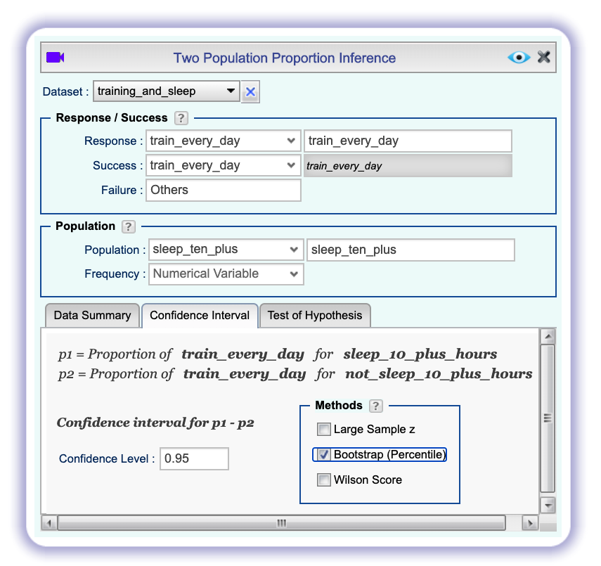

```{r global-options, include=FALSE}
knitr::opts_chunk$set(eval = TRUE, results = FALSE, message = FALSE)
```

## Getting Started

### The data

Every two years, the Centers for Disease Control and Prevention conduct the Youth
Risk Behavior Surveillance System (YRBSS) survey, where it takes data from high 
schoolers (9th through 12th grade), to analyze health patterns. You will work 
with a selected group of variables from a random sample of observations during 
one of the years the YRBSS was conducted.

The dataset is called *yrbss* and can be imported to your Rguroo workspace from Rguroo's `OpenIntro` **Dataset Repository**. Before importing the dataset, remind yourself of the variables in the dataset by clicking on the information icon , shown on the right of the dataset name. 

1.   What are the counts within each category for the number of days these students
have texted while driving within the past 30 days? **Hint:** Go to the **Analytics** toolbox, select *Analysis* $\rightarrow$ *Tabulation*, select the dataset *yrbss*, and tabulate the values for the variable *text_while_driving_30d*. If you need help using the **Data Tabulation** dialog, click the video icon [](https://youtu.be/GEYd98LwxiE) here or on the dialog box to watch the video tutorial *Tabulation and Distribution of Categorical Data*.

1.  What is the proportion of people who have texted while driving every day in 
the past 30 days and never wear helmets? **Hint:** Select the two relevant factors in the **Data Tabulation** dialog, and select the option `Proportions`.

1. Of those who never wore a helmet, what proportion have texted while driving every day in the past 30 days? **Hint:** Here, you are asked to compute a conditional proportion. That is, you need to find proportion of those who have texted while driving everyday in the past 30 days, conditional on never wearing a helmet. See the **Data Tabulation** dialog below, where the option `Cond` is checked. 

```{r text_and_helmet_tabulation, echo=FALSE, results="asis" , fig.align = "center", fig.cap = "*Using Data Tabulation to get a conditional proportion*",out.width="75%"}
knitr::include_graphics("img/text_and_helmet_tabulation.png")
```

To get a cleaner output, you can click  and only retain the level *never* of *helmet_12m* by dropping all other levels.

Let's calculate the above proportions in another way, namely by subsetting the data. When we calculated the conditional proportion in the Exercise above, we were only concerned with those who had stated that they never wore a helmet. Also, it will be easier if we create a new variable, *text_ind*, that specifies whether the individual has texted every day while driving over the past 30 days or not. We could use Rguroo's **Subset** function to get the subset with only those that never wore a helmet, and then use the **Transform** function on the subsetted data to create the variable *text_ind*. However, by using the **Transform** function cleverly, we can accomplish both in the **Transform** function.

Go to the **Data** toolbox and select **Functions** $\rightarrow$ **Transform**. Select the dataset *yrbss*, click the plus sign , and create the variable *text_ind* by typing in the following code in the center panel:

```{r, eval=FALSE}
ifelse(text_while_driving_30d == "30", "yes", "no")
```

Click the plus icon  again, and add a another variable, call it *never_only*, and in the middle panel type the following R code:

```{r, eval=FALSE}
ifelse(helmet_12m == "never", "never", NA)
```

The *never_only* variable will consist of the word "*never*" whenever the variable *helmet_12m* is *never*, and it will be *NA*, otherwise. *NA* is the missing data code in R. So, by selecting `Complete Cases Only` in the **Data Transform** dialog, all the cases that are *NA* will be removed when you preview the data. Thus, in our example, only cases with the value of *never* for the *helmet_12m* variable remain. This is a trick in getting a subset of a dataset using the **Transform** function.

Since we only need the *text_ind* variable to compute our proportion, we move all other variables to the `Excluded Variable` list (See the **Data Transform** dialog below). We have also retained the *never_only* variable, mostly as a reminder. Click the `Preview` button , then **Save** the new dataset as *never_helmet*.
 
```{r transform_never_only, echo=FALSE, results="asis" , fig.align = "center", fig.cap = "*Using Transform to subset the yrbss data and create the text_ind variable*",out.width="80%"}

```

Now, right-click on the *never_helmet* dataset in the **Data** toolbox and select **Dataset Summary**. Then, in the *Categorical Variables* table, you will see the counts of the variable *text_ind* for its levels *yes* and *no*. Use these values to see if you can come up with the same conditional proportion that you computed in Exercise 3.

## Inference on proportions

When summarizing the YRBSS, the Centers for Disease Control and Prevention seeks 
insight into the population *parameters*. To do this, you can answer the question,
"What proportion of people in your sample reported that they have texted while 
driving each day for the past 30 days?" with a statistic; while the question 
"What proportion of people on earth have texted while driving each day for the 
past 30 days?" is answered with an estimate of the parameter.

The inferential tools for estimating population proportion are analogous to 
those used for means in the last chapter: the confidence interval and the 
hypothesis test. Here we construct a confidence interval for the proportion of non-helmet wearers who have consistently texted while driving the past 30 days. 
To do so, we use the dataset *never_helmet* that we created, which consists of data only for non-helmet wearers, and the *text_ind* variable, which has the value "yes" for those who texted each day for the past 30 days and "no" otherwise.

To construct a confidence interval for a population proportion, open the **Analytics** toolbox, then click on **Analysis** $\rightarrow$ **Proportion Inference** $\rightarrow$ **One Population**. In the **One Population Proportion Inference** dialog, select the dataset *never_helmet*. Select *text_ind* in the `Factor` dropdown and choose *yes* from the `Success` dropdown. The three gray textboxes showing the sample size (`Sample Size`), number of successes (`# of Succ.`), and proportion of successes (`Prop. of Succ.`) auto-fill with their corresponding value. The value for the proportion of successes should be familiar! 

Rguroo has nine different options for constructing confidence intervals for a population proportion, although only three are shown in the main **One Population Proportion Inference** dialog. To see all options, click . In the **Advanced Features** dialog, select the section `Confidence Interval and Test of Hypothesis`, and in the tab `Confidence Interval` you will find all nine options.  Select the options `Bootstrap Percentile` and `Bootstrap SE`, then click the `Preview` button  to see the result.

```{r ci_text_ind, echo=FALSE, results="asis" , fig.align = "center", fig.cap = "*Constructing confidence intervals, using bootstrap methods*",out.width="95%"}

```

<div id="boxedtext">
**Rguroo's Bootstrap Method Defaults:** The default number of bootstrap samples in Rguroo is 10,000 and can be changed in the **Advanced Features** dialog by changing the value in the `Replication` textbox. There, you can also change the seed from the default value of 100 in the `Seed` textbox. The default confidence level is 95%, and you can change it in the  dialog in the `Confidence Level` textbox. 
</div>

<div id="boxedtext">
**Rguroo's Bootstrap Computations:** As we saw in the previous lab, the bootstrap sample consists of simulated values from a population with a probability of success equal to the observed sample proportion $\hat p$ (i.e., the proportion of the successes that we observe in our sample). The `Bootstrap (Percentile)` option computes the lower and upper confidence levels of a $100(1-\alpha)%$ confidence interval, respectively, from the $\alpha/2$ and $(1-\alpha)/2$ quantiles of the simulated bootstrap values. For the option `Bootstrap (SE)`, the lower and upper confidence levels are computed using the formula $\hat p \pm z^\star \times SE_{\hat p}$, where $z^\star$ is the $(1-\alpha)/2$ quantile of the standard normal distribution, and $SE_{\hat p}$ is the standard deviation of the simulated bootstrap proportions (*not* the standard deviation given by the formula in the previous lab!). Recall that the quantity $z^\star \times SE_{\hat p}$ is called the *margin of error*.
</div>

With 10,000 replications and 95% confidence level, the lower and upper confidence levels for the *Percentile* method are respectively the $250^{th}$ and the $9,750^{th}$ values in the ascending sorted bootstrap sample. For the *SE* method with 95% confidence level, the $z^\star$ value is 1.96.

1.  What is the margin of error for the estimate of the proportion of non-helmet 
    wearers that have texted while driving each day for the past 30 days based on 
    this survey? **Hint:** you should be able to figure this out using the output for the *Bootstrap (SE)* method.

1.  Using Rguroo's **One Population Proportion Inference**, calculate confidence intervals for two other 
    categorical variables. You'll need to decide which level to call "success", 
    and report the associated margins of error. Interpret the intervals in context 
    of the data. It may be helpful to create new data sets for each of the two 
    categorical variables first, and then use these data sets to construct the confidence intervals.

## How does the proportion affect the margin of error?

Imagine you've set out to survey 1000 people on two questions: are you at least
6-feet tall? and are you left-handed? Since both of these sample proportions were 
calculated from the same sample size, they should have the same margin of 
error, right? Wrong! While the margin of error does change with sample size, 
it is also affected by the proportion.

Think back to the formula for the standard error: $SE = \sqrt{p(1-p)/n}$. This 
is then used in the formula for the margin of error for a 95% confidence 
interval: 
$$
ME = 1.96\times SE = 1.96\times\sqrt{p(1-p)/n} \,.
$$
Since the population proportion $p$ is in this $ME$ formula, it should make sense
that the margin of error is in some way dependent on the population proportion. 
We can visualize this relationship by creating a plot of $ME$ vs. $p$.

Import the dataset *values_of_p* from Rguroo's OpenIntro dataset repository. Double-click on the dataset name to view the data. This dataset consists of a single variable "*p*" with 101 values that start from 0 and go to 1 by increments of 0.01 (the values are 0, 0.01, 0.02, ... , 0.99, 1$). Now, open the **Transform** function from the **Data** toolbox, select the dataset *values_of_p*, click the plus icon  and define a new variable, call it *ME*. We have the **Transform** function compute the margin of error formula. To do so, in the middle section of the **Data Transform** type the following R code:

```{r, eval=FALSE}
n = 1000
ME = 2 * sqrt(p * (1 - p)/n)
```

Since the sample size is irrelevant to this discussion, we set it to
$n = 1000$. Click the `Preview` button . You should see the new variable *ME* in the dataset. Save this dataset with the name *margin_of_error*.

```{r margin_of_error, echo=FALSE, results="asis" , fig.align = "center", fig.cap = "*Computing margin of error as a function of p*",out.width="80%"}

```

Lastly, you can plot the two variables against each other to reveal their 
relationship. To do so, open the **Scatterplot** dialog in the **Plots** toolbox. Select the dataset *margin_of_error*, set `Predictor (x)` to *p*, and `Response (y)` to *ME*. Set the `X-Axis` label to "Population Proportion" and the `Y-Axis` label to "Margin of error." Finally, select the option `Line Graph` in the **superimpose** section of the **Scatterplot** dialog box. In a less important detail, if you want to remove the dots from the graph, uncheck the box `Show Points` in the first section of the **Graph Settings** dialog in the **Details**.

```{r scatter_margin_of_error, echo=FALSE, results="asis" , fig.align = "center", fig.cap = "*Graphing the relationship between p and margin of error*",out.width="95%"}

```


1.  Describe the relationship between *p* and *ME*. Include the margin of
    error vs. population proportion plot you constructed in your answer. For
    a given sample size, for which value of *p* is margin of error maximized?

## Success-failure condition

We have emphasized that you must always check conditions before making 
inference. For inference on proportions, the sample proportion can be assumed 
to be nearly normal if it is based upon a random sample of independent 
observations and if both $np \geq 10$ and $n(1 - p) \geq 10$. This rule of 
thumb is easy enough to follow, but it makes you wonder: what's so special 
about the number 10?

The short answer is: nothing. You could argue that you would be fine with 9 or 
that you really should be using 11. What is the "best" value for such a rule of 
thumb is, at least to some degree, arbitrary. However, when $np$ and $n(1-p)$ 
reaches 10 the sampling distribution is sufficiently normal to use confidence 
intervals and hypothesis tests that are based on the normal approximation.

You can investigate the interplay between $n$ and $p$ and the shape of the 
sampling distribution by using simulations. Let's see how we can visualize the sampling distribution of $\hat p$ for a given sample size and a value of the population proportion $p$. The easiest approach is to simulate values from the so-called Bernoulli random variable.

A Bernoulli random variable has an associated success probability $p$; we denote this random variable by $Bernoulli(p)$. Each simulated value from a $Bernoulli(p)$ random variable, is either 1 (success) with probability $p$ or 0 (failure) with probability $1-p$. Say we would like to investigate the sampling distribution of the sample proportion $\hat p$, for a sample of size $n=300$ and population probability of success $p = 0.1$. Let's begin by simulating one sample of size 300.

In the **Probability-Simulation** toolbox select **Probability** $\rightarrow$ **Multiple Distribution Generator**. In the **Multiple Distribution Random Generator** dialog that opens click the plus icon  to define your simulation. Change the name *Sample_1* to *Bern*. This name can be anything, as long as it has no spaces. This function allows simulating from various types of random variables. For our example, select *Bernoulli* from the `Distribution` dropdown, type-in 0.1 in the `Prob. of Success` textbox, and type-in 300 in the `Sample Size` textbox. Click the `Preview` button  to see the result.

```{r bernoulli, echo=FALSE, results="asis" , fig.align = "center", fig.cap = "*Generating a sample of size 300 from Bernoulli(p=0.1)*",out.width="75%"}

```

You should have 300 rows of data (by default 100 is shown), with most of the values (approximately 90%) being 0, and the others (approximately 10%) being 1. Thus, we have simulated one sample of size 300 from a population with a proportion of successes 0.1. 

Now click the  to the  button to reopen the **Multiple Distribution Random Generator** dialog. Leave everything as is, except change the value of `Replications` from 1 to 5, and click the `Preview` button .  This time you should see five columns labeled *Bern_1*, *Bern_2* ... *Bern_5* with each column being a sample of size 300 from $Bernoulli(p=0.1)$.

Now let's have Rguroo compute the sample proportions $\hat p$ for each of the samples. 
Again, click the  button to reopen the **Multiple Distribution Random Generator** dialog. Click the `Custom Statistic` button at the bottom of the dialog to open the **Custom Statistic** dialog. Click the plus icon  and change the name *Statistic_1* to *phat*, and in the text area to the right type in the following R code:

```{r, eval = FALSE}
sum(x) / length(x)
```

The command `sum(x)` adds all the values in each sample (in our example the zeros and ones), thus its result is the total number of successes for each sample. The command `length(x)` counts the number of values in each sample, which is the sample size. Dividing these two quantities give the sample proportion of successes. Click the `Preview` button  to see the result.

```{r custom_stats, echo=FALSE, results="asis" , fig.align = "center", fig.cap = "*A custom statistic to compute sample proportion*",out.width="75%"}

```

The result is five values, under the variable name *Bern_phat* that are the proportions of successes (or 1's) for each of the five samples that we simulated. What are these values close to?

Now that we know how to simulate sample proportions $\hat p$, we can investigate its  sampling distribution for various values of $n$ and $p$ by simulating a large number of $\hat p$'s.

Increase the number of replications to 1000, and save the resulting dataset as *phat_n300*. It's best to save both the parameters and the standalone dataset. When you save the parameters, you can come back to the dialog box and change values of $n$ and $p$ to see other sampling distributions.

By right-clicking on the dataset name *phat_n300*, you can see the mean and standard deviation of the variable *Bern_phat*. Compare these values to the values of $p$ and $SE = \sqrt{np(1-p)}$. 

To see the shape of the distribution, in the **Plots** toolbox select **Create Plot** $\rightarrow$ **Dotplot**. In the **Dotplot** dialog select the dataset *phat_n300* and in the **Numerical Variables** section of the dialog move the variable name *Bern_phat* to the `Selected` column. Click the `Preview` button  to see the distribution of $\hat p$ for $n=300$ and $p=10$. 

```{r phat_dotplot, echo=FALSE, results="asis" , fig.align = "center", fig.cap = "*Creating dotplot of the simulated p-hat values*",out.width="75%"}
knitr::include_graphics("img/phat_dotplot.png")
```

1.  Describe the sampling distribution of sample proportions at $n = 300$ and 
    $p = 0.1$. Be sure to note the center, spread, and shape.

1.  Keep $n=300$ constant and change $p$. How does the shape, center, and spread 
    of the sampling distribution vary as $p$ changes? For example try the following values for $p$: 0.005, 0.01, 0.2, 0.5, 0.7, 0.99, and 0.995. Hint: Go back to the *phat_n300* simulation that you saved and click on the plus icon  and fill-in the same information as the one that we did for the case $n=300$ and $p = 0.1$, except change the $p$ to each of the above values for each case. When you preview the result, you should see eight columns of data, each corresponding to one of the probability values.
    
<div id="boxedtext">
**How to see all plots simultaneously: ** If you want to see all of the distributions at the same time, use the option `Stacked with Sample IDs` in the **Multiple Distribution Random Generator** dialog box, and plot the values by the factor ID in the **dotplot** function.
</div>

    
1.  Now also change $n$. How does $n$ appear to affect the distribution of $\hat{p}$? For example, keep $p = 0.1$ and try the following values of $n$: 10, 50, 100, 300, and 1000.

* * *

## More Practice

For some of the exercises below, you will conduct inference comparing two 
proportions. In such cases, you have a response variable that is categorical, and
an explanatory variable that is also categorical, and you are comparing the 
proportions of success of the response variable across the levels of the 
explanatory variable. 

1.  Is there convincing evidence that those who sleep 10+ hours per day are more
    likely to strength train every day of the week? As always, write out the 
    hypotheses for any tests you conduct and outline the status of the conditions
    for inference. If you find a significant difference, also quantify this 
    difference with a confidence interval. See instructions below on how to use Rguroo to solve this problem.
    
As a first step, use the **Transform** function to create two variables from the yrbss data that are indicators for sleep 10+ hours and strength training every day. Call the variables *sleep_10_plus* and *train_every_day*. Use the R code:

```{r eval=FALSE}
ifelse(school_night_hours_sleep == "10+", "sleep_10_plus_hours","not_sleep_10_plus_hours")
ifelse(strength_training_7d == 7, "train_every_day", "not_train_every_day")
```


```{r subset_train_sleep, echo=FALSE, results="asis" , fig.align = "center", fig.cap = "*Data Transform dialog a obtain a subset of the yrbss dataset*",out.width="75%"}

```

In the **Analytics** toolbox select **Proportion Inference** $\rightarrow$ **Two Populations**. ill-out the **Two Population Proportion Inference** dialog as shown below.


```{r Entering_data_two_pop, echo=FALSE, results="asis" , fig.align = "center", fig.cap = "*Entering data to test hyposeses about difference of two population proportions.*",out.width="75%"}

```

Click on the `Test of Hypothesis` tab, and fill-in the information, and preview the result. You will obtain a p-value.

```{r two_pop_proportion_test_of_hypothesis, echo=FALSE, results="asis" , fig.align = "center", fig.cap = "*Specifying method and the alternative hypothesis*",out.width="75%"}

```

To obtain a confidence interval for the difference of the two proportions, select the `Confidence Interval` tab and check the method `Bootstrap (Percentile).

```{r ci_diff_two_prop, echo=FALSE, results="asis" , fig.align = "center", fig.cap = "*Obtaining bootstrap confidence intervals for difference of two proportions*",out.width="75%"}

```


1.  Let's say there has been no difference in likeliness to strength train every
    day of the week for those who sleep 10+ hours. What is the probablity that
    you could detect a change (at a significance level of 0.05) simply by chance?
    *Hint:* Review the definition of the Type 1 error.

1.  Suppose you're hired by the local government to estimate the proportion of 
    residents that attend a religious service on a weekly basis. According to 
    the guidelines, the estimate must have a margin of error no greater than 
    1% with 95% confidence. You have no idea what to expect for $p$. How many 
    people would you have to sample to ensure that you are within the 
    guidelines?\
    *Hint:* Refer to your plot of the relationship between $p$ and margin of 
    error. This question does not require using a dataset.

* * *

<a rel="license" href="http://creativecommons.org/licenses/by-sa/4.0/"></a><br />This work is licensed under a <a rel="license" href="http://creativecommons.org/licenses/by-sa/4.0/">Creative Commons Attribution-ShareAlike 4.0 International License</a>. Rguroo.com, the Rguroo.com logo, and all other trademarks, service marks, graphics and logos used in connection with Rguroo.com or the Website are trademarks or registered trademarks of Soflytics Corp. in the USA and other countries and are not included under the CC-BY-SA license.