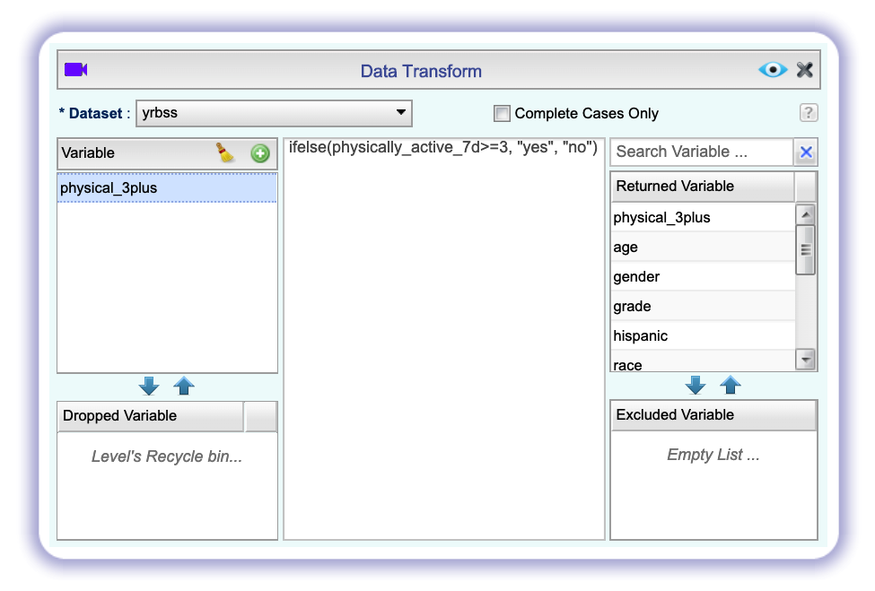
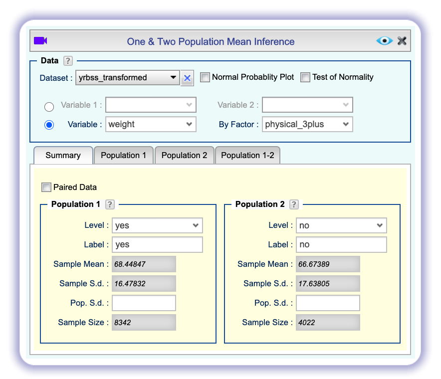

```{r global_options, include=FALSE}
knitr::opts_chunk$set(eval = TRUE, message = FALSE)
```

## Getting Started

### The data

Every two years, the Centers for Disease Control and Prevention conduct the Youth
Risk Behavior Surveillance System (YRBSS) survey, where it takes data from high 
schoolers (9th through 12th grade), to analyze health patterns. You will work 
with a selected group of variables from a random sample of observations during 
one of the years the YRBSS was conducted. We have already seen this dataset in the previous lab and it should already be in your Data pane.

## Exploratory data analysis

You will first start with analyzing the weight of the participants in kilograms:
`weight`.

Using the `Dataset Summary` and `Histogram` functions in Rguroo, describe the distribution of weights.

1.  How many observations are we missing weights from?

Next, consider the possible relationship between a high schooler's weight and their
physical activity. Plotting the data is a useful first step because it helps 
us quickly visualize trends, identify strong associations, and develop research
questions.

First, let's create a new variable `physical_3plus`, which will be coded as either
"yes" if they are physically active for at least 3 days a week, and "no" if not. Remember that we do this with `Transform`.

```{r create new var, echo = FALSE, results = "asis"}

```

Let's save the dataset as `yrbss_transformed`.

1.  Make a side-by-side boxplot of `physical_3plus` and `weight`. Is there a 
relationship between these two variables? What did you expect and why?

The box plots show how the medians of the two distributions compare, but we can
also compare the means of the distributions using the `Summary Statistic` function:

```{r by-means1, echo = FALSE, results = "asis"}

```

There is an observed difference, but is this difference statistically 
significant? In order to answer this question we will conduct a hypothesis test.

## Inference

1.  Are all conditions necessary for inference satisfied? Comment on each. You can 
see the group sizes in the same Summary Statistic output.

1.  Write the hypotheses for testing if the average weights are different for those
who exercise at least times a week and those who don't.

Next, we will use the `Mean Inference` dialogs to conduct hypothesis tests. Since we are looking at a difference between two groups, we want the `One and Two Population` version.

First, select the `yrbss_transformed` dataset. We want to look at the values of a numerical `Variable`, weight, grouped `By Factor`, physical_3plus. Select the appropriate Population ` and Population 2 `Level`. In the screenshot below, Population 1 represents the people who are physically active at least 3 days a week ("yes") and Population 2 represents the people who are not ("no").

```{r HT1, echo = FALSE, results = "asis"}
knitr::include_graphics("img/hypothesistest1-1.png")
```

In the tabs below, click `Population 1-2` to indicate that we are comparing two populations, then click the `Test of Hypothesis` tab. The default option in Rguroo is to do a test using a `z-statistic`; uncheck that box and instead check the `Permutation Unscaled` box to do a simulation-based test for the difference of means. Fill in the appopriate alternative hypothesis and view the results.

```{r HT2, echo = FALSE, results = "asis"}

```


We can visualize the null distribution by finding in the output the graph labeled "Distribution of Permutation Replicates".

1. According to the graph, what is the p-value? How many replicates were generated, and how many of them produced a difference of at least `obs_stat`?

This the standard workflow for performing hypothesis tests.

1.  Construct and record a confidence interval for the difference between the 
weights of those who exercise at least three times a week and those who don't, and
interpret this interval in context of the data.

* * *

## More Practice

1.  Calculate a 95% confidence interval for the average height in meters (`height`)
and interpret it in context.

1.  Calculate a new confidence interval for the same parameter at the 90% 
confidence level. Comment on the width of this interval versus 
the one obtained in the previous exercise.

1.  Conduct a hypothesis test evaluating whether the average height is different
for those who exercise at least three times a week and those who don't.

1.  Now, a non-inference task: Determine the number of different options there 
are in the dataset for the `hours_tv_per_school_day` there are.

1. Come up with a research question evaluating the relationship between height 
or weight and sleep. Formulate the question in a way that it can be answered using
a hypothesis test and/or a confidence interval. Report the statistical results, 
and also provide an explanation in plain language. Be sure to check all 
assumptions, state your $\alpha$ level, and conclude in context.

* * *

<a rel="license" href="http://creativecommons.org/licenses/by-sa/4.0/"></a><br />This work is licensed under a <a rel="license" href="http://creativecommons.org/licenses/by-sa/4.0/">Creative Commons Attribution-ShareAlike 4.0 International License</a>.
