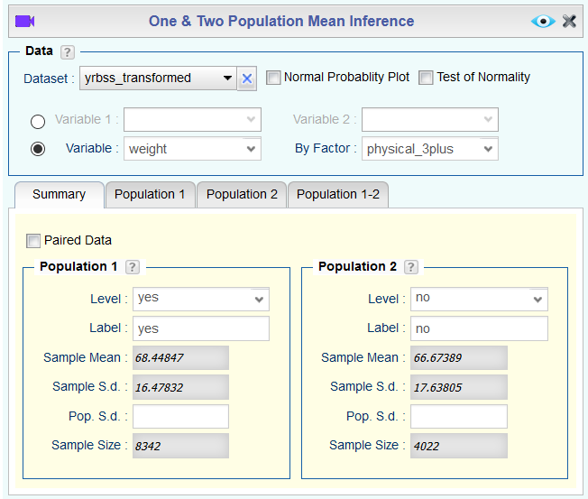

```{r global_options, include=FALSE}
knitr::opts_chunk$set(eval = TRUE, message = FALSE)
```

## Getting Started

### The data

Every two years, the Centers for Disease Control and Prevention conduct the Youth
Risk Behavior Surveillance System (YRBSS) survey, where it takes data from high 
schoolers (9th through 12th grade), to analyze health patterns. You will work 
with a selected group of variables from a random sample of observations during 
one of the years the YRBSS was conducted. We have already seen this dataset in the previous lab and it should already be imported to your **Data** toolbox.

There are observations on 13 different variables, some categorical and some numerical. Recall that you can find the meaning of each variable by locating the *yrbss* dataset in the Rguroo's `OpenIntro` **Dataset Repository** and clicking on the information icon . Also, recall that you can obtain a summary of the data by right-clicking the *yrbss* dataset name in the **Data** toolbox and selecting **Dataset Summary**.

1. What are the cases in this data set? How many cases are there in our sample?

## Exploratory data analysis

You will first start with analyzing the weight of the participants in kilograms:
`weight`.

1.  How many observations are we missing weights from?

1. Using the **Histogram** function in Rguroo, visualize the distribution of weights. Include the plot you create and write 1-2 sentences to describe the distribution in words.

Next, consider the possible relationship between a high schooler's weight and their
physical activity. Plotting the data is a useful first step because it helps 
us quickly visualize trends, identify strong associations, and develop research
questions.

First, let's create a new variable `physical_3plus`, which will be coded as either
"yes" if they are physically active for at least 3 days a week, and "no" if not. Remember that we do this in the **Transform** function. The code is:

```{r create var, eval = FALSE}
ifelse(physically_active_7d >= 3, "yes", "no")
```

```{r create new var, echo = FALSE, results = "asis", fig.align = "center", fig.cap = "*Creating the catgorical variable physical_3plus*", out.width="90%"}
knitr::include_graphics("img/transform1-1.png")
```

Let's **Save** the dataset with the added variable *physical_3plus* as *yrbss_transformed*.

To create a boxplot, open the **Plots** toolbox and select **Create Plots** $\rightarrow$ **Boxplot**. Move the variable *weight* in the `Numerical Variables` section to the `Selected` column, and move the variable *physical_3plus* in the `Factor Variables` column to the `Selected` column. Rguroo considers the missing values for a categorical variable as a level of a categorical variable. In order not to include the missing cases in the *physical_3plus* variable, click on the   button, and in the **Factor Level Editor** dialog, select *physical_3plus* and move the level *NA* (standing for missing data) from the `Level` column to the `Dropped Level` column.
Click the `Preview` icon  to see the new set of boxplots.

```{r boxplot_weights, echo = FALSE, results = "asis", fig.align = "center", fig.cap = "*Creating a boxplot of weights by the categorical variable physical_3plus*", out.width="80%"}

```

1.  Look at the side-by-side boxplot of `physical_3plus` and `weight` that you created in Rguroo. Is there a relationship between these two variables? What did you expect and why?

The box plots show how the medians of the two distributions compare, but we can
also compare the means of the distributions. You can check the box `Show Mean` on the top right of the **Boxplot** dialog to add two red diamonds to the plot that indicate the mean weight for each group. You can also use the **Summary Statistic** function in the **Data** toolbox to find the values for the mean weight in each group.

```{r by-means1, echo = FALSE, results = "asis"}
knitr::include_graphics("img/summarystat1-1.png")
```

There is an observed difference, but is this difference statistically 
significant? In order to answer this question we will conduct a hypothesis test.

## Hypothesis Test Step-by-Step

### Step 0: Ensure all necessary conditions for performing inference are met

Before doing the hypothesis test, we need to look at our graphical and numerical summaries to determine which conditions for performing our desired inference are satisfied. If all conditions are satisfied, then we can proceed. If not, then we need to find a different type of hypothesis test that only requires the conditions that are satisfied.

1.  Are all conditions necessary for inference satisfied? Comment on each. You can 
see the group sizes in the **Summary Statistic** output that you created above.

### Step 1: Specify the null hypothesis, alternative hypothesis, and significance level

We write each hypothesis as a complete sentence and also, if possible, as a "mathematical sentence" (equation or inequality) about the parameter(s) of interest.

1.  Write the (null and alternative) hypotheses for testing if the average weights are different between those who exercise at least three times a week and those who don't.

We also specify our significance level $\alpha$ in this step. This removes the temptation to define our $\alpha$ level after seeing the results of the test. For this lab example, we will use $\alpha = 0.05$, a typical default significance level.

### Step 2: Choose the appropriate procedure in your statistical software

Since our null and alternative hypothesis concern population means, we use Rguroo's  **Mean Inference** dialog from the **Analytics** toolbox to conduct this hypothesis test. Since our null and alternative hypothesis discuss a difference between two groups, we select the **One and Two Population** option under **Mean Inference**.

### Step 3: Set up the test in your statistical software

To fill out the **One & Two Population Mean Inference** dialog for this test, select the *yrbss_transformed* `Dataset`. We want to look at the values of a numerical `Variable`, *weight*, grouped `By Factor`, *physical_3plus*. Select either "yes" or "no" as the `Level` in the `Population 1` section and the other value as the `Level` in the `Population 2` section. In the screenshot below, Population 1 represents the people who are physically active at least 3 days a week ("yes") and Population 2 represents the people who are not ("no").

```{r HT1, echo = FALSE, results = "asis", fig.align = "center", fig.cap = "*Testing a hypothesis about difference of two population means*", out.width="80%"}

```

In the tabs below, click `Population 1-2` to indicate that we are comparing two populations, then click the `Test of Hypothesis` tab. The default option in Rguroo is to do a test using a `z-statistic`; uncheck that box and instead check the `Permutation Unscaled` box to do a simulation-based test for the difference of means. Fill in the appropriate alternative hypothesis.

```{r HT2, echo = FALSE, results = "asis", fig.align = "center", fig.cap = "*Specifying the method and the alternative hypothesis*", out.width="80%"}
knitr::include_graphics("img/hypothesistest1-2b.png")
```

### Step 4: Run the test and identify the p-value in the output

Now, we can `Preview`  the Rguroo output for our hypothesis test. We can visualize the null distribution (the sampling distribution of the test statistic, assuming the null hypothesis is true) by finding in the output the graph labeled "Distribution of Permutation Replicates."

1. According to the graph, what is the p-value? How many replicates were generated, and how many of them produced a difference at least as great as the observed difference in sample means?

### Step 5: Make a conclusion in context

A conclusion requires two steps. First, we must decide whether to reject the null hypothesis. Second, we must explain what that decision means in the context of our original question.

1. Using our $\alpha = 0.05$ significance level, do we have enough statistical evidence to reject the null hypothesis? What does this suggest about the difference in average weight between those who exercise at least three times a week and those who don't?

This process is the standard workflow for performing hypothesis tests.


* * *

## More Practice

1.  Construct and record a 95% confidence interval for the difference between the average 
weights of those who exercise at least three times a week and those who don't, and
interpret this interval in context of the data. This exercise uses the same data as in the previous section. To construct a bootstrap confidence interval using this data, click the  button to reopen the dialog box, select the `Confidence Interval` tab, and select the option `Bootstrap Percentile`.

1.  Calculate a 95% confidence interval for the average height in meters (*height*)
and interpret it in context.

1.  Click on , change the `Confidence Level` to *0.90*, and obtain a new confidence interval for the same parameter at the 90% 
confidence level. Comment on the width of this interval versus 
the one obtained in the previous exercise.

1.  Conduct a hypothesis test evaluating whether the average height is different
for those who exercise at least three times a week and those who don't. Follow all steps in the workflow.

1.  Now, a non-inference task: Determine the number of different options there 
are in the dataset for the variable *hours_tv_per_school_day*.

1. Come up with a research question evaluating the relationship between height 
or weight and sleep. Formulate the question in a way that it can be answered using
a hypothesis test and/or a confidence interval for a difference of means. Report the statistical results, 
and also provide an explanation in plain language. Be sure to check all 
assumptions, state your $\alpha$ level, and conclude in context.

* * *

<a rel="license" href="http://creativecommons.org/licenses/by-sa/4.0/"></a><br />This work is licensed under a <a rel="license" href="http://creativecommons.org/licenses/by-sa/4.0/">Creative Commons Attribution-ShareAlike 4.0 International License</a>. Rguroo.com, the Rguroo.com logo, and all other trademarks, service marks, graphics and logos used in connection with Rguroo.com or the Website are trademarks or registered trademarks of Soflytics Corp. or Soflytics Corp. licensors and are not included under the CC-BY-SA license.
