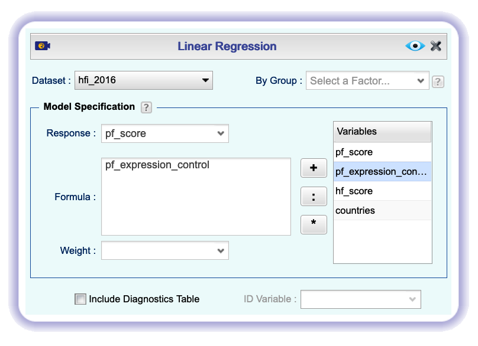
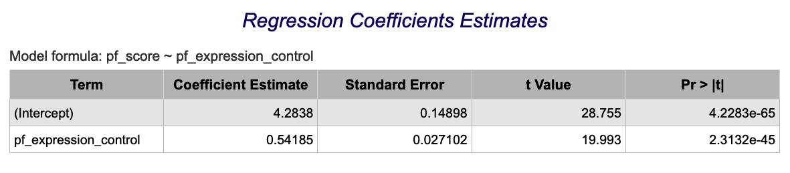
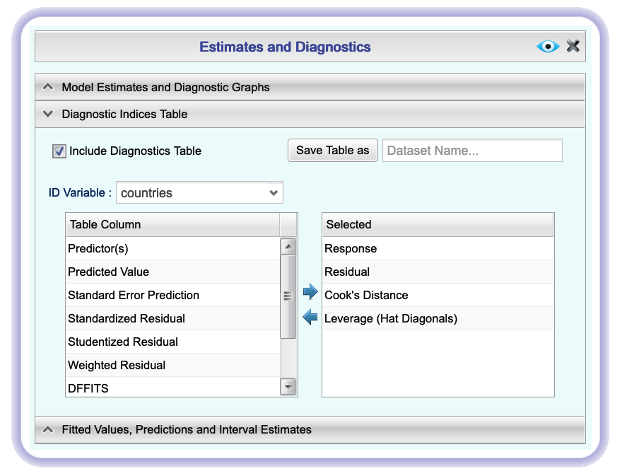
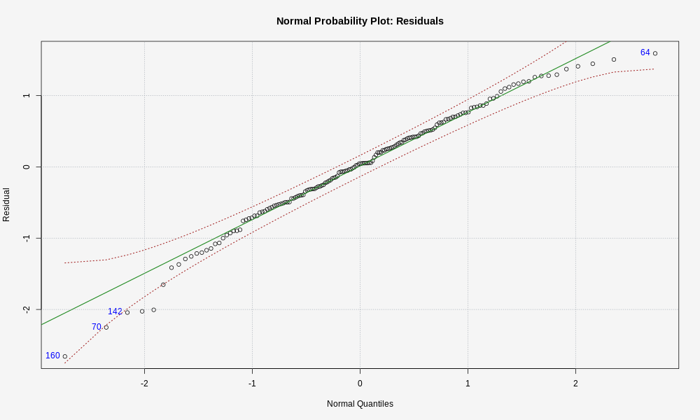

```{r global_options, include=FALSE}
knitr::opts_chunk$set(eval = TRUE, results = FALSE, message = FALSE)
```

The Human Freedom Index is a report that attempts to summarize the idea of "freedom"
through a bunch of different variables for many countries around the globe.
It serves as a rough objective measure for the relationships between the different
types of freedom - whether it's political, religious, economical or personal freedom -
and other social and economic circumstances. The Human Freedom Index is an anually
co-published report by the Cato Institute, the Fraser Institute, and the Liberales
Institut at the Friedrich Naumann Fourndation for Freedom.

In this lab, you'll be analyzing data from Human Freedom Index reports from 2008-2016.
Your aim will be to summarize a few of the relationships within the data both 
graphically and numerically in order to find which variables can help tell a story
about freedom.

## Getting Started

### The data

The data we're working with is in the Rguroo Data Repository and it's called `hfi`, 
short for Human Freedom Index.

1.  What are the dimensions of the dataset?

1.  What type of plot would you use to display the relationship between the personal
    freedom score, `pf_score`, and one of the other numerical variables? Plot 
    this relationship using the variable `pf_expression_control` as the predictor.
    Does the relationship look linear? If you knew a country's `pf_expression_control`,
    or its score out of 10, with 0 being the most, of political pressures and 
    controls on media content, would you be comfortable using a linear model to
    predict the personal freedom score?


If the relationship looks linear, we can quantify the strength of the
relationship with the correlation coefficient. Click `Basics` and check the `Show Correlation and LS Equation` box.

## Sum of squared residuals

*** This doesn't work in Rguroo ***

<div id="boxedtext">
In this section, you will use an interactive function to investigate what we mean by "sum 
of squared residuals". You will need to run this function in your console, not in your 
markdown document. Running the function also requires that the `hfi` dataset is loaded 
in your environment.
</div>

Think back to the way that we described the distribution of a single variable. 
Recall that we discussed characteristics such as center, spread, and shape. It's
also useful to be able to describe the relationship of two numerical variables, 
such as `pf_expression_control` and `pf_score` above.

1.  Looking at your plot from the previous exercise, describe the relationship 
    between these two variables. Make sure to discuss the form, direction, and 
    strength of the relationship as well as any unusual observations.

Just as you've used the mean and standard deviation to summarize a single variable, 
you can summarize the relationship between these two variables by finding the 
line that best follows their association. Use the following interactive 
function to select the line that you think does the best job of going through 
the cloud of points.

```{r plotss-expression-score, eval=FALSE}
#this isn't working, wondering if we should just remove rows with NA
plot_ss(x = pf_expression_control, y = pf_score, data = hfi)
```

After running this command, you'll be prompted to click two points on the plot 
to define a line. Once you've done that, the line you specified will be shown in
black and the residuals in blue. Note that there are 30 residuals, one for each 
of the 30 observations. Recall that the residuals are the difference between the
observed values and the values predicted by the line:

\[
  e_i = y_i - \hat{y}_i
\]

The most common way to do linear regression is to select the line that minimizes
the sum of squared residuals. To visualize the squared residuals, you can rerun 
the plot command and add the argument `showSquares = TRUE`.

```{r plotss-expression-score-squares, eval=FALSE}
plot_ss(x = pf_expression_control, y = pf_score, data = hfi, showSquares = TRUE)
```

Note that the output from the `plot_ss` function provides you with the slope and
intercept of your line as well as the sum of squares.

1.  Using `plot_ss`, choose a line that does a good job of minimizing the sum of
    squares. Run the function several times. What was the smallest sum of 
    squares that you got? How does it compare to your neighbors?

## The linear model

It is rather cumbersome to try to get the correct least squares line, i.e. the 
line that minimizes the sum of squared residuals, through trial and error. However, it is quite easy to obtain the model in Rguroo. In your plot, click `Basics` and check the `LS Line` button. Your plot should now show the least squares line and, if you also checked the box earlier to show the correlation, the equation of the line should be shown above the plot.

To get more information about the line, in the `Analytics` section, select `Linear Regression`. In the dialog, select `hfi` as the Dataset and `pf_score` as the Response. In the Formula box, type `pf_expression_control`:

```{r linreg1, echo= FALSE, results = "asis"}

```

The most important part of the output is the Regression Coefficient Estimates table:

```{r linreg1 output, echo= FALSE, results = "asis"}

```

Let's consider this output piece by piece. Its first column displays the linear model's y-intercept and the coefficient of `pf_expression_control`.
With this table, we can write down the least squares regression line for the 
linear model:

\[
  \hat{y} = 4.6171 + 0.49143 \times pf\_expression\_control
\]

One last piece of information we will discuss from the summary output is the 
Multiple R-squared, or more simply, $R^2$. This value can be found in the table helpfully labeled Model Summary: Coefficient of Determination (R-Squared) The $R^2$ value represents the 
proportion of variability in the response variable that is explained by the 
explanatory variable. For this model, 63.42% of the variability in pf_score is 
explained by pf_expression_control.

In Rguroo, the model and report need to be saved separately. Click the Save button, then save both the model and report as `hfi_model1`.

1.  Fit a new model that uses `pf_expression_control` to predict `hf_score`, or
    the total human freedom score. Using the estimates from the Rguroo output, write 
    the equation of the regression line. What does the slope tell us in the 
    context of the relationship between human freedom and the amount of political
    pressure on media content?

## Prediction and prediction errors

Go back to the scatterplot with the least squares line laid on top.

This line can be used to predict $y$ at any value of $x$. When predictions are 
made for values of $x$ that are beyond the range of the observed data, it is 
referred to as *extrapolation* and is not usually recommended. However, 
predictions made within the range of the data are more reliable. They're also 
used to compute the residuals.

1.  If someone saw the least squares regression line and not the actual data, how
    would they predict a country's personal freedom score for one with a 6.7 rating
    for `pf_expression_control`? Is this an overestimate or an underestimate, and
    by how much? In other words, what is the residual for this prediction?

## Model diagnostics

To assess whether the linear model is reliable, we need to check for (1) 
linearity, (2) nearly normal residuals, and (3) constant variability.

**Linearity**: You already checked if the relationship between `pf_score` and 
`pf_expression_control' is linear using a scatterplot. We should also verify this
condition with a plot of the residuals vs. fitted (predicted) values.

This plot can be found in the Rguroo Linear Regresion output as the plot labeled Residuals vs. Fit.

```{r residual plot, echo= FALSE, results = "asis"}
knitr::include_graphics("img/res_fit.png")
```

The red dashed line is a horizontal line at $y = 0$ (to help us check whether the residuals are distributed around 0), and the green line is a moving average of sorts (to help us look for underlying patterns).


1.  Is there any apparent pattern in the residuals plot? What does this indicate
    about the linearity of the relationship between the two variables?  

</br>

**Nearly normal residuals**: To check this condition, we can look at a histogram of the residuals. To do this, we need to save the residuals as an Rguroo dataset. Click `Details`, go to the `Diagnostic Indices Table` section, and check `Include Diagnostics Table`. Then View the output to re-run the model.

Now we can save the dataset. Open the `Diagnostics Indices Table` section again and save the table as `hfi_residuals`.

```{r save table, echo= FALSE, results = "asis"}

```

Once you have the dataset saved, you can make a histogram of the `hfi_residuals` dataset, variable `Residuals`.

In Rguroo, it is much less work to look at a normal probability plot of the residuals, as the plot is shown in the default Rguroo output and labeled Normal Probability Plot: Residuals.

```{r qq-res, echo= FALSE, results = "asis"}

```

1.  Based on the histogram and normal probability plot, does the nearly 
    normal residuals condition appear to be met?

</br>

**Constant variability**:

1.  Based on the residuals vs. fitted plot, does the constant variability condition 
    appear to be met?

* * *

## More Practice
<div class="oyo">

-   Choose another freedom variable and a variable you think would strongly
    correlate with it.. Produce a scatterplot of the two variables and fit a 
    linear model. At a glance, does there seem to be a linear relationship?

-   How does this relationship compare to the relationship between 
    `pf_expression_control` and `pf_score`? Use the $R^2$ values from the two 
    model summaries to compare. Does your independent variable seem to predict
    your dependent one better? Why or why not?


-   What's one freedom relationship you were most surprised about and why? Display
    the model diagnostics for the regression model analyzing this relationship.
    
* * *

<a rel="license" href="http://creativecommons.org/licenses/by-sa/4.0/"></a><br />This work is licensed under a <a rel="license" href="http://creativecommons.org/licenses/by-sa/4.0/">Creative Commons Attribution-ShareAlike 4.0 International License</a>.
