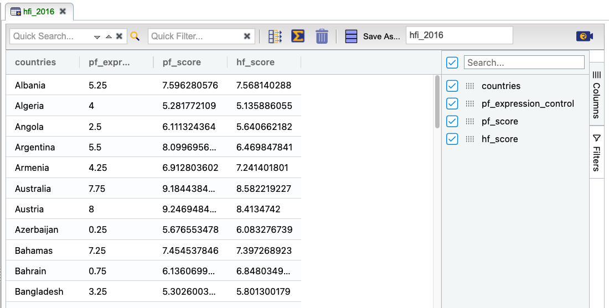

```{r global_options, include=FALSE}
knitr::opts_chunk$set(eval = TRUE, results = FALSE, message = FALSE)
```

The Human Freedom Index is a report that attempts to summarize the idea of "freedom"
through a bunch of different variables for many countries around the globe.
It serves as a rough objective measure for the relationships between the different
types of freedom - whether it's political, religious, economical or personal freedom -
and other social and economic circumstances. The Human Freedom Index is an annually
co-published report by the Cato Institute, the Fraser Institute, and the Liberales
Institut at the Friedrich Naumann Foundation for Freedom.

In this lab, you'll be analyzing data from Human Freedom Index reports for 2016.
Your aim will be to summarize a few of the relationships within the data both 
graphically and numerically in order to find which variables can help tell a story
about freedom.

## Getting Started

### The data

The data we're working with is in the `OpenIntro` **Dataset Repository** and it's called *hfi*, short for Human Freedom Index.

1.  What are the dimensions of the dataset? (How many rows, how many columns?)

#### Subsetting the data

This dataset has **a lot** of variables, but we are only interested in a few. There are also nine years of data in this dataset, but we are only interested in 2016. We can use Rguroo's **Subset** function to obtain only the variables of interest for 2016, but it is simpler to use the built-in filters in the Data Editor.

In the **Data** toolbox, right-click the dataset *hfi* and select *Open*. On the very right, select  and open *year*. Click *Select All* to de-select everything, then check the *2016* box to select only the year 2016. Then, on the very right, select  to choose the columns in the dataset. Click the checkbox next to the *Search* function to de-select everything, then check the boxes next to the variables we will use in this lab: *pf_score*, *pf_expression_control*, *hf_score*, and *countries*. It may be easiest to search for these variables individually in the search box rather than scroll through the entire list, as demonstrated in the figure below. **Save** the new dataset as *hfi_2016*.

1. How many rows and columns are in the new *hfi_2016* dataset?

```{r subset1, echo= FALSE, results = "asis", fig.cap = "*Subsetting columns in Rguroo using the Data Editor*", fig.align='center'}
#
```


## Exploring the data

1.  What type of plot would you use to display the relationship between the personal
    freedom score, *pf_score*, and one of the other numerical variables? Plot 
    this relationship using the variable *pf_expression_control* as the predictor. Use the appropriate function in Rguroo's **Plots** toolbox. Does the relationship look linear? If you knew a country's value for *pf_expression_control* (how much political pressure and control the country has on media content, with 0 being the most control and 10 being no control), would you be comfortable using a linear model to predict the personal freedom score in that country? 

If the relationship looks linear, we can quantify the strength of the
relationship with the correlation coefficient. In the Rguroo tab showing your graph, click  and check the `Show Correlation and LS Equation` box.

## The linear model

It is rather cumbersome to try to get the correct least squares line, i.e. the 
line that minimizes the sum of squared residuals, through trial and error. However, it is quite easy to obtain the model in Rguroo. In your plot, click  and check the `LS Line` button. Your plot should now show the least squares line and, if you also checked the box earlier to show the correlation, the equation of the line should be shown above the plot.

To get more information about the line, in the **Analytics** toolbox section, select **Linear Regression** then **Simple and Multiple Regression**. In the dialog, select *hfi_2016* as the `Dataset`. You can specify the `Response` variable for our model by either typing *pf_score* in the text box or selecting *pf_score* from the dropdown menu. The `Formula` box specifies the explanatory variable(s) in the model. You can either type *pf_expression_control* in the box, or double-click *pf_expression_control* in the `Variables` list on the right to move it into the box automatically.

Once your dialog looks like the screenshot below, `Preview`  the output.

```{r linreg1, echo= FALSE, results = "asis", fig.cap = "*Creating the least-squares model in Rguroo*", fig.align='center'}
knitr::include_graphics("img/linear-regression-1.png")
```

The default Rguroo output contains a table reporting the number of cases (rows) used in the analysis, the **Regression Coefficients Estimates** table, a **Model Summary** giving additional information about the model, an **Analysis of Variance** table, and two diagnostic plots (**Residuals Versus Fit** and **Normal Probability Plot: Residuals**) useful for checking conditions for inference.

We will start by investigating the **Regression Coefficients Estimates** table:

```{r linreg1 output, echo= FALSE, results = "asis", fig.cap = "*The Regression Coefficients Estimates table for the least-squares model*", fig.align='center'}
knitr::include_graphics("img/linear-regression-1-output.png")
```

The first column in this table identifies each *Term* in our model. A simple linear regression model has two terms: a y-intercept and a term containing the predictor variable. So according to the *Term* column, the first row contains information about the y-intercept term and the second row contains information about the *pf_expression_control* term. The second column displays the actual values of the y-intercept and the slope coefficient corresponding to *pf_expression_control*. With this table, we can write down the equation of the least squares regression line for the linear model:

\[
  \widehat{pf\_score} = 4.2838 + 0.54185 \times pf\_expression\_control
\]

One last piece of information we will discuss from the summary output is the 
**Multiple R-squared**, or more simply, $R^2$. This value can be found in the table helpfully labeled **Model Summary: Coefficient of Determination (R-Squared)**. The $R^2$ value represents the 
proportion of variability in the response variable that is explained by the 
explanatory variable. For this model, 71.4% of the variability in *pf_score* is 
explained by *pf_expression_control*.

In Rguroo, the model and report need to be saved separately. Click the **Save** button, then save both the **Model** and **Report** as *hfi_model1*.

1.  Fit a new model that uses *pf_expression_control* to predict *hf_score*, or
    the total human freedom score. Using the estimates from the Rguroo output, write 
    the equation of the regression line. What does the slope tell us in the 
    context of the relationship between human freedom and the amount of political
    pressure on media content?

## Prediction and prediction errors

Go back to the scatterplot with the least squares line laid on top.

This line can be used to predict $y$ at any value of $x$. When predictions are 
made for values of $x$ that are beyond the range of the observed data, it is 
referred to as *extrapolation* and is not usually recommended. However, 
predictions made within the range of the data are more reliable. They're also 
used to compute the residuals.

1.  If someone saw the least squares regression line and not the actual data, how
    would they predict a country's personal freedom score for a country with a 7 rating
    for *pf_expression_control*? 
    
1. The United States in 2016 had a 7 rating for *pf_expression_control* and a *pf_score* of 8.75. Use the equation of your least-squares regression line to predict the personal freedom score for the United States. Is this prediction an overestimate or an underestimate, and by how much? How is your answer related to the residual for this prediction?

Now we will check your answer to the previous exercise.

Go back to your **Linear Regression** output for the *hfi_model1* model. Click , go to the `Diagnostic Indices Table` section, and check `Include Diagnostics Table`. First, we will select *countries* as our `ID Variable`, which will make it easy to identify which country each residual corresponds to. Then click `Preview`  to see the updated output, which now contains a table labeled **Predicted Values, Residuals, and Diagnostic Indices**. 

```{r diagnostic table, echo= FALSE, results = "asis", fig.cap = "*Obtaining a table including the residuals*", fig.align='center'}
knitr::include_graphics("img/diagnostic-table-1.png")
```

1. In the **Predicted Values, Residuals, and Diagnostic Indices** table, find the residual (**Residuals** column) for the United States. Does this agree with the residual you computed earlier?

## Model diagnostics

To assess whether the linear model is reliable, we need to check for (1) 
linearity, (2) nearly normal residuals, and (3) constant variability of residuals. We also need to check for (4) independent observations, but that is more difficult to check using model diagnostics, so we will not perform that check in this lab.

### Checking Linearity

You already checked if the relationship between *pf_score* and 
*pf_expression_control* is linear using a scatterplot. We should also verify this
condition with a plot of the residuals vs. fitted (predicted) values.

This plot can be found in Rguroo's **Linear Regression** output as the plot labeled **Residuals Versus Fit**.

```{r residual plot, echo= FALSE, results = "asis", fig.cap = "*The Residuals Versus Fit plot generated by Rguroo*", fig.align='center'}

```

The red dashed line is a horizontal line at $y = 0$ (to help us check whether the residuals are distributed around 0), and the green line is a moving average of sorts (to help us look for underlying patterns).

1.  Is there any apparent pattern in the **Residuals Versus Fit** plot? What does this indicate
    about the linearity of the relationship between the predictor and the response?  

### Checking Nearly Normal Residuals

To check the nearly normal residuals condition, we can look at a histogram of the residuals. To do this, we need to save the residuals as an Rguroo dataset. Click , open the `Diagnostics Indices Table` section again and `Save Table as` *hfi_residuals*.

Once you have the dataset saved, you can make a **Histogram** of the *hfi_residuals* dataset, using the `Variable` *Residuals*.

In Rguroo, it is much less work to look at a normal probability plot of the residuals, as the plot is shown in the default Rguroo output and labeled **Normal Probability Plot: Residuals**.

```{r qq-res, echo= FALSE, results = "asis", fig.cap = "*The Normal Probability Plot generated by Rguroo*", fig.align='center'}
knitr::include_graphics("img/qq_res.png")
```

In the Normal Distribution lab, you compared the normal probability plot to plots of simulated data from known normal distributions. This is a lot of work to just check an assumption visually, so the Rguroo output helps to streamline this process. If we simulated from a normal distribution with mean 0 and standard deviation equal to the standard deviation of the residuals, we would expect 95% of the points to lie within the dashed red lines.

1.  Based on the histogram and normal probability plot, does the nearly 
    normal residuals condition appear to be met?

### Checking Constant Variability ###

To check the constant variability condition, look again at the **Residuals Versus Fit** plot you examined earlier.


1.  Are the points on the **Residuals Versus Fit** plot roughly evenly distributed around the red horizontal line $y = 0$, or are there regions along the x-axis where there is much more scatter in the y-direction? What does this indicate about whether the constant variability condition appears to be met?

* * *

## More Practice

1. Choose another freedom variable and a variable you think would strongly
    correlate with it. Create a **Subset** of the *hfi* dataset containing only those two variables and the variable *countries* for the year 2016. Using this subset, produce a scatterplot of the two variables and fit a 
    linear model. At a glance, does there seem to be a linear relationship?

1.  How does this relationship compare to the relationship between 
    *pf_expression_control* and *pf_score*? Use the $R^2$ values from the two 
    model summaries to compare. Does your predictor variable in this model seem to predict
    your response better than in the model we fit earlier? Why or why not?


* * *

<a rel="license" href="http://creativecommons.org/licenses/by-sa/4.0/"></a><br />This work is licensed under a <a rel="license" href="http://creativecommons.org/licenses/by-sa/4.0/">Creative Commons Attribution-ShareAlike 4.0 International License</a>. Rguroo.com, the Rguroo.com logo, and all other trademarks, service marks, graphics and logos used in connection with Rguroo.com or the Website are trademarks or registered trademarks of Soflytics Corp. or Soflytics Corp. licensors and are not included under the CC-BY-SA license.

