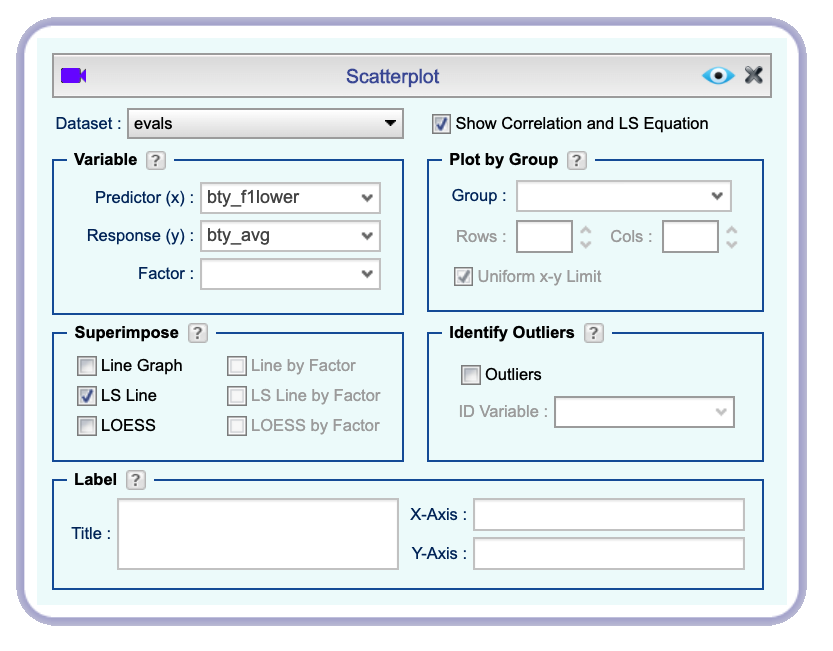
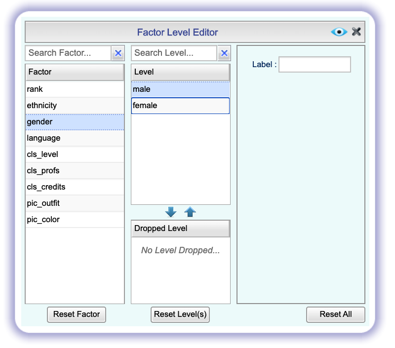
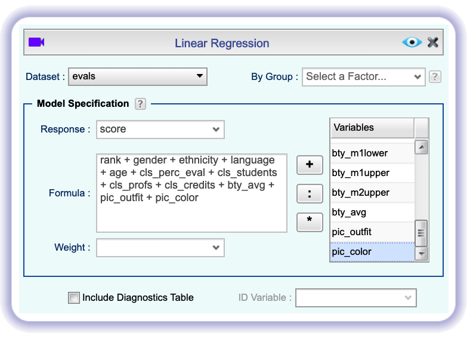

```{r global_options, include=FALSE}
knitr::opts_chunk$set(eval = TRUE, results = FALSE, message = FALSE)
```

## Grading the professor

Many college courses conclude by giving students the opportunity to evaluate 
the course and the instructor anonymously. However, the use of these student 
evaluations as an indicator of course quality and teaching effectiveness is 
often criticized because these measures may reflect the influence of 
non-teaching related characteristics, such as the physical appearance of the 
instructor. The article titled, "Beauty in the classroom: instructors' 
pulchritude and putative pedagogical productivity" by Hamermesh and Parker 
found that instructors who are viewed to be better looking receive higher 
instructional ratings. 

Here, you will analyze the data from this study in order to learn what goes 
into a positive professor evaluation.

## Getting Started

### The data

The data were gathered from end of semester student evaluations for a large 
sample of professors from the University of Texas at Austin. In addition, six 
students rated the professors' physical appearance. The result is a data frame 
where each row contains a different course and columns represent variables about 
the courses and professors. This data frame can be found in the `OpenIntro` **Dataset Repository** as the dataset *evals*.

We have observations on 21 different variables, some categorical and some 
numerical. The meaning of each variable can be found by bringing up the codebook (click ) before importing the dataset from the Repository.

## Exploring the data

1.  Is this an observational study or an experiment? The original research
    question posed in the paper is whether beauty leads directly to the
    differences in course evaluations. Given the study design, is it possible to
    answer this question as it is phrased? If not, rephrase the question.

2.  Describe the distribution of *score*. Is the distribution skewed? What does 
    that tell you about how students rate courses? Is this what you expected to 
    see? Why, or why not?

3.  Excluding *score*, select two other variables and describe their relationship 
    with each other using an appropriate visualization.

## Simple linear regression

The fundamental phenomenon suggested by the study is that better looking teachers
are evaluated more favorably. Let's create a scatterplot to see if this appears 
to be the case:

```{r scatter-score-bty_avg, echo = FALSE, results = "asis", fig.align = "center", fig.cap = "*Scatterplot dialog for plotting score vs. bty_avg*", out.width="80%"}

```

Before you draw conclusions about the trend, compare the number of observations 
in the data frame with the approximate number of points on the scatterplot. 
Is anything awry?

Most likely, you noticed fewer points on the plot than the number of data values. It's because many points overlap. To be able to see more points, we use a technique called *jittering*.  Jittering is the act of adding random noise to data in order to prevent overlaps in graphs. To apply jittering to your plot, click the  button and open the section `Attributes of Scatterplot Points, ...`. By default, the `Point-Line` tab opens. In the `Points` section, there are two text boxes labeled `X-Jitter` and `Y-Jitter`. Type positive values in these boxes to jitter the plot points in horizontal (x) or vertical (y) directions by a random amount. The larger the value, the more displaced the points get. Try a value of 3 for both the `X-Jitter` and the `Y-Jitter`. Click the `Preview` button  to see how your plot changes.

```{r jitter, echo = FALSE, results = "asis", fig.align = "center", fig.cap = "*Graph Settings dialog for jittering the points in the x and y directions*", out.width="80%"}

```

1. Now that you have jittered the points, what was misleading about the initial scatterplot where you had not jittered the points?


Click  and add the line of the best fit to your plot by checking the `LS Line` box in the **Scatterplot** dialog:
    
```{r scatter-score-bty_avg-line, echo = FALSE, results = "asis", fig.align = "center", fig.cap = "*Adding least squares line to the scatterplot*", out.width="80%"}

```

1. Let’s see if the apparent trend in the plot is something more than natural variation. Use Rguroo's **Linear Regression** module in the **Analytics** toolbox to fit a linear model to predict average professor score by average beauty rating. Write out the equation for the linear model and interpret the slope. Is average beauty score a statistically significant predictor? Does it appear to be a practically significant predictor?


1.  Use residual plots to evaluate whether the conditions of least squares
    regression are reasonable. Provide plots and comments for each one.

**Save** your model and report as *m_bty*.

## Multiple linear regression

The dataset contains several variables on the beauty score of the professor: 
individual ratings from each of the six students who were asked to score the 
physical appearance of the professors and the average of these six scores. Let's 
take a look at the relationship between one of these scores (*bty_f1lower*) and the average beauty score.

```{r bty-rel, echo = FALSE, results = "asis", fig.align = "center", fig.cap = "*Scatterplot of bty_avg vs. bty_f1lower*", out.width="80%"}

```

As expected, the relationship is quite strong---after all, the average score is 
calculated using the individual scores. You can actually look at the 
relationships between all beauty variables (columns 13 through 19) using a matrix plot.

In the **Linear Regression** module, select the dataset *evals*. In the `Response` dropdown select *bty_avg*, and in the `Formula` box type in

```{r eval = FALSE}
bty_f1lower  + bty_f1upper + bty_f2upper + bty_m1lower + bty_m1upper + bty_m2upper
```

In order not to make spelling errors in typing variable names, you can double-click the names of the variables on the column labeled `Variables`. When done, click the `Preview` button  to see the matrix plot.


```{r scatterplot_matrix, echo = FALSE, results = "asis", fig.align = "center", fig.cap = "*Creating a scatterplot matrix to show the relationships between beauty variables*", out.width="95%"}

```

These variables are collinear (correlated), and adding more than one of these 
variables to the model would not add much value to the model. In this 
application and with these highly-correlated predictors, it is reasonable to use
the average beauty score as the single representative of these variables.

In order to see if beauty is still a significant predictor of professor score 
after you've accounted for the professor's gender, you can add the gender term 
into the model. To do this, we have to start with the *m_bty* model, open the 
menu, click the `+` sign, and double-click *gender* to add it to the `Formula` box.

```{r scatter-score-bty_avg_gender, echo = FALSE, results = "asis", fig.align = "center", fig.cap = "*Fitting a multiple regression model*", out.width="80%"}

```

1.  P-values and parameter estimates should only be trusted if the
    conditions for the regression are reasonable. Verify that the conditions
    for this model are reasonable using diagnostic plots.

1.  Is *bty_avg* still a significant predictor of *score*? Has the addition
    of *gender* to the model changed the parameter estimate for *gender*?

Note that the estimate for *gender* is now called *gendermale*. You'll see this 
name change whenever you introduce a categorical variable. The reason is that Rguroo
recodes *gender* from having the values of *male* and *female* to being an 
indicator variable called *gendermale* that takes a value of $0$ for 
female professors and a value of $1$ for male professors. (Such variables 
are often referred to as "dummy" variables.)

As a result, for female professors, the parameter estimate is multiplied by zero,
leaving the intercept and slope form familiar from simple regression.

\[
  \begin{aligned}
\widehat{score} &= \hat{\beta}_0 + \hat{\beta}_1 \times bty\_avg + \hat{\beta}_2 \times (0) \\
&= \hat{\beta}_0 + \hat{\beta}_1 \times bty\_avg\end{aligned}
\]

1.  What is the equation of the line corresponding to male professors? 
    (**Hint:** For male professors, the parameter estimate is multiplied
    by 1.) For two professors who received the same beauty rating, which gender tends to have the higher course evaluation score?

The decision to call the indicator variable *gendermale* instead of 
*genderfemale* has no deeper meaning. Rguroo simply codes the category that 
comes first alphabetically as a $0$. You can change the reference level of a categorical variable, which is the level that is coded as a 0, by opening the , selecting the variable of interest, and dragging-and-dropping the desired reference level to the top of the list, as shown below:

```{r scatter-score-bty_avg_gender 2, echo = FALSE, results = "asis", fig.align = "center", fig.cap = "*Using the Factor Level Editor to change order of the levels*", out.width="75%"}

```

**Save** the new model and report as *m_bty_gender*.

1. Create a new model with *gender* removed and *rank* 
    added in. How does Rguroo appear to handle categorical variables that have more 
    than two levels? Note that the *rank* variable has three levels: *teaching*, 
    *tenure track*, *tenured*.

The interpretation of the coefficients in multiple regression is slightly 
different from that of simple regression. The estimate for *bty_avg* reflects
how much higher a group of professors is expected to score if they have a beauty
rating that is one point higher *while holding all other variables constant*. In
this case, that translates into considering only professors of the same rank 
with *bty_avg* scores that are one point apart.

## The search for the best model

We will start with a full model that predicts professor score based on rank, 
gender, ethnicity, language of the university where they got their degree, age, 
proportion of students that filled out evaluations, class size, course level, 
number of professors, number of credits, average beauty rating, outfit, and 
picture color.

1. Which variable would you expect to have the highest p-value in this model? 
    Why? **Hint:** Think about which variable would you expect to not have any 
    association with the professor score.

Let's create and run the model.

Keep *score* as the `Response` but now, set the `Formula` box to read:

```{r formula_full, eval = FALSE}
rank + gender + ethnicity + language + age + 
  cls_perc_eval + cls_students + cls_profs + cls_credits + 
  bty_avg + pic_outfit + pic_color
```

Remember that, to avoid typos, you can double-click the variable names in the `Variables` section.

```{r m_full,  echo = FALSE, results = "asis", fig.align = "center", fig.cap = "*Fitting the full model in the Linear Regression module*", out.width="80%"}

```

**Save** this model and report as *m_full*.

1. Check your suspicions from the previous exercise. Include a screenshot of the model output
    in your response.

1. Interpret the coefficient associated with the ethnicity variable.


1. Open the  menu. Delete the variable with the highest p-value from the `Formula` box and re-fit the model.Did the coefficients and significance of the other explanatory variables change?
    (One of the things that makes multiple regression interesting is that
    coefficient estimates depend on the other variables that are included in
    the model.) If not, what does this say about whether or not the dropped
    variable was collinear with the other explanatory variables?
    
One approach to obtain a final model is called *backward-selection*. In this approach, the model selection is stepwise. At each step, you remove the predictor variable with the highest p-value from the model, and refit. You continue this process until all the p-values are less than or equal to a threshold value, say 0.05.

1. Using backward-selection and p-value with a threshold of 0.05 as the selection criterion,
    determine the best model. You do not need to show all steps in your
    answer, just the output for the final model. Also, write out the linear
    model for predicting score based on the final model you settle on.

**Save** the final model and report as *m_final*.

1. Verify that the conditions for this model are reasonable using diagnostic 
    plots.

1. The original paper describes how these data were gathered by taking a
    sample of professors from the University of Texas at Austin and including 
    all courses that they have taught. Considering that each row represents a 
    course, could this new information have an impact on any of the conditions 
    of linear regression?

1. Based on your final model, describe the characteristics of a professor and 
    course at University of Texas at Austin that would be associated with a high
    evaluation score.

1. Would you be comfortable generalizing your conclusions to apply to professors
    generally (at any university)? Why or why not?

* * *

<a rel="license" href="http://creativecommons.org/licenses/by-sa/4.0/"></a><br />This work is licensed under a <a rel="license" href="http://creativecommons.org/licenses/by-sa/4.0/">Creative Commons Attribution-ShareAlike 4.0 International License</a>. Rguroo.com, the Rguroo.com logo, and all other trademarks, service marks, graphics and logos used in connection with Rguroo.com or the Website are trademarks or registered trademarks of Soflytics Corp. in the USA and other countries and are not included under the CC-BY-SA license.
